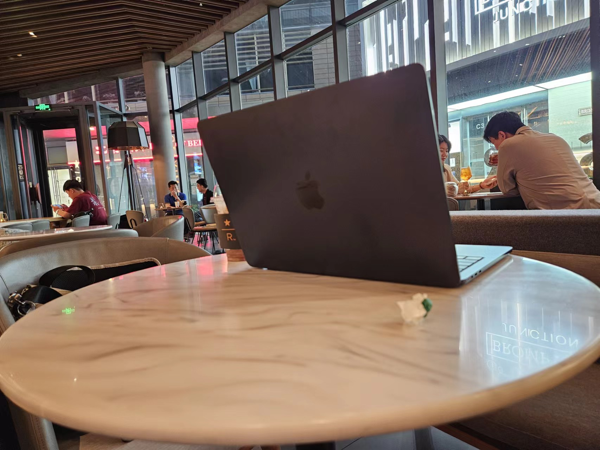

我其实已经很久没有属于自己的笔记本了。毕业之后公司发了一台 Precision 5530 作为工作电脑，我就把我自己的 Precision 5510 留给家里人用了，再加上为了打游戏我分别在自己住处和家里装了台式机，用笔记本的场景就更少了。想来想去，需要笔记本的场景只有一个，就是出远门拍照的时候，可能需要把相机存储卡里的数据复制到移动硬盘里，然后可能顺便快速修图发朋友圈。虽然我之前尝试过平板电脑也能满足这些需求，但平板电脑供电的能力有限，连接移动硬盘还需要外接供电，而且 Android 版的 Lightroom 导入的速度也太慢了，只能说勉强能用。

当然我可以直接带着公司的 Precision 5530 出门的时候用，但是实在是太重了，而且在 Linux 下面电池顶多能用两小时。有了台式机之后我对笔记本的需求产生了一些变化，比如笔记本可以不需要处理所有的任务，复杂的工作可以在台式机上解决，所以我对笔记本的需求变成了轻便和长续航。这样一看苹果的 M1 变成了最合适的选项：续航可以和平板电脑相比，但是又是实打实的电脑，同时对于剪视频修图这种媒体编辑非常合适。当然这都是马后炮，我一开始只是因为在二手频道刷到有人出售 M1 的 MacBook Air 只要 3000 块出头，感觉这个价格就算是买一个回来玩玩也很合适。不过这个价格是丐版，8G 内存对我来说等于不能用。但我看了一下 16G M1 的 MacBook Air，价格要贵 1500 左右，又有点下不去手。

我恰好有一个朋友在苹果实习，她告诉我苹果有员工优惠计划，可以以 85 折给家人或者朋友购买 MacBook，不过仅限于官网有卖的产品，于是我开始思考要不要干脆加钱正经买一台笔记本给自己用，这中间反复的纠结过程就略过不提，总之我最后两千块钱卖掉了一千块钱购入的万世权杖（当时工作之后打算买一个玩玩，没想到涨了一倍），又两千块钱卖掉了很久没用过的尼康大 F，然后本着买新不买旧不行挂闲鱼的逻辑买了 M3 的 MacBook Air，毕竟有个在苹果工作的朋友可不容易！

一开始我是想买 16G + 256G 的版本的，但是发现 16G + 512G 可以直接去 Apple Store 提货，思考再三还是买了 512G，甚至还加了 AppleCare+。然后看到午夜黑的配色虽然我知道肯定会粘指纹但我还是义无反顾的选了，然后直奔朝阳大悦城的 Apple Store 提了电脑本体和苹果购物袋。

这个过程中当然有朋友质疑我一个 Linux 桌面程序员为什么会买 MacBook 自己用，除了上面那些比较理性的原因之外，还有个原因是就算是 **Linux 桌面程序员也不是一出生就是 Linux 桌面程序员** 的吧！大概十年以前我还不是 Linux 桌面程序员（甚至不是程序员）的时候，我对 Retina MacBook Pro 的宣传片印象深刻：

<iframe src="//player.bilibili.com/player.html?isOutside=true&aid=799187626&bvid=BV19y4y1Y7rc&cid=296995197&p=1" scrolling="no" border="0" frameborder="no" framespacing="0" allowfullscreen="true"></iframe>

我买电脑确实是看脸的，因此不管别的 Linux 爱好者有多喜欢 ThinkPad，我都对那玩意嗤之以鼻：您能先让自己看起来像是一整块东西吗？不过我看到这个宣传片的时候可能还在上初中，距离我能买得起五位数电脑看起来不能说是遥遥无期，也可以说是希望渺茫。至于上大学之前花了两万块买了 Precision 5510 则是后话了，原因也很简单，单纯是 XPS 15 那个时候看脸比 MacBook 更酷，而且我那个时候已经开始用 Linux 了。所以如果没有 XPS 15，我可能就会买 MacBook Pro，不过再回想一下 2016 年到 2020 年苹果在 MacBook 产品线上做了多少愚蠢的决策（我会把我这辈子见过最蠢的笔记本电脑的称号颁给 New MacBook……真是只有外观设计完全不考虑能不能用的顶峰啊）……可能没有买苹果反而是幸运。

但把时间拨回到 2012 年，Retina MacBook Pro 确实看起来很棒，用起来也很棒。考虑到使用 M 系列芯片的 MacBook Air 确实在续航和性能之间找到了平衡点，并且苹果确实逐渐从当年制造愚蠢笔记本的顶峰退下来，所以我觉得是时候买一台了，就算是为了延迟满足十年前的自己。就像选择午夜黑的颜色也很简单，它很像十年前我用的蓝黑墨水，不像碳素墨水那么无聊，也不像蓝墨水那么肤浅。我也没打算考虑买 Windows 笔记本装 Linux 的选项，因为显然续航上难以和 MacBook 相比，而且按我看脸的标准能买的 Windows 笔记本也奔着五位数去了……

拿到手之后确实也是比较满意吧，除了内存和硬盘卖金子价格还是让我很不爽，以及刘海……虽然一个写插件恶搞过这个刘海的人买了刘海笔记本这件事有点讽刺吧，但我想问既然因为刘海加高了顶栏，为什么要特意把顶栏做的比刘海高一点点！就算是为了告诉用户刘海两侧是联通的，这个设计也足够逼死强迫症了。

我自己的博客生成器因为是 Node.js 写的所以直接就可以在 macOS 上运行，Emacs 则一直以来对 macOS 支持都好得过分，简单修改了 Ansel 的脚本之后我也成功在 macOS 上运行了，DaVinci Resolve 也是跨平台的，所以我期望在笔记本上做的任务都还比较方便，我甚至也跑了 Tailscale 方便我随时远程连接到 Linux 设备上。虽然别人可能觉得我打肿脸充胖子但我还是要说我觉得 GNOME 桌面的使用体验比 macOS 桌面要好，我在自己的博客里写自己的主观看法不是很过分吧！其它的当然可以适应（比如我在 GNOME 里把关闭按钮改到左边了，我不是很在乎这个，然后在 macOS 里面用 Loop 实现了窗口靠边贴放），但为什么 macOS 不能自己调整输入法顺序！我想要一个固定的自己设置的输入法列表是什么大逆不道的事情吗？

当然少不了去星巴克当气氛组，比如这篇博客就是在星巴克写的：

关于买这台笔记本还有个很有意思的插曲是一开始和在苹果的朋友对需求对了半小时结果她以为我要买的是 iPad Pro，特别是我还说了我要跑 Node.js 要写博客 iPad Pro 太蠢了之后，我不知道这个对话是怎么进行下去的，我们跨频道聊天一直聊到她以为我要花两千块钱买妙控键盘——我曾经无数次的批评过这个破玩意，毕竟 HHKB 这种顶级的静电容键盘我也才花了两千块……我真的有思考要是最后她给我买了 iPad Pro 和妙控键盘我是掏钱还是不掏钱……
