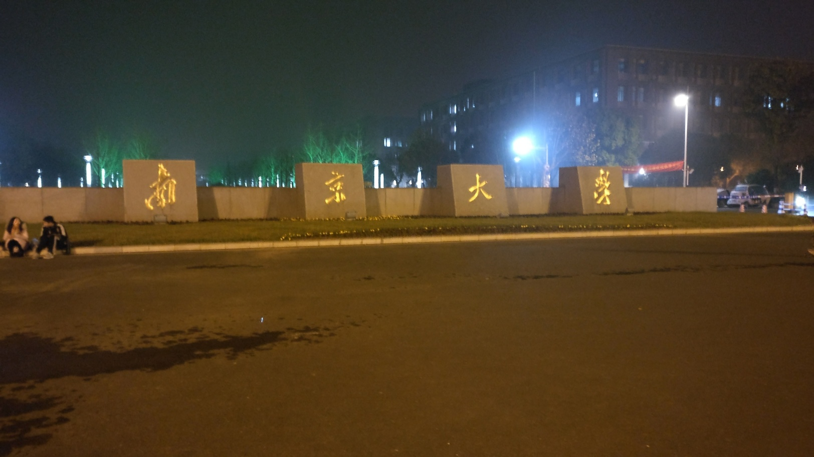

回到住处，掀出电脑，拉开在超市买的一听可口可乐的拉环，还有一个半小时，现在该写2017年的年终总结了。时间刚刚好。

<!--more-->

一直拖一直拖，拖到最后却发现把想说的都丢在了路上。

想起来才发现好久以来都是“你也牵过手，是左手牵右手”，无所谓，没人看的。

今晚月色真美，你的学校也是，虽然从北京来到南京也没能逃过雾霾，河北省可以不背锅了这次。

喝可口可乐也会醉吗？

有好多事情没有做呢，明年再说吧。我又不是个精力充沛的人。

其实很想做一个深情又优雅的人啊，可以唱深情的歌，但是总是做不到的吧，提速提的再快也只能发现优雅的人他的高贵大概是天生的，再努力的结果也只是让你更清楚的认识到这中间的差距不是靠努力就能实现的。

我曾经如此觊觎日月的光辉。

我曾经如此渴望爱情的甜美。

我曾经如此在乎他人的感受。

我曾经如此高估自己的才华。

能怎么样呢，有时候样子是装给别人看的，还有时候样子是装给自己看的，要么改变样子成为自己想要的，要么坦然接受自己现在的样子，做到任何一个是勇气，做不到任何一个，只能是自己给自己笑话好了。

爱一个人是那么容易的事情么？

也许对于18岁的自己来说是的吧，但是毕竟没有人永远18岁啊。

以前就想不明白，想恋爱怎么也会是负担。但是想多了就不敢了啊。

做选择为什么这么难呢。

世界说这世界并不像你想像的那么友好。

世界说它总是对你带有敌意。

世界说你所珍视的最后总是只对你自己有意义。

世界说每个人都会投入生活的洪流，最后被生活碾碎。

世界说生命不断进化，但是世界永远循环往复。

世界说我爱你因为你就是世界。

生命如此漫长，漫长到我们不得不寻找一些事情，给他们附加上别的意义。人类就是这样一种脆弱而又倔强的物种啊，我们提出了自己是谁的终极问题，然后发现这个问题并不能推导，我们必须通过实践，认识不同的人，建立重要的关系，给事物附上属于自己的意义。生命是漫长的，但它的漫长不过是让我们有机会做完所有自己要做的事情，才能更好的认清我们自己。

哪怕前面五个悍匪端起P90 Rush B，也要握紧手里的M4A1-S。早就过了可笑的追逐最强的年龄，到现在才无可救药的开始喜欢超电磁炮，即使她不是最强，即使在剧情里出现了越来越多更强的人，可是我还是喜欢她啊。

一个好故事比什么都值钱，一个会讲故事的人也是。对于StackHarbor而言，又增加了一年呢，又要开始讲述新的故事。

请原谅我这个不熟练的讲述者吧，因为我爱这世界。我不仅爱它的每一次相聚，也爱每一次分离，我不但歌颂每一个新生命的诞生，我也歌颂每一个生命的离去。即使知道前面是洪流，我也要追逐爱情。

2018，新的一年，请多指教，当然，请不要忘记先看[最新版的About Me](/about/)。

我爱你，因为你就是世界。

