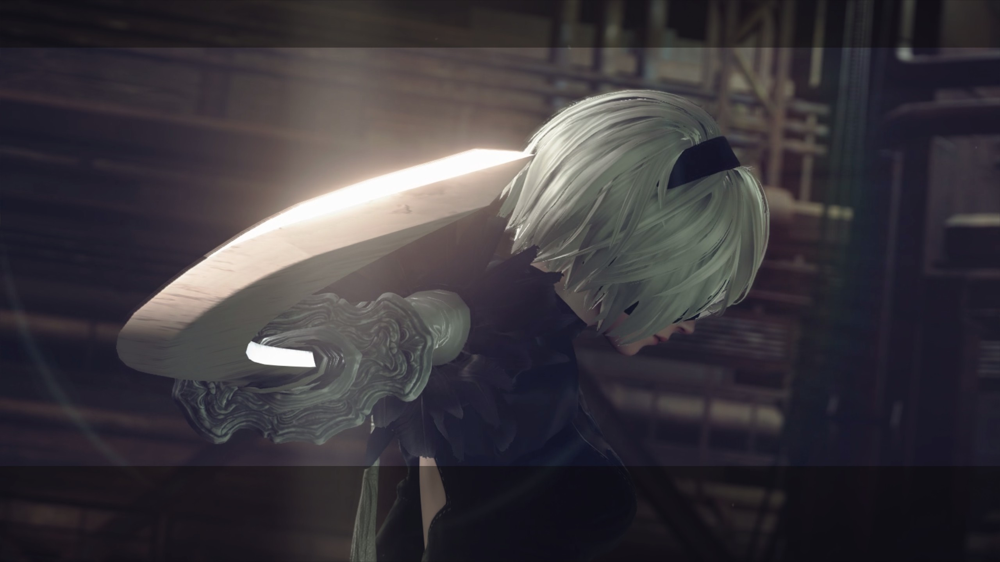

还没有到月亮升起的时候呢。

<!--more-->

不是所有特殊的日子都能让人开心，特别是对于一个记性不太好的人来说。虽然距离上一个这样标题的已经过了一年，但我似乎想不起来这一年有什么值得开心的事情。我是指那种能维持很久的开心，但是很遗憾似乎让人难过的事情总是能持续的更久一点。

今年大概保证了一个月一篇 post 的频率，虽然有些月份就懒的什么也不想干，但回头翻一翻之前还有存货，让人变懒的原因不是无事可做，往往是由于各种没什么意义还不得不做的事情，一旦沉迷在这些事情里太久，就容易让人忘记自己应该做什么事情。

似乎这一年来就一直不清楚自己该做什么，虽然对于自己不想做什么有清晰的了解，但是说到做什么，似乎每一件事都不是很容易完成，特别是一些没接触过的东西。而且糟糕的是我觉得这个状态还会继续存在下去——我还没搞到该死的创新创业学分！

说句实在话，我不想当韭菜，也没当韭菜的成本。我还有好多事情没有完成呢！大概对于一棵韭菜来说，长得和其他韭菜不一样就是错误。

所以说实话，最近没有什么值得开心的事情，更远一些也没有。

如果从最早开始说的话，今年大概从 *空之境界* 开始，然后是 *Fate/Stay Night*，然后是 *Fate/Zero*。第一遍看空之境界的时候还不知道整个在说什么，只是模糊地觉得十分喜欢，最近又拿起来重新看了一遍，才发现一些不一样的意思。

话说回来，虽然是第一次看，但是却有十分熟悉的感觉，大概是因为里面一些插曲早就不知道循环了多少个深夜的原因。总有一些旋律是停留在记忆里面的，理解它们从来就没有什么困难。

然后是 Fate，最开始只是因为把 *卫宫家今天的饭* 当成泡面番来看的，没想到一下子就点开了一年霸权（真·年番）。当然看过 Stay Night 之后和没看之前看这部的感觉是不一样的——一同经历过很多，怎么能不留下些痕迹呢——大概和所有人一样，只要看到他们还在一起就满足了。

然后大概 Unlimited Blade Works 线的动画从音乐上整个就输给了 Fate 线动画，除了 LAST STARDUST 是确确实实的超水平，believe 和 ring your bell 表现实际很一般（这里一般的意思就是指没什么第一遍就吸引人的地方）。Fate/Zero 也是完完全全的超出 Unlimited Blade Works 的音乐（只要把满天拉出来就可以吊打了），至于 2019 年 1 月 11 日的 Heaven's Feel……我并不是樱厨，所以大概这条线不适合我吧。还有 *幻想嘉年华* 大概和卫宫家今天的饭是同一水平的作品，太严肃了也是很累的。至于 *Fate/Apocrypha*？这不是讲的莫德雷德和狮子劫界离的故事嘛？写的挺好的！就是 23 集就完结有点奇怪……后面还做两集多余的骗收视率嘛？（摸着良心说，阿福这个配角也挺可爱的。）

Fate 系列其他的作品就没看过了，我觉得也没有看的必要，FGO 从看完 Stay Night 开始玩，到现在也差不多没什么动力了（主要是懒），反正一年过去了，我还是没有抽到蓝呆毛。（93 连抽！279 个石头！一个五星都没有！）虽然金卡有了一大堆一般的本也都轻轻松松，但是我还是很想要蓝呆。（无独有偶，信用卡我也只拿到武藏的，没有蓝呆。）明年有第六七章的动画化，第七章我只是觉得故事性很好，但第六章的动画是我最期待的。

导致不开心的大概是在我重新开始听 Kalafina 的时候听见了 Keiko 退出的消息，完全不愿意回想这件事发生的前后过程。无论希望还是失望也都已经过去了，那剩下的复杂的感情又是什么呢？与其空怀希望，不如让时间回到一切还没发生的时候，重来一遍的话，我应该不会错过那些不该错过的机会了吧。与已经得不到的相比，每天都在重复的无聊事情有什么意义吗？

顺便一提，假期之前通关了 NieR: Automata，但现在的我恐怕没有再来一次的勇气。

也许我可以有更多的事情可以做，但是实际上我只有两个作品，一个是现在正在用的主题 ARIA，某种程度上它和我的想法一样简单，本来就是非常简单的逻辑嘛。这个东西写的非常直白，样式也全部是我自己完成的，不会出现什么奇怪的乱七八糟的调用。也没有对一些历史垃圾进行没必要的适配，直接采用最合适的技术，去掉那些对内容没什么帮助还消耗资源的东西就好了。

还有一个是 Hikaru，基于和上面类似的原因，我对 Hexo 也有一定的不满，虽然看起来其它的让我更没什么兴趣。于是大致按照逻辑设计了自己的生成器，并且给它起了我最喜欢的歌手的名字。这个程序也是一样的直白，反正只是生成一遍页面而已，没有必要搞什么乱七八糟的数据库嘛，就算有必要也可以直接上 SQLite（当然我没有，而是直接用对象引用了）。包括一些乱七八糟的模板里的工具，总之是把所有不符合自己习惯的地方都改了一遍。截至目前一切工作的都很良好，甚至一些我开始不知道怎么实现的地方也都工作了。我也并不觉得需要有多少多少人来用它，只要满足我自己用就行了，至于别人，随意。

然后大概就是换手机，一加 3T 使用了两年已经是伤痕累累，但是看起来又没什么符合要求的手机，一加的后几代产品完全就是“不讲究”，MIX2S 看起来不错但没有耳机孔也没有防水，而且我并不是很喜欢 MIUI，Pixel 3 的性价比完全就是冲着“有种别买”去的，何况这个价格一旦出了问题没保修就要了命了。**反正我都是晚上充电，充的太快反而让我不放心，快充完全没什么需求**，所以最后考虑加钱买 Galaxy S9（因为 128G 的 S9+ 实在是超出预算了），但是看到 S9+ 有 64G 的版本（反正可以插存储卡），同时 4G 内存实在是太小，咬咬牙就 S9+ 了，反正有奖学金和上个月的结余。别问我 6k+ 为什么不买 iPhone，我考虑了一下，这东西我拿来完全不能用（**没文件管理** 怎么愉快的用 Samba 在 Arch 和手机之间交换文件，以及 Shadowsocks 处理起来也很麻烦，我也不可能因为一个 iPhone 迁移我整个生态和习惯，顺便还 **没有耳机孔**，以及 **被限制的 NFC**，也 **不能随便外接 U 盘**……），所以还不如当它不存在，不存在的东西就不考虑了，这样一来 Galaxy S9+ 就变成了第一档配置的选项。

拿到 S9+ 以后才发现多出来的价格完全没有白花。对我来说这个手机唯一的缺点就是这个曲屏太难贴膜以及担心摔碎（所以想办法搞了碎屏险）。至于其它的完全 OK，防水是一个平时我不会故意去用（我不洗手机！）但总能让人很安心的功能，双摄也是到手了之后发现 2X 变焦在拍猫的时候很有用（不用担心追的太近猫猫跑掉了），指纹识别在后面总比没有要强（毕竟我很讨厌实体按压 Home 键），有 NFC，屏幕水平中规中矩（手机居然可以切换分辨率你敢信！平时用 1080P 就很清晰了。），可以插存储卡，耳机孔绝对是加分项目，特别是 **随包装送了 AKG 耳机、USB-C 到 MicroUSB 的转接头，USB-C 到 USB-A 的转接头（本来是换机助手用的，但完全可以用来接 U 盘）、透明手机壳甚至还有无线充电器（聊胜于无，对我来说只是多了一个充电的位置，角度什么的并不十分合适）**，甚至似乎还可以一边接收 WiFi 一边开热点（！！！）。另外软件上也和当初的 TouchWiz 有天壤之别，整个系统的动画很复杂，可配置项多到根本翻不完（对我来说这是优点），比如我喜欢返回键在左侧（OK），还可以设置桌面下拉通知栏，**不但可以设置是否显示二级菜单（二级菜单爱好者手动吐槽一众国产和 iPhone），甚至可以设置是手势开启二级菜单还是单独图标（可惜图标不能换位置，不过反正我用手势）**，桌面可以横屏……以及 Android P 的更新……顺便还有能解决毒瘤但是又不过分突出的智能管理器（真的好用，不是假的，实名推荐），连我这种原生党也非常满意。甚至在 Note 9 上用任意线缆就能开启 DeX 的特性也在 Android P 通过软件更新就实现了（在 S9 上 **不是硬件限制**！三星也 **没有强行要求你买他自家底座** 的意思！亲测完全没有阉割。），手动 @ 某没良心配件厂一下。

最后一个月稍微有点安慰的就是又看了一部 9.8 分的番（上一个 9.8 的是卫宫家今天的饭），*青春猪头少年不会梦到兔女郎学姐*，真正的高情商男主和真正的高情商女主以及不狗血的爱情故事让人实名羡慕啊，顺便樱岛麻衣真可爱！回头再看看某些废物后宫男，整个的质量已经是在恶心人了，要不是为了明年的电磁炮，谁会花钱看这种东西啊喂！都不是小学生了，天天比这个强比那个强算战斗力有意思吗？

总而言之，幸福的事情都是相似的，不幸的事情则各有各的不幸，某种程度上来说，**幸福的事情并不在于事情本身，而是在等待这件事情到来的过程中**，就像一个慢慢升起的气球，当它上升到看不见的时候，反而会有难以掩盖的失落感。反正天下没有不散的宴席，幸福的事情也总会结束，也许是如此人们才会给自己一个又一个理由让平凡的日子变的不平凡，好有下一个盼头支撑自己活下去。但是回过头来看，这些事情又留下了什么呢？

已经是月亮升起的时候了，何等愚蠢而幸福的人啊！

*Alynx Zhou*

**A Coder & Dreamer**
