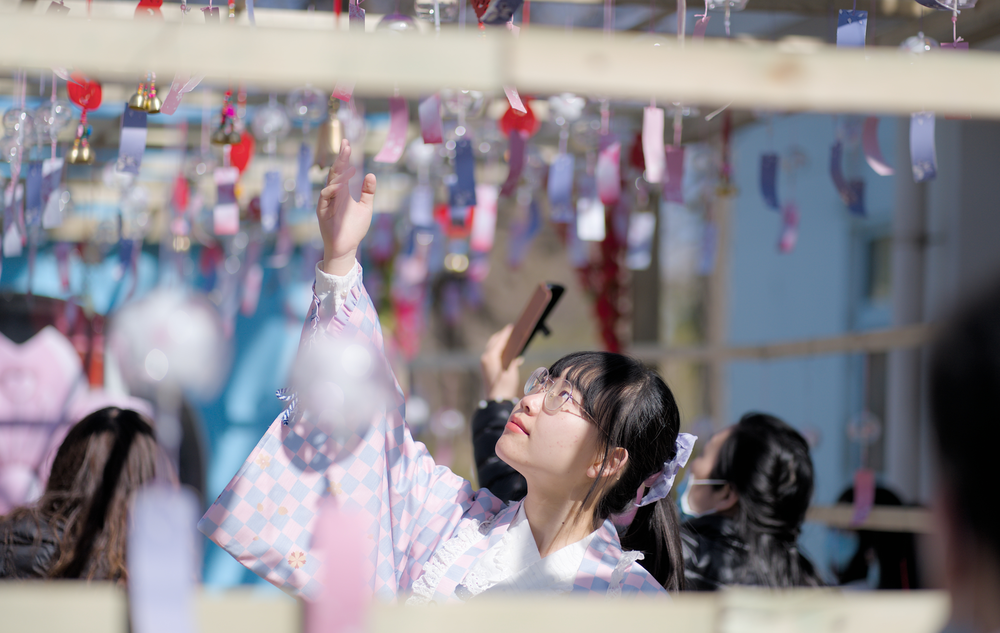
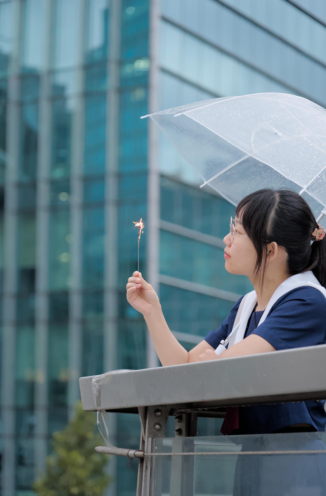
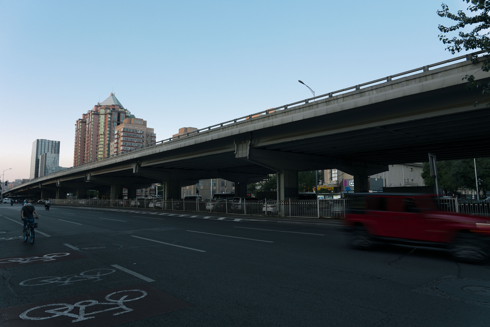
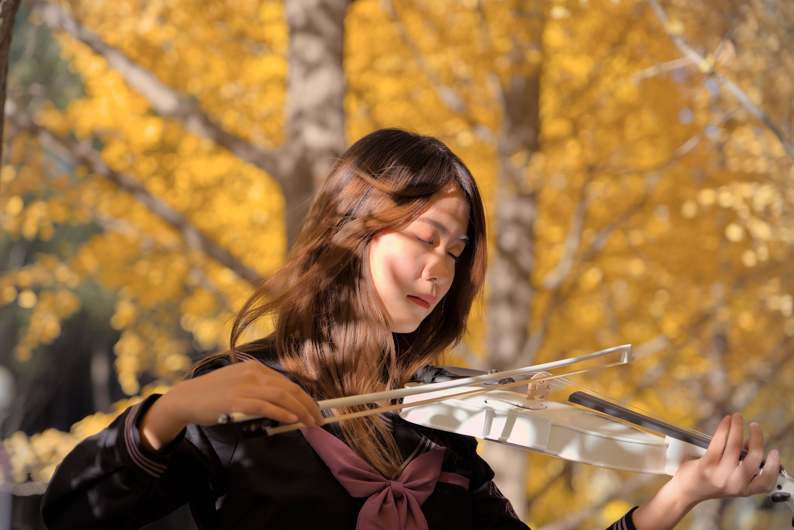
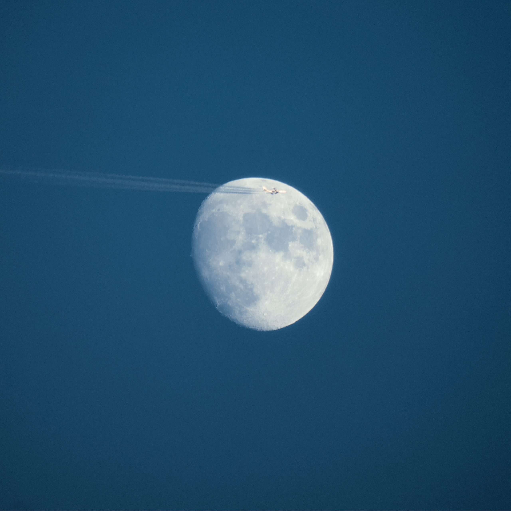
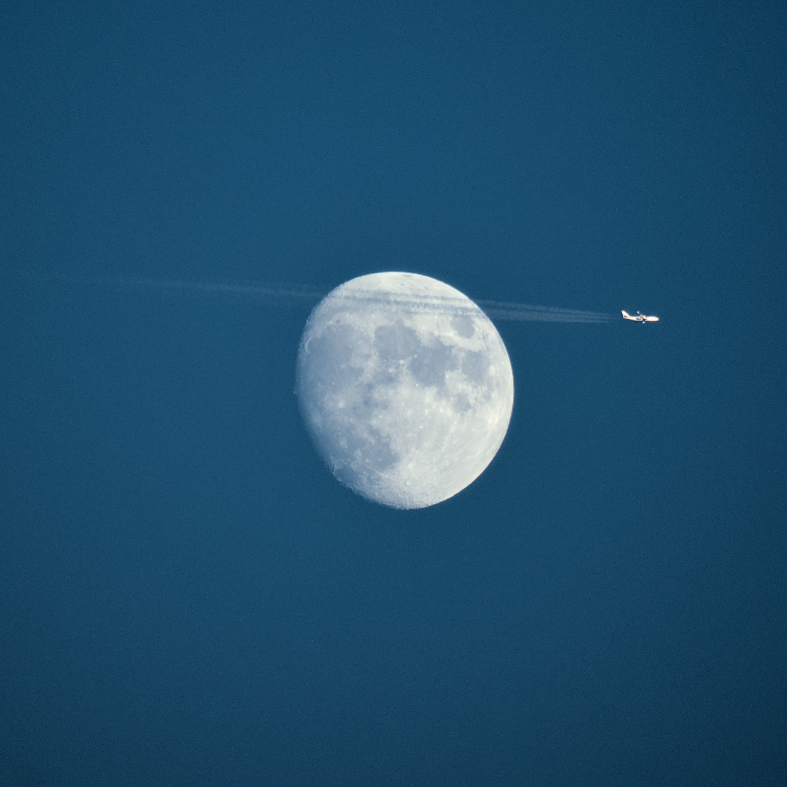
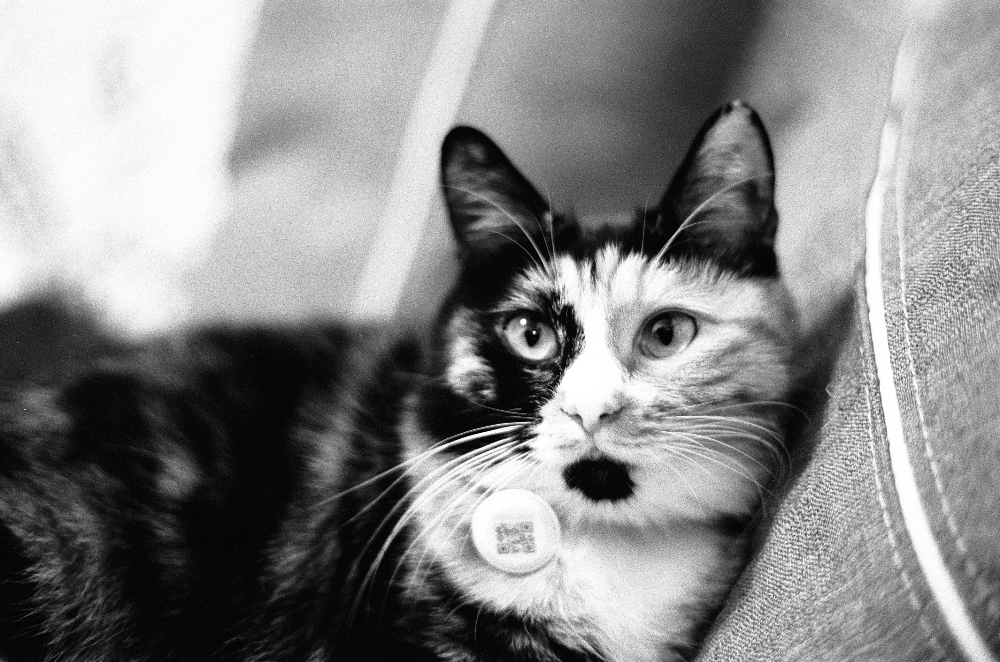

每年写年终总结我都会拖很晚，因为基本上我写博客是看心情，最近事情比较多，其实也打算再拖几天的，但是实在是不想回家之后写，所以不得不今天仓促动手。

然后实际上我不喜欢分类列提纲的写法，我本质上比较倾向于文学性的写法或者就是想到什么写什么，不过最近我在翻以前的年终总结的时候发现事情总是记的乱七八糟而且有些我都想不起来出现在哪篇文章里了，这当然可能也和我写完年终总结从来不看有关系，反正这次打算试一下分类的写法。

按照惯例还是要感慨一句时间过得真快，仅仅只是靠记忆的话，就会觉得自己什么也没做就过了一年。写年终总结的时候到处翻一下记录，才会意识到自己其实做了不少事情。

<!--more-->

# 编程

我经常会处于一种“我好菜啊怎么什么都做不了”和“我还能搞定这个其实还不错”的叠加态，实际上仔细翻一下感觉去年还是做了不少东西。比如说在 HackWeek 把 Show Me The Key 成功换成了 GTK4。然后还抽时间利用 Telegram 机器人做了个照片墙，虽然中间我把它关了很长时间，不过后来我又把它跑起来了。

这一年我印象最深的其实是搞我的 Emacs 配置。在有确定消息说 GitHub 打算放弃 Atom 之后，我不得不给我自己重新找一个编辑器，因为我得了一种看到 Visual Studio 就会死的病所以坚决不会用 VSCode，除非他们哪天改名部把 VS 从里面去掉。然后我一直是不喜欢模态编辑的所以也不会用 Vim，同时 Emacs 的 PGTK 分支已经被上游接受，所以我很高兴地重回 Emacs 拥抱我所知的第一个 pure Wayland 的 GUI 编辑器。说是重回，其实相当于重新学习了一遍 Emacs Lisp，毕竟我一开始尝试 Emacs 是被 Spacemacs 那句著名的口号吸引的（但是我又不用 Evil）。那时候其实我不太懂 Emacs Lisp，但是现在回头再看发现确实是更好掌握了。虽然有无数的人说应该从别人配好的 Emacs 配置开始，但我还是决定自己编写一套配置而不是使用最流行的 doom。一个是这些配置好像都以模态编辑为中心，另一个是我经常会自己定制自己的编辑器，使用这些别人配好的配置调起来总觉得很不自在。然后就是我逐渐理解了 `use-package` 的用法，解决了各种奇奇怪怪的问题，甚至还自己用 Emacs Lisp 写了很多自己需要的功能。虽然可能有人要问你搞这一通有什么意义之类的，但是我做事的一个原则就是看心情，我高兴就好，所以觉得还挺值的。

然后不论是工作还是个人爱好上这一年多少也做了点东西，毕竟我的工作就是我的爱好。比如很有意思的一个是我研究了一下 GNOME 的智能卡登录到底怎么搞，顺便也大致了解了一下 PAM 的配置，虽然可能这个还是没什么用，不过最后我修改了 openSUSE 的 gdm 包添加了一直缺失的指纹和智能卡的 PAM 配置，也算是帮助了其他人。我还抽出时间调查了一下 GTK3 和 GTK4 的亮色 / 暗色主题切换到底是怎么回事。然后还做了一些微小的贡献，比如我印象里一直有人吐槽说 GNOME Shell 的搜索只能从开头匹配而不能做子串匹配，还有人说难道他们只会用 `String.prototype.startsWith()` 不会用 `String.prototype.includes()`，我一开始只是想既然这么简单，有吐槽的时间为什么不自己改一个？于是我花时间看了一下还真不是这么简单，总之最后我阅读了 glib 里面的算法，并且添加了根据不同的匹配模式分组的功能，现在如果有单词开头匹配的会优先显示，然后再显示子串匹配，就可以通过搜索 `fox` 得到 `Firefox` 了（<https://gitlab.gnome.org/GNOME/glib/-/merge_requests/3107>）。

和这个类似的还有另一个，我看到有人说 `gdbus-codegen` 生成的代码没有加空指针检查导致程序崩溃，然后和开发者吵了起来，开发者说加空指针检查不是真的解决问题，这里不应该传空指针，那个人就丢出一堆各种代码规范说传了空指针应该继续运行不该崩溃，开发者说你给我们加的话我们愿意接受，他又说自己不擅长 python，总之我看了觉得很不可理喻，于是我自己改掉提交了然后嘲笑了那人一通。有些时候真不是开发者脾气不好，是有人态度太差……（<https://gitlab.gnome.org/GNOME/glib/-/merge_requests/3175>）

# 音乐

去年一年我还是录了好几个曲子的，虽然我自己是觉得没怎么练琴而且还经常咕咕咕。不过我发出来的我自己还都觉得不错，虽然不是每个都有很多播放量吧。最近手上有几个想录的，比如 シリウスの心臓 和 暗恋是一个人的事，不过可能又要拖到年后了。

然后今年通过 [澪音奏](https://space.bilibili.com/4947340) 的翻唱听了好多伍佰的曲子，对于我这种几乎不会主动找歌曲来听的人，能扩充曲库还是好事。还在 B 站听了纵贯线的亡命之徒，没早点听到这个真是有点可惜。

# 数码

其实我觉得我也没买什么东西，但是再看一下又不少，很多其实没什么可说的，比如买了个新镜头，那就是新镜头，也没什么好在博客里分析一番的。考虑到那块老移动硬盘用了很久，又买了一块三星的 T7 Shield，固态的移动硬盘还是可靠很多。犹豫了很久还是买了平板，不过不是 iPad，是 Galaxy Tab S8，除了 LCD 屏幕有点漏光，别的我都很满意，不管是看谱子还是看视频都不错，虽然有些 app 不支持横屏，但我还是觉得文件管理更重要。

开销比较大的是装了一台 NAS，实际也是挑来挑去才决定的，运行了小一年觉得还不错，极大的缓解了我的存储压力。

# 摄影

自我评价的话我觉得还是有点进步，别的不说，今年我拍了很多自己觉得不错的照片。摸索了一年，我大概也知道怎么用 darktable 得到想要的效果了。之前看到有人总结了一下自己拍过的照片里觉得不错的，我觉得这个想法很好，于是挑了一些今年满意的照片放在这里：

很想找机会把我喜欢的照片打印出来装上相框挂在家里，只是一直没去做这件事。

# 动漫

今年应该只看了两部，一部是 DitF，具体的评价我在 [这篇文章](/posts/Not-to-Be-EVA-but-to-Be-Pacific-Rim/) 写过了。另一部是 赛博朋克：边缘行者，我其实是不喜欢赛博朋克题材的，但是这一部做得太好了，我在这里向所有读者推荐。

# 小说

今年应该是看了基地三部曲，还有格兰特船长的儿女和神秘岛，因为都是很好找到电子版的，所以没有买实体书，神秘岛以前看过简写版，其他的都是头一次看，总体上来说我觉得都不错，毕竟也是流传很久的书了。

# 游戏

除了和开黑群的朋友打 Dota 2 就是和牛爷爷高先生吃鸡，今年更多的玩了游廊地图，感觉我还是想玩休闲一点不太需要团队配合的，吃鸡的话我以为我很久没玩了水平会很差，不过我好像逐渐掌握这个游戏怎么赢了，而且经常可以吃鸡。其实玩游戏本身倒不重要，重要的是有人一起玩。一个人玩的话，要不是因为看中单光一，我大概不会坚持玩 Dota 2。

# 生活

在经历了翻大饼之后果然是不负众望的夺冠了，虽然已经好了。大饼现在是翻过来了，但是保不准哪天又要翻回去，反正我是受够了这种提心吊胆的日子。仔细想想今年我大概有好几次对着共享单车打开健康码扫码，还是挺可怕的。蓝猫今年去了日本，没办法再找她玩了，虽然我很羡慕，但是我又穷又懒。至于脱单这种事情，算了吧，我已经放弃了，一个人待着也挺好的，我一点都不羡慕别人（假的）。

最近几天突然又肋骨痛，只要有动作扯到就很难受，我也不知道是气胸还是肋间神经痛还是肌肉拉伤，本来打算去医院看看的，但最近事情安排满了，回家的时间取决于车票不取决于我，所以只能等回家之后再说。
