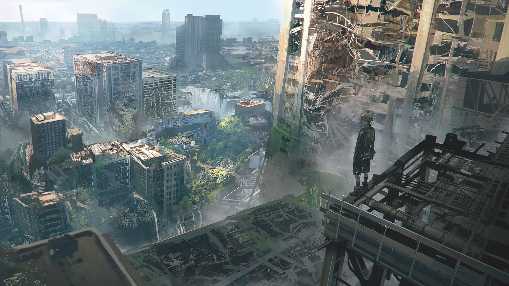

<blockquote class="centerquote">我没有办法评价这款游戏 因为我觉得我被结结实实地折腾了一回</blockquote>

<!--more-->

> Everything that lives is designed to end.
> 一切活着的事物，都注定要终结。
> We are perpetually trapped ...
> 我们被永远地囚禁……
> ... in a never-ending spiral of life and death.
> ……于永无止境的生死轮回之中。
> Is this a curse?
> 这是一种诅咒？
> Or some kind of punishment?
> 还是某种惩罚？
> I often think about the god who blessed us with this cryptic puzzle ...
> 我时常想起那用模糊的谜团祝福我们的神……
> ... and wonder if we'll ever have the chance to kill him.
> ……并猜想我们是否终有弑神的机会。

我大概对动作游戏不感冒。在我最开始对 NieR: Automata 感兴趣的时候，是把它当作剧情游戏来看的，动作只是买剧情附赠的而已。

一周目结束的时候，我以为这是个讲生命和进化的故事。

二周目结束的时候，我以为它要说的是爱情。

三周目开始，我才发现作者是要给玩家一个彻头彻尾的绝望。

能写出这样的开场白的人，不可能做出一款糟糕的游戏。尽管整个游戏的游玩方式实在是逊色于剧情，整个游戏的玩法总结起来大概就是无穷无尽的跑打跑打跑打，伴随着优美或者说是诡异的配乐。然而排除掉动作和开放世界元素仍然可以维持形式完整，以视觉小说的形式，开放世界大概是由于经费限制并没有什么玩法，我又不是有闲情逸致跑来跑去做任务的人。

以机械构成昆虫或者战车的形式确实很好的在震撼和恶心之间取得了平衡，随时出现的视角锁定也可以说是独树一帜的特色。

原本以为一二周目就完整地讲述了进化与爱情，但是和后面的故事比起来，前面的打斗只是岁月静好罢了。

前两周目是一个玩的人很累但看的人很爽的游戏，当然 PC 版就算了，毕竟 bug 太多，PS4 的优化和画质还是很不错的，特别是与巨型兵器战斗时的满天阴霾。至于配音，英语和日语一样优秀，有时反而是中文翻译失去了英文的特殊味道，第一次在 PC 上启动英文版之后许多表达方式就印在了脑海里。

三周目则是让看的人和玩的人都感到痛苦。失去 Bunker，失去爱人，足以让人疯狂。机械都进化出了感情，人造人怎么会没有呢？

故事有多绝望，剧情就可以有多荒谬。

凌晨三点，经历过所有优秀的战斗场面和恰到好处的音乐之后，还是删掉了存档。一切的一切好像终于结束了，没有办法评价这个故事，没有办法评论其中各种可以说是鬼才的设计，没有办法评价这个游戏。它不像是会让你流出眼泪，只是会让你觉得，这次是结结实实地被横尾太郎折腾了一把呢。

2B，9S 和 A2 都留下来了，还有什么需要留恋的吗？可惜缺乏的是再来一次的勇气。

“如果没有战争，我们也不是士兵，是不是也能在这里像人类一样购物呢？”

但愿是吧。

> Everything that lives is designed to end.
> 一切活着的事物，都注定要终结。
> They are perpetually trapped ...
> 我们被永远地囚禁……
> ... in a never-ending spiral of life and death.
> ……于永无止境的生死轮回之中。
> However ... life is all about the struggle within this cycle.
> 但是……生命的全部意义就在于这轮回中的挣扎。
> That is what we believe.
> 那正是我们所相信的。

--------

后记：在 NieR: Automata 原生音乐会“人形们的记忆”上的朗读剧里交待了 Pod 们修复好 2B 和 9S 身体后发生的事情，也就是 E 结局之后的真正结局。按照 [The Ark](https://theark.wiki/w/Farewell) 这个网站的记录，原本的台本是这样的（可靠性未知）（我在这里附上翻译）（看完伤心欲绝的往后看）：

> （前情：2B 磨损了自己的手在「塔」的遗迹 40 米深处挖掘方舟留下来的结晶直到由于过载自动关机，然后使用结晶制作疫苗尝试修复 9S 但却失败了。）
> Pod 042: Hypothesis: Unit 9S's personal data has been lost.
> 辅助机 042: 猜测：机体 9S 的个人数据已经丢失。
> 2B: His personal data ... is lost ...?
> 2B：他的个人数据……丢失了……？
> Pod 042: His personal data was wiped of his own accord, but there is the possibility it was moved to a different location.
> 辅助机 042：他的个人数据被从他的个人记录中擦除了，但是也有可能是被移动到了别处。
> Pod 042: According to unit A2's records, it is possible his data evacuated using the machine lifeforms' Ark.
> 辅助机 042：按照机体 A2 的记录，他的数据有可能是通过机械生命体的方舟疏散到了别处。
> Pod 042: Report: Possibility of recovering 9S's personal data extremely low.
> 辅助机 042：报告：9S 的数据恢复可能性极低。
> S.P.
> （这个不知道是什么的缩写了……有人知道请教教我。）
> 2B: No ...
> 2B：不……
> (Three beeps suddenly sound.)
> （突然响起了三声蜂鸣。）
> Pod 153: Report: Memory components discovered within traces of personal data.
> 辅助机 153：报告：内存组件发现了个人数据的痕迹。
> Pod 153: Partial playback possible of memory containing the reason behind his personal data's reparation failure.
> 辅助机 153：可用的内存局部回放包含有他个人数据修理失败的原因。
> Pod 153: Query: Does unit 2B feel it necessary to repair this memory component?
> 辅助机 153：询问：机体 2B 是否认为有必要修复该内存组件？
> 2B: ... Repair it.
> 2B：……修复。
> Pod 153: Understood.
> 辅助机 153：了解。
> Pod 153: Data repair complete.
> 辅助机 153：数据修复成功。
> Pod 153: Starting playback.
> 辅助机 153：开始回放。
> (9S's voice begins to play back with the sound quality of a radio.)
> （9S 的声音开始以无线设备的音质回放。）
> (He seems to be suffering.)
> （他听起来很痛苦。）
> 9S: I didn't ... get on the Ark created by the machine lifeforms.
> 9S：我没有……乘上机械生物制造的方舟。
> 9S: We YoRHa ... We don't deserve to be loved by this world ... We're just soldiers created to die ...
> 9S：我们寄叶部队……我们不值得得到这个世界的爱……我们只是为了死去而制造出来的士兵而已。
> 9S: But I ... I think I'm glad ... that I was born as myself ...
> 9S：但是我……我很高兴……能够作为我自己而生……
> 9S: My personal data, it ... it can't keep it's shape any longer.
> 9S：我的个人数据…，它……它没办法再保持它的形式了。
> 9S: I wonder if I'm about to disappear ...
> 9S：我想我是该离去了……
> 9S: But ... I'm okay with that ...
> 9S：但是……我觉得还好……
> (2B begins crying, without making a sound.)
> （2B 开始无声地哭泣。）
> 9S: Hey, 2B ... We're ... we're not immortal or anything.
> 9S：嘿，2B……我们……我们不是不朽的也不是无所不在的。
> 9S: Someday, we'll break down and return to the Earth.
> 9S：终有一天，我们会损坏并归于尘土。
> 9S: But, my existence ... It wasn't meaningless ...
> 9S：但是，我的存在……并不是毫无意义……
> 9S: Meeting you ... gave meaning to my birth ...
> 9S：遇见你……给了我出生的意义……
> 9S: Thank you ...
> 9S：谢谢你……
> 9S: Thank you ...
> 9S：谢谢你……
> (9S's voice becomes hidden behind static.)
> （9S 的声音逐渐消失在静电声里。）
> (2B begins weeping.)
> （2B 开始抽泣。）
> 2B: Nines ...
> 2B：Nines……（抱歉我觉得“奈兹”这个翻译还不如不翻译……太糟糕了……）
> Pod 042 (narration): 2B didn't move from where she was.
> 辅助机 042（叙述）：2B 没有从她所在的地方移动过。
> Pod 042 (narration): She remained there, unmoving ... forever.
> 辅助机 042（叙述）：她留在那里没有移动……永远地。
> Pod 042 (narration): It was a completely irrational act.
> 辅助机 042（叙述）：这是个十分不合理的举动。
> Pod 042 (narration): However, "we" can now understand the reason behind it.
> 辅助机 042（叙述）：然而，“我们”现在可以理解这样做的原因。
> Pod 042 (narration): Why it was that 2B didn't move.
> 辅助机 042（叙述）：为什么 2B 不再移动。
> Pod 042 (narration): Why it was that she didn't speak.
> 辅助机 042（叙述）：为什么她不再说话。
> Pod 042 (narration): Because "we" are now in that same place, feeling the same thing.
> 辅助机 042（叙述）：因为“我们”如今也在相同的位置，感受着相同的事情。

然而不知出于什么原因，最终公开的剧本里是 9S “不知出于什么原因” 在疫苗修复失败后醒过来了（“你还知道醒过来啊喂！”），推测可能是横尾老贼害怕继续虐 2B 小姐姐被玩家打死吧。下面附上 B 站带中文字幕的视频，一定要看完啊！

<iframe src="//player.bilibili.com/player.html?aid=10344669&cid=17095298&page=1" scrolling="no" border="0" frameborder="no" framespacing="0" allowfullscreen="true" width="640" height="480"></iframe>

*AlynxZhou*

**A Coder & Dreamer**
