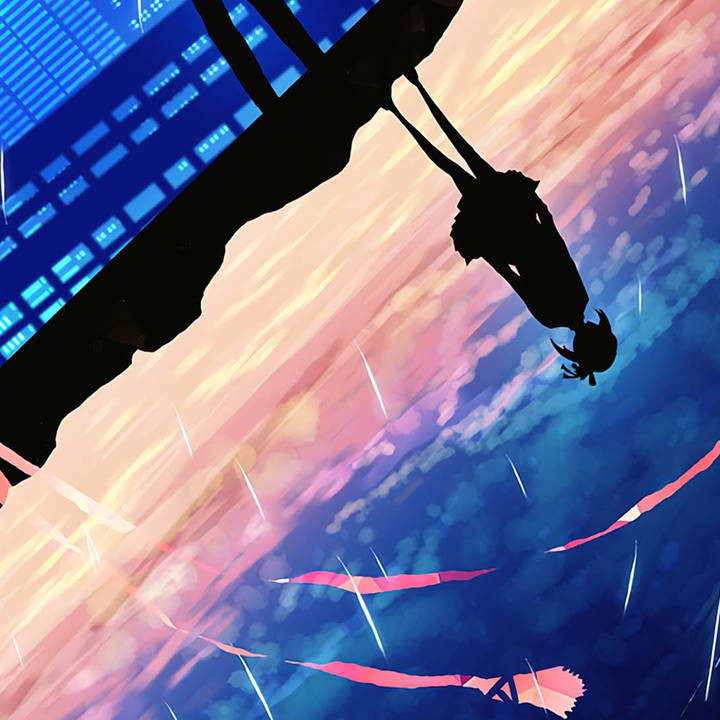
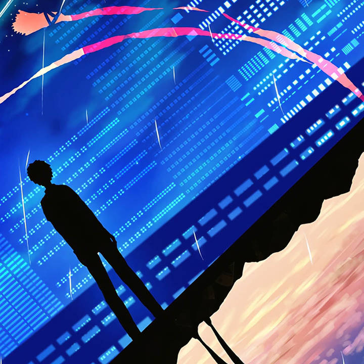

It's really hard for me to type something in this post, all I want but can't express is fearness.

<!--more-->

<iframe frameborder="no" border="0" marginwidth="0" marginheight="0" width=330 height=86 src="//music.163.com/outchain/player?type=2&id=503268&auto=0&height=66"></iframe>

Don't know how to express, I think if to express is a kind of ability, I must lose this for a long time.

All I am trying to do is just like a man who cannot swim but trying his best in water, you cannot say he did nothing to help himself, but in fact his work did nothing.

I am really afraid of losing control of everything I can reach, I want everything go as my thought, even a little difference can drive me crazy.

I have no time can express except the darkest night, everyone lives in everyday works so hard, I cannot give them a sad face.

I give it to myself. I am trying to be the most perfect and attractive to other people. I know I always fail.

I know I did things wrongly, but I need chance to redo.

Chances are expensive, but only you get chances can you make changes.

All things go like this must have reasons.

Sometimes I find myself boring.

I did lots of things to find other interests to support life.

I listen to music, but I find I got crazy and press next in 30 seconds for a song. I cannot keep listening to even one song, I just feel tired.

I read books, sometimes I can read them quickly, but most I cannot read even one page.

I cannot write even one line of code.

I play games from day to day, but not so happy.

I want to stay alone while I want someone can stay with me.

I nearly get the one, I nearly lose the one, I don't want to lose the one, I must regain the one.

But how can I get a chance?

Will there be a person from the future telling me that the result?

I know no one can lives in his fifteen forever.

I used to think little about the far future.

Now I still think little, but a little bit further.

Totally out of my control, the future.

Girl inside.

Maybe I can only write such boring things now.

Sorry.

Be brave, just two simple words, but how can I keep brave while facing uncertainty?

I still trying to make me seems perfect.

I know only in this way can I regain chance.

Just for a chance.

Leave tears and fearness to myself, I won't let others see.

But who can wipe my tears when I wake from dream in midnight?

*AlynxZhou*

**A Coder & Dreamer**
