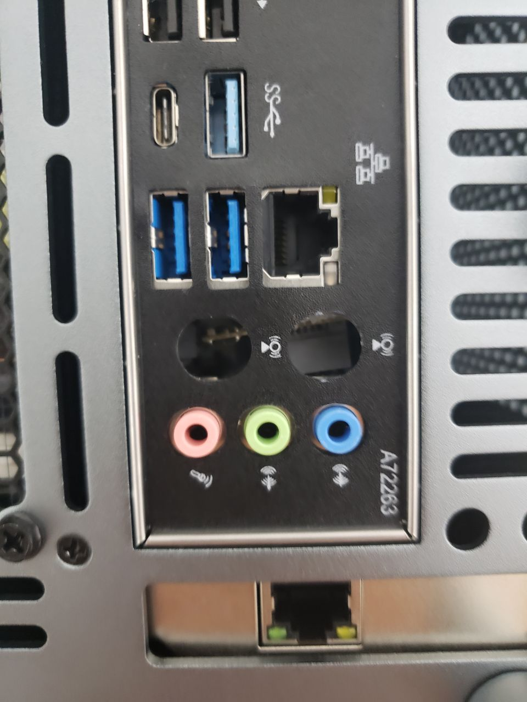
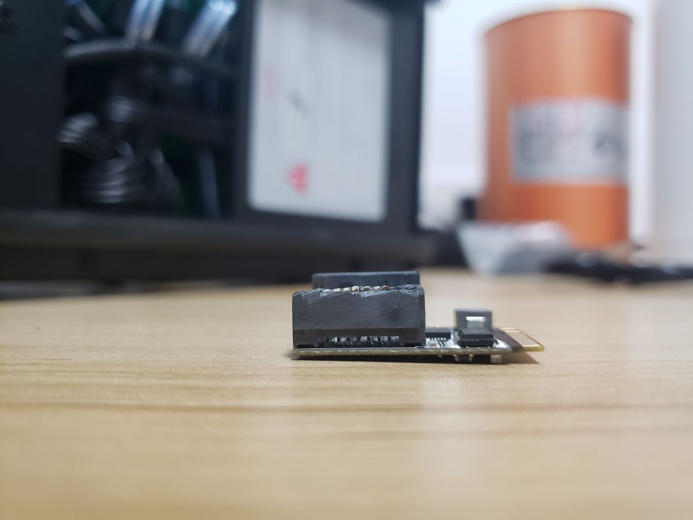
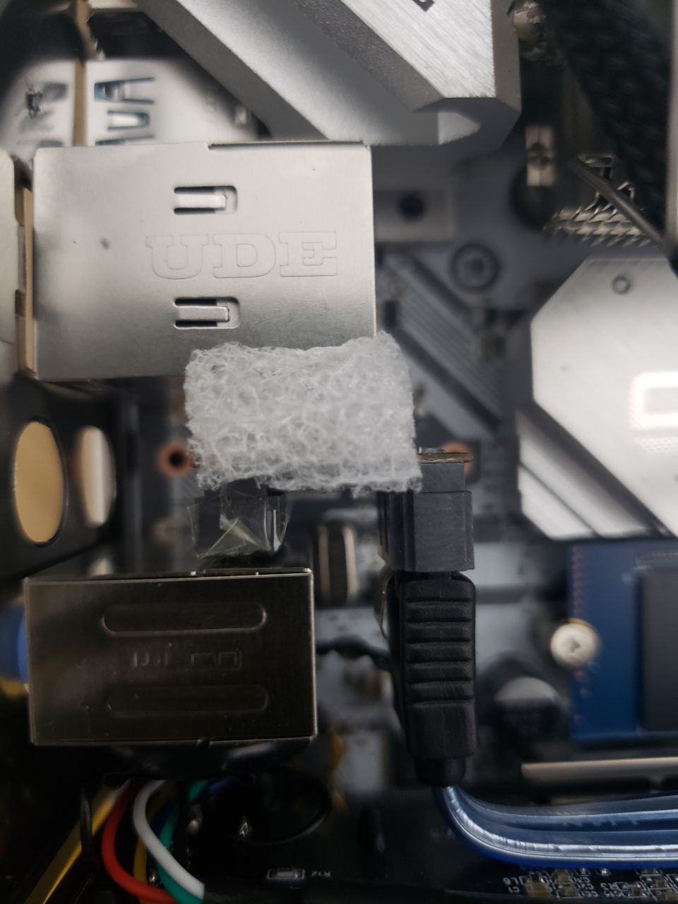
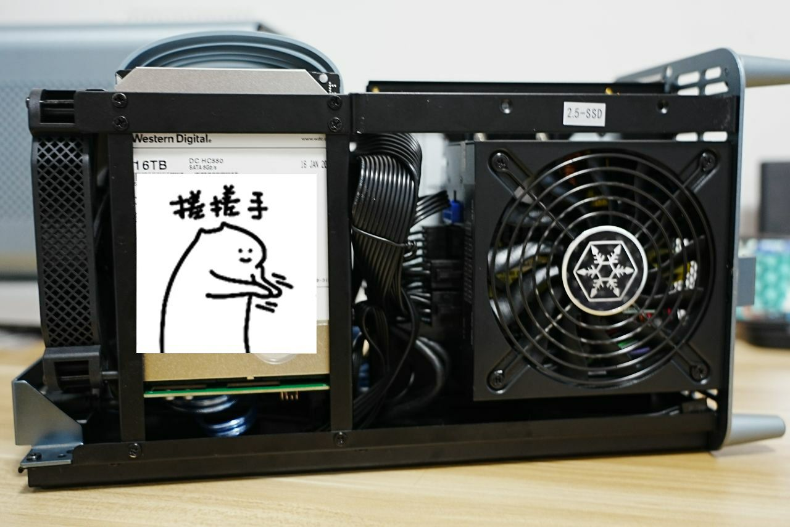
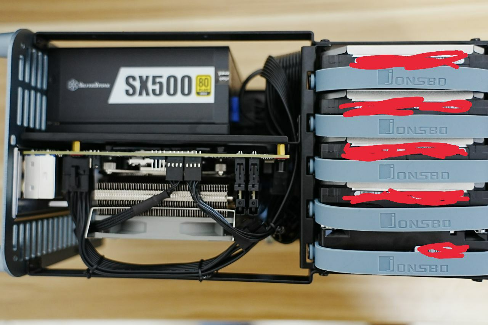
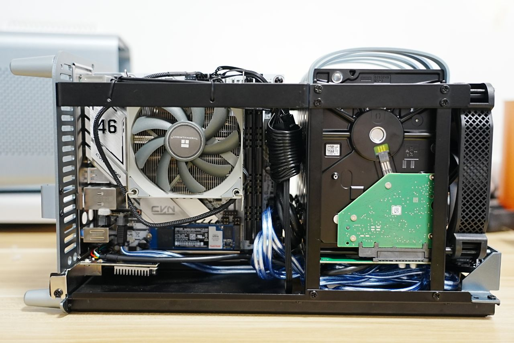

本来我是不打算装 NAS 的，甚至都把我的星际蜗牛关了，因为我觉得我又没有网络多人协作的需求，而且我醒着的时候我的台式机也醒着，我睡着了又不会用到网络存储。不过自从我买了相机开始拍照片录视频，存储空间就越来越紧张了，先是把我机箱里的硬盘从 2T 直接升级到 8T，又觉得没有冗余始终心慌慌。偏偏我现在这个机箱哪里都不错，就是机械硬盘位不太充裕。为了扩展存储空间，也只能装一个 NAS 了。

<!--more-->

决定好装 NAS 之后比较难的就是选硬件了，我肯定不会买那些闭源拖拉机的，我要装 Linux。肯定排除掉星际蜗牛，因为我实在不放心用那个背板带四块硬盘。然后对这种低功耗的设备用那种主板和 CPU 集成的赛扬应该不错，还免了主动散热，不过问题是我不知道在哪里能买到。所以还是考虑普通零售的硬件，不过大部分零售的硬件都有点性能过剩了，挑来挑去挑出下面的一套配置，不过不建议大家直接拿过来用。

- CPU：i3-10105T 645
- 主板：七彩虹 B460I 579
- 机箱：乔思伯 N1 669
- 电源：银欣 SX500-LG 549
- 散热：利民 AXP90-X47 139
- 内存：光威 8G DDR4 2666 169x2
- 网卡：EDUP PCI-E 2.5Gbps 网卡 89
- SSD：闪迪 至尊高速 NVMe 256G 259
- HDD：西数 HC550 16T 1498x4
- HDD：希捷 酷鹰 2T 375
- 扩展：乐扩 M.2 A+E Key 转 SATA 75

下面简单介绍一下为什么选这套。

首先装 NAS 第一个要决定的不是别的而是硬盘，毕竟你这设备就是拿来放硬盘的，因为台式机里面已经有 8T 的硬盘了，我也不想再经历换硬盘时候拷贝数据的痛苦，所以还是直接上了 16T 的。这种容量建议直接购买企业盘，不过也就和静音说拜拜了。没选希捷的银河系列不是因为别的，只是因为西数 HC 系列便宜点而已。选 4 块盘而不是 3 块的原因也很简单，我不会用 ZFS，肯定要用 btrfs，但是 btrfs 的 RAID5 有 bug，于是性能容量冗余的平衡点就是 RAID10 了，那就需要 4 块硬盘起步。

决定好硬盘之后就得选合适的机箱，毕竟你得能把硬盘装进去，不过我对大部分的 NAS 机箱都不满意，有些类似个人产品或者众筹的机箱比如什么宝藏盒TANK之类的看起来很能装，但是造型不伦不类，做工也一般般，然后可能迎广或者万由有一些成品 NAS 机箱看起来不错，但是基本上是高配蜗牛，而且我实在不想用 flex 电源。其实某种意义上我是先看中乔思伯 N1 这个机箱才决定装的 NAS，我对这个牌子其实没什么好感，但这个机箱实在是过于好看，而且可以装 SFX 或者 SFX-L 电源，还是有很多零售产品可以选的。

选好机箱以后就是机箱里能塞进什么硬件就塞什么硬件了，乔思伯 N1 和大部分 NAS 机箱一样都只能放 ITX 主板，但 ITX 主板可选的实在不多。首先我想要一个内置核显的 CPU，因为最简单的调试办法肯定是给机箱接上键盘鼠标显示器，也比较方便调整 BIOS，而 ITX 只有一个宝贵的 PCIE 插槽，再说 NAS 多半也没必要上个亮机卡耗电。而 AMD 那边 200GE 太弱了，Ryzen Pro 系列又太强了，实在不知道选什么比较好，而且也不容易买到最低配的 Ryzen Pro CPU，所以就选 Intel i3 了，正好还有带 T 的低功耗版本。同时 10 代的主板还比较好买，也就是说能买到新的。虽然这台机箱前面有 USB-C，不过实际上是和 USB 3.0 共享一个插座，所以也不需要主板有 USB-C 的插座。七彩虹这块 B460 的优点在于后面还是有一个标准的 USB-C 接口，以及能在京东自营买到。

SFX 电源虽然不如 ATX 电源好选，但是仍然比 flex 电源好选太多了，而且这台机器还可以放下 SFX-L 的电源，12cm 的风扇肯定比 4cm 要安静很多。于是我就在京东随便挑了一个观感不坏的牌子的全模组 SFX-L 电源里功率最低的。不过装这个机箱的时候最好注意一点，买的电源的 24pin 线最好不要是那种捆成圆柱型的，因为需要从主板边上极小的缝隙里拉过来，排线肯定比圆柱线要容易过，银欣这款是排线。当然你是定制模组线的有钱人当我没说。

这款机箱最高可以支持 70mm 的下压散热，所以其实完全可以买利民那款 12cm 的散热器，不过我觉得也无所谓了，我比较担心 12cm 的下压散热会导致在主板上装内存和 SSD 比较困难，9cm 的也够用了。

内存其实是随便选的，因为我不用 ZFS，其它文件系统对于 ECC 也没那么严格的依赖。然后 i3 和 B460 也不会支持更高的频率了。

考虑到我的台式机上有两个网口，分别是 1Gbps 和 2.5Gbps 的，我就在想可不可以把 NAS 和台式机通过 2.5Gbps 直接连起来（路由器什么时候普及 2.5Gbps 啊），这样速度基本上和访问本机的机械硬盘没有太大差距。但是主板厂家实在是太抠门了，本来 ITX 主板型号就不多，内置 2.5Gbps 网卡的就更少了。虽然让一个 2.5Gbps 的网卡占着 PCI-E x16 插槽实在是有点浪费，但也没别的选择了。至于万兆，考虑到要使用专门的线和专门的网卡，还得给台式机也装一个，算了吧，反正机械硬盘的阵列也跑不满万兆。

然后系统盘只要随便搞一个 NVMe 就可以了，反正安装一个 Arch Linux 不会占用多少空间。实际上比较头痛的是怎么接上所有的硬盘。这款机箱有 5 个在背板上的 3.5 寸硬盘位和一个单独的 2.5 寸硬盘位。大部分 ITX 主板都只有 4 个 SATA 接口，本来我觉得接 4 盘的阵列够了，但是后来我发现北邮人 pt 可以使用我的交大学校邮箱注册……要是挂 PT，我觉得还是单独放一块硬盘比较好，那接口就不够用了。比较靠谱的办法是买 HBA 卡把 PCI-E 转成 SATA，但是已经被 2，5 Gbps 网卡用掉了。我还没有发现同时有网卡和 SATA 的 PCI-E 扩展卡。还有一个方案是 M.2 转 5 个 SATA 的转接卡，其实倒也可以用一块 2.5 寸的 SSD 当作系统盘，然后解放出这个 M.2 接口，不过我实在不放心把 4 盘阵列放在这种转接卡上……而且我估计系统盘也是不能接在转接卡上的。当然你可以买一块有 2.5 Gbps 网卡的 ITX 主板，不过那基本只有 Z590 可选了，最便宜的华擎 Z590 ITX 也要 1400。所以我最后采用的方案是放弃掉无线网卡，反正 NAS 摆在路由器附近可以拉网线，然后把无线网卡下面那个 A+E Key 的 M.2 接口利用上。有这样的转接卡，可以转接出两个 SATA 口，虽然我只要一个就够了。

不过当我拿到转接卡的快递之后发现安装还是有点麻烦。最好的办法是拧下无线网卡之后发现那个保护罩可以拆掉一侧的面板，然后可以把无线网卡从保护罩上拿下来再换成转接卡。但是那个固定无线网卡的螺丝实在太紧了我拧不下来，只能放弃这个保护罩，反正转接卡应该也不会受到什么外力，就在我把转接卡插好打算开机之前，我发现还是有点问题……虽然 SATA 接口已经够矮了，但是里面那个用不上的 SATA 接口还是顶住了前面的音频接口，导致转接板是歪的。其实可以淘宝再买一个 M.2 A+E Key 的延长线，不过那样我纠结的就是把延长出来的转接卡固定在哪里了。不管了！反正我就要一个 SATA 口，用刀把里面的 SATA 口的顶端削掉吧！虽然削的很粗糙但是还是达到了效果，然后用一块胶带把那个口粘住，防止 SATA 接口里面的金属触点接触到音频口保护壳而短路，再把一块泡沫放到转接板后面顶住转接板，我觉得就差不多了。

直接装上是歪的：

“高个的 SATA 接口被我给锯了，比矮个的还矮！”：

“磨”改之后的效果，应该没问题吧：

最后就是绞尽脑汁把各种线塞到 ITX 机箱里面，实在是太痛苦了。对了，这个机箱自带的风扇接线不是很长，而它那个硬盘背板上的插针又是满速的，如果你要是想插到主板上进行调速，最好自备一根 4pin 风扇延长线。

剩下就没什么好说的了，毕竟我不打算在这里复述一遍 Arch Wiki。我对 btrfs 使用的参数是 `-m raid1c3 -d raid10`，然后在系统里设置了 samba 和 transmission 的daemon。最后附上一些装完的照片。

