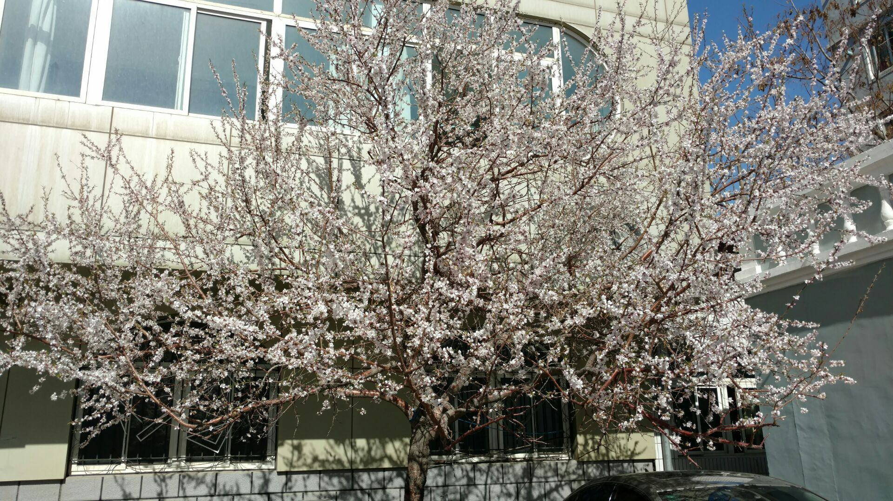
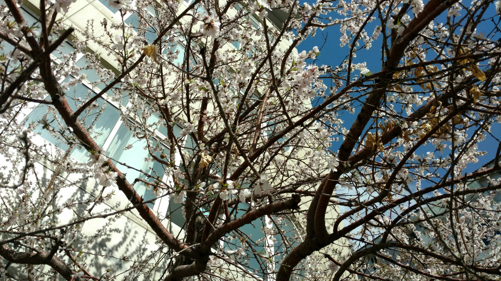
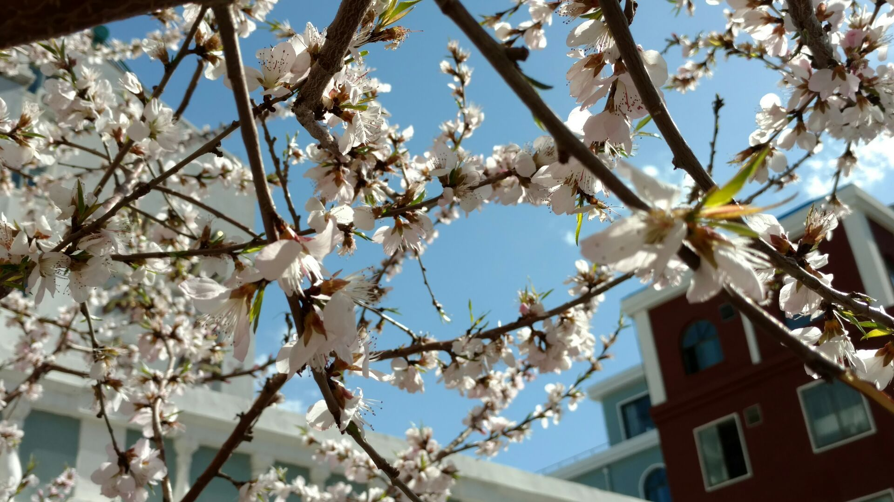
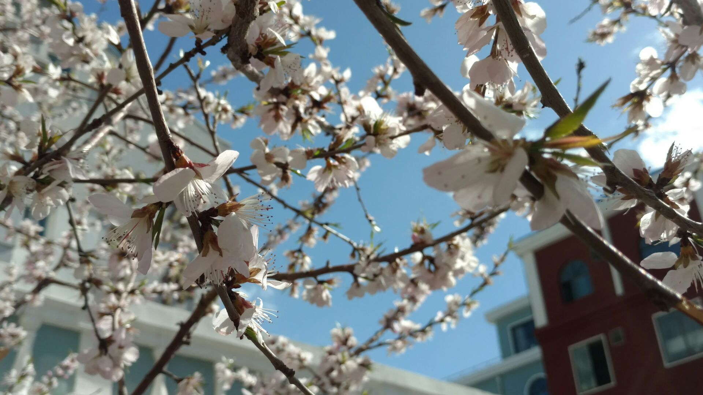
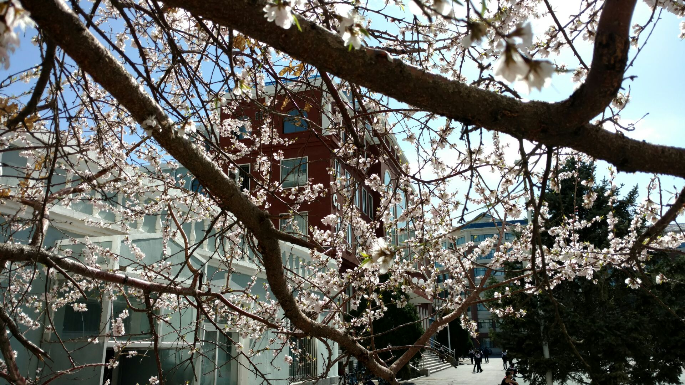
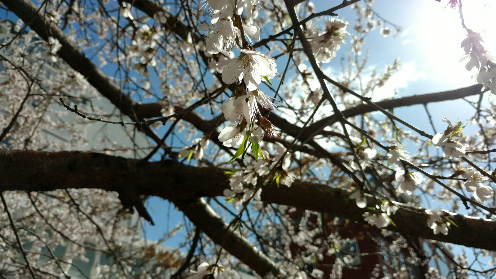

如果不是因为角落里的那棵树又开了花，我也许不会意识到春天来了，而只任凭它悄悄从屋外溜过。

那是一棵不知名的树。虽然是树，却并不比周围的灌木显眼几分，甚至直到它所有的花苞绽放时，人们的目光也只会被那两棵仍未开放的玉兰夺走。

<!--more-->

所以我一直怀疑，除了我以外，是不是只有它一个人孤芳自赏。但即使如此也不能让它辜负时光，这是它的春天，但不属于我。

所谓杏花春雨，雨确实是第一场春雨，但它是不是杏花却无人知晓。这场春雨把它的花瓣种到了它周围的每一片土地上－－不要担心，留在树上的更多一些。

雨停了，天是蓝色的，极好极好的阳光又落在它身上，风一吹似乎能听见花朵歌唱的声音。似乎它没有花香，但对于我这么一个从来就不能欣赏花香的鼻子，这或许更是一种怜悯。

树，也会有前世今生吗？我固执地想。也许你的前世是一棵胡杨？它一如沉默。偏偏我总是认为沉默的人都是因为天机不可泄露，所以我想，答案是肯定的。

那么它的前世就一定是一棵胡杨，对，就是那种生长在沙漠中一千年不死，死后一千年不倒，倒后一千年不朽的“神树”。那这些花瓣就是它的眼泪了？我想。孤单而耀眼地走完了三千年执着守候的前世，今生才甘心做一株角落里的小树，好让自己有足够的时间，把前世的眼泪一片片地流光。

我无数次地想象自己在树下，风一吹过，漫天的花瓣飘落。喂，你等了前世，又等了今生，等的又是什么呢？

它不说，但我看到了它的倔强，无论是前世三千年的生命，还是今生。即使每片花只有三秒在风中飞舞，它也要让自己在有限的时光里尽情的灿烂。

夜晚的风吹来慵懒的凉意，如果有机会，我一定要坐在那里静静地想，从黄昏到天明，把天上的云朵化成繁星。或许冥冥之中自有定数，让每一个执着等待的人都成为了一棵树，这样才能一直等下去，好让等到的那一天恢复成青春年华，相守共度？又或许因为每对相互等待的人都变成了两颗相互守望的数，无法动身相见，所以才有了这世上的遍地繁荫？那么树，你所等待的树又在哪里呢？

我不知道当年是怎样两个人怀着相思种下了这一堆树，但我痴痴地相信，假使我见到另一棵树，应该和它一样，亭亭如盖了。

写于2016年4月1日。

