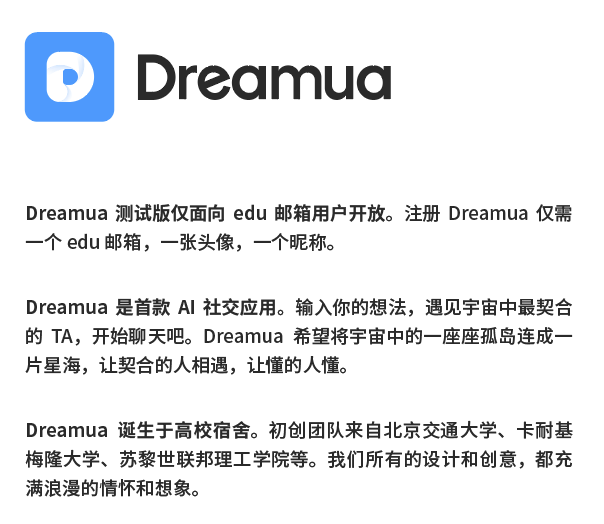

一个多月没更新了，这次要写的不是什么技术问题，而是技术的附属问题。

<!--more-->

一切问题的起源是邮箱里出现的这两封邮件：

当你使用的邮箱服务是按某种数字顺序批量注册用户名的时候，你就没办法避免这种情况，不止我自己，而是很多人都收到这种邮件，没办法，谁叫邮箱都是连号的，甚至不需要写脚本，只要用 Excel 拖一下就能生成一大串邮箱地址，毫无技术含量。

从哪里开始呢？今天我不打算讨论写这么个 app 的技术问题，因为不管怎么说写这么一个系统也不是个简单的活，还是要尊重别人的劳动成果。但除了技术问题，别的问题就一大堆了。

# 我不想下载

没错，最大的问题其实是我看了这个东西以后根本没有下载的欲望，甚至连让我下载下来找找里面有哪些技术缺陷的欲望都没有。我也不是什么专业的传播学者或广告设计者，但从一个用户的角度而言就没有使用欲望——而且这种现象也不止我自己。

# 你的情怀和我有什么关系

> 今年春半，凝聚了团队无数努力和心血的项目终于开启了测试阶段。这对于我们整个团队来说都是一个饱含着拼搏意义和激动情绪的时刻。

上一个想要靠卖弄情怀来宣传聊天软件的人叫罗永浩，结果如何呢？提起罗永浩大家还是首先想到 TNT、打脸，有几个想到聊天宝（**原子弹短信**）的？罗老师的原子弹短信一开始可是给用户发红包的，这年头光卖情怀可不行，大家都喜欢红包。

我知道你们实现了目标非常开心，但能不能冷静下来再发广告，这句话放在这里除了浪费几 Byte 流量之外，对用户了解你的应用有什么帮助嘛？

# AI 不是万能形容词

> Dreamua 是首款 AI 社交应用。

如果你做了个图片识别程序，你打个标签叫 AI 识图，那我觉得你的可信度有 90%，毕竟有很多现成的例子了。

如果你做了个文本翻译程序，你打个标签叫 AI 翻译，那我觉得你的可信度有 70%，因为有几家财大气粗的公司在做，虽然效果不一定太好。

如果你做了个自动驾驶程序，你打个标签叫 AI 驾驶，那你的可信度取决于你是不是在特斯拉上班。

如果你非得叫 AI 社交……AI 社交了，还要我干什么？社交是人与人之间的互动哎，你这个 AI 社交，AI 在里面扮演什么角色呢？AI 能猜出来“今晚月色真美”的潜台词嘛？要是能猜出来，全世界的翻译官都失业了。

写广告的人不懂的话可以问问程序员，最起码程序员应该懂。

# 求你别搞假大空

> 我们想了很久的slogan，最后把它决定为“Dreamua—遇见宇宙中最契合的TA”。
> “宇宙”、“契合”是很宏大的词，但是我们希望可以和你一起，实现这个slogan的意义。

如果语文老师没教你避免假大空，那软件工程老师应该教过你怎么写文档，**请问你们这个软件是想让我和外星生物配种嘛？**

# edu 邮箱就很靠谱吗

> Dreamua是一个仅对edu邮箱用户开放的高校社交App，其核心和灵魂是AI社交。注册Dreamua 账号无需填写复杂简介，仅需一个edu邮箱，一张头像，一个昵称。

废话，**edu 邮箱要是那么靠谱，我就不会收到这个邮件了**——毕竟发件人也是 edu 邮箱。

一个 edu 邮箱能说明什么呢？学号？学校？这个邮箱的主人可能已经毕业了，比如发邮件的这位 14xxxxxx，你是留级了在读大五？

知道为什么我用 edu 邮箱申请 GitHub 学生认证不给过吗？就是因为国内的 edu 邮箱管理太松散了，完全没办法辨别真伪。那既然邮箱不能验证我是不是学生，再加一张头像一个昵称就能验证我是不是学生了吗？

如果你们下次还想发广告，我觉得可以去淘宝搜索一下“教育 邮箱”，多买几个马甲，别总用一个，添加黑名单很容易的，大家只是太懒而已。

# 说话能不能说准了

> Dreamua是一个仅对edu邮箱用户开放的高校社交App。
> Dreamua 测试版仅面向 edu 邮箱用户开放。

第一封邮件告诉我这个社交 app 只对高效学生开放。第二封就告诉我是测试版仅面向 edu 邮箱——那以后呢？

# 生人社交本身就是伪命题

求求你了我们真的不是没社交就会孤独到死。不是每个人每个晚上都睡不着觉拿着微信疯狂摇一摇。我有自己认识的人，我可以认识我认识的人认识的人，我甚至看到有趣的人也可以直接上去要联系方式——或者我干脆就不想和别人说话。

从小到大不爱和人说话的同学我见得多了，他们活得好好的，也没见谁需要下个 app“寻找志趣相投的伙伴”。**实在不行的话，我还有沙雕网友呢。**

# 我为什么非要用你的

我倒不是说微信微博 QQ 做的比你们技术好，但每个人都或多或少的被这些或者其他 app 黏着。本身这些东西已经够用了，我看不到需要切换到第 N + 1 个 app 来和别人说话的任何理由，特别是对于我们这些生活在地球外面的人，想切换就更艰难了。

原子弹短信的尸体还在墙头上挂着呢，支付宝也有聊天功能，除了聊天框里的“转账”按钮，你按过别的吗？

# Play 商店搜不到

这一条可能有些不接地气，但对 Android 用户来说，Play 商店是最可靠的程序来源，就如同苹果的 App Store 一样。只有 Play 会定期检查手机里的 app 是不是有安全问题，其它的国内商店根本没有安全保证——拍个身份证照片注册就安全了吗？

我看到你们的 app 提交了 App Store，所以应该不差那 25 美元提交 Play Store 吧，毕竟我自己的开源 app 也掏了 25 上了 Play 呢。

# 官网没有可用信息

还好我能够在 Google 搜索到 <https://www.dreamua.com/>，但这个页面逻辑和我自己的 app 页面 <https://livewallpaper.alynx.xyz/> 逻辑差不多嘛——就一个简单的静态页面，分几个段落，写一些半通不通的话（“年轻有朝气的初创团队，致力于打造一家有影响力、有社会责任感的互联网科技公司。”这话怎么读怎么奇怪）。既然你都注册公司了，多写几个页面问题不大吧。你们是公司，我可是一个人单打独斗写的 app，不至于和我一样套开源 bootstrap 主题吧！

顺便，上面写诞生于高校宿舍，下面又写有 Uber、Facebook、Amazon、腾讯等知名互联网公司工作经验……大概能是真的，就是会让人觉得开发之后已经换了一波人一样，再说，腾讯出来的人写个前端页面不难吧。

# 化再浓的妆也没用

说实在的，我对用户群体的评估可能有点失误，真的有人告诉我他们的室友下载了这个 app，后一句就是喜闻乐见的“想通过这玩意脱单”。

你看看你看看，人家用户都摆明了自己的需求了，就不要写什么“将宇宙中的一座座孤岛连成一片星海”了。单身直男们也该思索一下了，为什么夏目漱石说“今晚月色真美”是表白，你说“今晚月色真美”就是华为 P30 Pro 的高端黑了，你看王跃琨一下子就被开除了！太晦涩难懂是没法脱单的！

# 真的别再卖情怀了

> 首先谢谢你打开这封信。
> 我们是交大的一个学生团队，我们和你们一样在学活吃渔粉，在球场踢足球，在傍晚看明湖鸭。
> Dreamua 诞生于高校宿舍。

说真的，你这样会让别人对我们宿舍里这些同学的真实水平产生怀疑——我觉得我们学校的教学还是偏重于踏踏实实讲理论老老实实学技术的，而不是选个厮杀的你死我活的行业（你们的对手不止有探探陌陌 Soul 其实还有微信微博 QQ 甚至是 Bilibili 和网易云音乐）来创业，写一堆乱七八糟的文案卖情怀。

以前好像有个公众号，文案风格如出一辙，也挺喜欢卖情怀的，结果清华评特奖的时候从简历上被人挖出来婊说实际什么都没做。我觉得这种事情给人留的印象挺差的，所以还是别卖情怀了，能好好写文案就好好写，写不出来吃点渔粉踢会足球看看鸭鸭可能就有灵感了。

# 百度没收录我的网站

最近那个《旗帜鲜明地反对李彦宏当选工程院院士》挺出名的。我先声明一下，我的网站放在地球上，谷歌必应收录了我的网站而百度搜狗 360 这种辣鸡引擎没有收录，特别是百度还把山寨我的站点放在了搜索结果首页上。所以百度和我没什么利害关系，我也就不担心这种问题。

至于腾讯封了《旗帜鲜明》我也不太担心，毕竟我这人不喜欢用微信，连公众号都没有，生平最烦举报党。

我恰好想起来今天是我建站的三周年零一个月整，114777 个点击量不算太多，但从第一篇文章开始我的目标就没变过——“网站是属于自己的，我可以记录我自己的想法，喜不喜欢则是你的自由”。

*AlynxZhou*

**A Coder & Dreamer**
