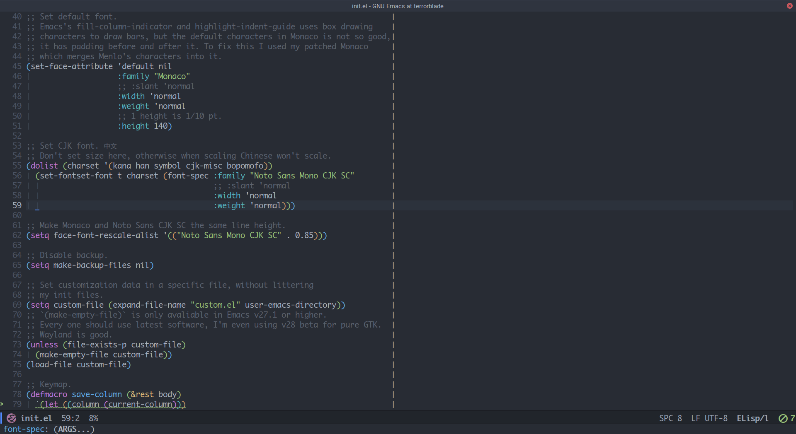
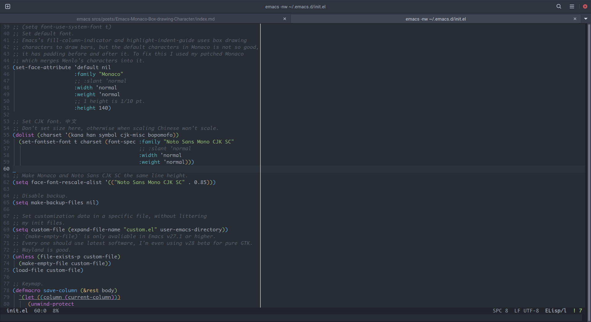
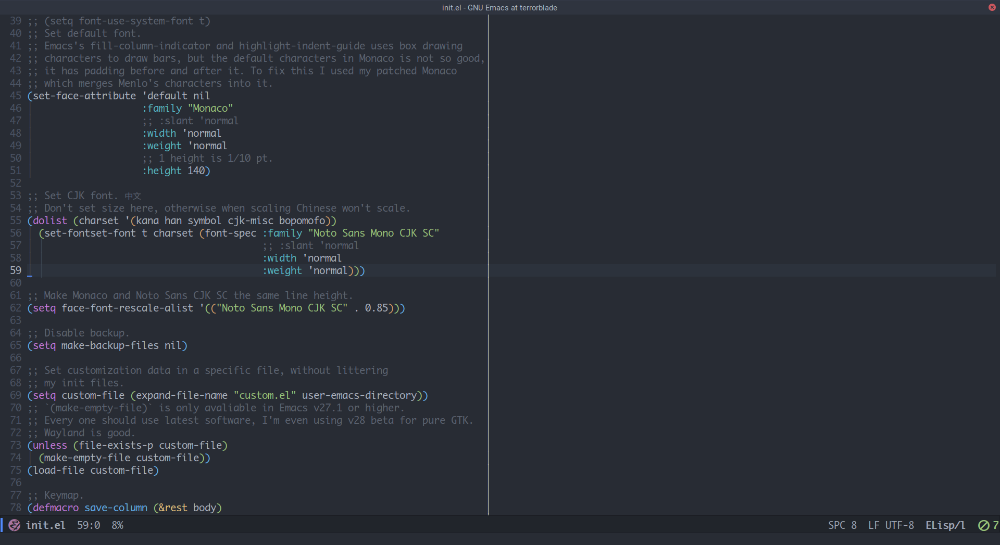

2016 年的我开始用 Atom 这种“modern”的编辑器，2022 年的我却又开始用回岁数比我都大的 GNU Emacs。切换的理由其实很简单，我曾经以为一直能追上最新版 Electron 的 VSCode 会成为第一个纯 Wayland 的代码编辑器——只要 Chromium 那边支持纯 Wayland 就好了嘛，然而直到 Emacs 那边的 pgtk 分支合并进主线（以防有读者不太清楚来龙去脉我解释一下，Emacs 虽然有图形界面，但实际上只是用 X 实现了一个 Terminal 层，而传统的 GTK3 界面只是使用 GTK3 创建一个 X 窗口，然后其它操作都是通过 X 进行，这实际上非常不适合 GTK3，导致了很多 bug，同时也使 Emacs 没法利用 GTK 的 Wayland 后端。而 pgtk 分支则是在 X 部分之外另起炉灶，利用 GTK 实现了一个和 X 部分平行的 Terminal 层，全部的绘制操作都是以 GTK/Cairo 的现代程序方式进行，自然也就摆脱了对 X 的依赖。总之在 Emacs 这样又老又庞大的代码库上做如此大范围的工程我觉得可以称得上是一项壮举了。），Chromium 的 ozone backend 还是问题多多。虽然 Emacs/Vim 这种软件看起来确实有点老派作风，但没想到也有走在这些“现代”编辑器前面的地方。

<!--more-->

至于这和我换掉 Atom 有什么联系呢？主要是我发现在家里的台式机上，所有 XWayland 程序在 nvidia 驱动下面都会有闪回的情况，也就是说你打字的时候突然会闪回前几帧的画面，过一会再闪回来，你经常看不到自己输入的字符。Electron 程序尤其严重，也就导致我没有办法使用 Atom 写代码，于是不得不捡起以前东拼西凑的 Emacs 配置重新研究。（奇怪的是我自己的台式机也是 nvidia 驱动，没遇到过这种问题。）

扯远了，这篇文章主要想记录的问题是什么呢？其实还要和 Emacs 绘制界面的方式有关系，对于 Atom/VSCode 这种基于浏览器的程序来说绘制点什么图形元素很简单，但是对于 Emacs/Vim 这种来自于终端里的程序，开发者们习惯的是处理字符而不是处理图形，于是你会发现比如 80 column ruler 或者 indent guide 这种东西，在 Emacs 里面其实是通过在对应的位置插入竖线字符实现的……我个人不太喜欢这样，一个原因是我以为竖线字符并不是占满整行而是上下有空白。我一直以为这是 Emacs 的问题——你干嘛用竖线字符画 UI 啊。



直到有一天我输错了 alias 在 GNOME Terminal 里面打开了 Emacs，我惊讶的发现竖线竟然接上了头！



我当时就震惊了，我的终端和 Emacs 用的是同样的 Monaco 字体，怎么会不一样呢？难道是 Monaco 字体有问题？于是我上网搜了一下，我以前一直以为是 Emacs 的哪个设置比如 line-spacing 我没搞好，怎么搜也搜不出来，这次换成搜字体一下子就找到原因了：一个 Alacritty 的 issue 里面和我有同样的问题，不过他是 tmux 的分割线接不上头，都是 Monaco 字体。

为什么只有 Monaco 接不上头呢？原来在字符界面下画这些竖线的字符和平时用 `Shift+\` 输入的字符并不是一个，这类字符叫做 [Box-drawing Character](https://en.wikipedia.org/wiki/Box-drawing_character)，主要的范围是 `U+2500` 到 `U+257F`，这些字符用于在终端里绘制方框或者其它形状，所以应该是没有 padding 的，才能接上头，而 Monaco 这里有问题，它给这些字符加上了 padding，导致接不上。我尝试着给 Emacs 的字体换成 Source Code Pro，竖线立刻就连上了。

怎么解决？换字体？不可能的，我是 Monaco 的狂粉，看惯了 Monaco 再看别的字体都觉得傻了吧唧的。如果不是因为它好看我才不会忍受它这么多缺点（没有内置粗体，虽然是等宽字体内部的连字表却和非等宽字体一样，有版权不能二次分发）。解决方法其实比较简单，把 `U+2500` 到 `U+257F` 的字符换成正常字体里的就可以了。简单的解决办法是用 FontForge 的同个实例打开 Monaco 和另一款字体（我选择了 Menlo，Menlo 是苹果用来替代 Monaco 做内置默认等宽字体的，应该会比较接近），然后选择 Monaco 的这个范围清空，然后选择 Menlo 的复制粘贴过来。不过我没在 FontForge 里面找到连续区间选择的办法，上网搜了一下说可以用它的脚本 API 选，办法是打开 File 菜单里面的 Execute Script，执行 `fontforge.activeFont().selection.select(("ranges", None), 0x2500, 0x257F)`。如果你不知道怎么把 Menlo 里面的一段字形复制粘贴到 Monaco 里面，你也可以在 Menlo 里执行这段脚本，然后反选，全部清空，然后把这部分生成一个字体，再去 Monaco 里面选 Elements 菜单里面的 Merge Fonts。

或者你也可以看看这个 [叫 Menloco 的项目](https://github.com/Alhadis/Menloco)，是我偶然间搜索到的有同样问题的用户的解决方案，这个项目包含更多的细微 tweak 脚本，帮你利用 Monaco 和 Menlo 合并出一个 Box-drawing Character 能完美接头的字体。不过有几个地方需要注意，一个是这个项目的作者应该是 macOS 的用户，如果你不是 macOS，需要自己想办法搞到 Menlo.ttf 和 Monaco.ttf，简单的办法是找个用 Mac 的朋友让他发给你，不过有可能你得到的是 Menlo.ttc，需要用 FontForge 打开选择 Regular 字重，然后导出成单个的 ttf。你还需要修改 `utils/find-font.sh`，这个脚本的 `font_paths` 只包含 macOS 放置字体的目录，你得加上你自己放这两个字体的目录。以及这个项目默认生成的字体名（不是文件名）叫 Menloco，如果你不想修改已有的写着 Monaco 的配置文件的话，就把 merge 这一项下面的 `--font-name=$(RESULT)` 改成 `--font-name=$(INTO)` 就好了。

生成一个没问题的字体之后你还可以像我一样用 FontForge 做一些修改，比如说我发现 Menlo 有很多 Monaco 没有的字符，于是我直接把 Menlo merge 进了生成的字体里。并且我之前提到过 Monaco 作为一个等宽字体，内置的连字表竟然是非等宽的，不是像 Fira Code 那种把不同的编程符号连字起来同时保持等宽的连字，而是像普通无衬线一样把 `fi` 一类的字符连起来变成单个字符宽度。我被坑得最狠的一次就是 review 同事的 patch，我问他这里是不是少了个空格，他说在他那看没问题，最后我发现是 Monaco 连字了！虽然你可以通过配置 fontconfig 关闭连字，但是 Firefox 是不吃这个配置的，而你也不可能给每个网页的代码块都加上关闭连字的 CSS。所以我直接在 FontForge 里面干掉了连字表，具体方法就是打开 Element 菜单下面的 Font Info，点击左侧的 Lookup，选中带 liga 的项 delete 之后导出字体即可。

还有一个比较古怪的 Emacs 问题，Emacs 设置字体和其它程序不太一样，可以先设置一个默认字体然后针对不同的字符集设置不同的字体，一般要为中文单独设置字体才能得到合适的效果，就像下面这样：

```elisp
(set-face-attribute 'default nil
                    :family "Monaco"
                    ;; :slant 'normal
                    :width 'normal
                    :weight 'normal
                    ;; 1 height is 1/10 pt.
                    :height 140)

(dolist (charset '(kana han symbol cjk-misc bopomofo))
  (set-fontset-font t charset (font-spec :family "Noto Sans Mono CJK SC"
                                         ;; :slant 'normal
                                         :width 'normal
                                         :weight 'normal)))
```

首先要注意 height 的单位是 1/10，所以你想要的字号需要乘 10 才行。

然后你会发现明明你只设置了一个字号，可是中文和英文字体却不是等高的！也就是说如果你在本来都是英文的一行里面输入一个中文字，那这行的高度就会突然跳一下变高，非常烦人，也许是这两个字体在同样的字号的时候尺寸并不完全一致，但是明明其它程序都能正常处理，为什么这里这么怪！

你可能会想要对中文那段单独设置 size 缩小一点，但是这样不行，你用 `C-x C-=` 放大字体的时候中文字体就会固定大小不跟着你变了。正确的解决方法是加入下面一句：

```elisp
(setq face-font-rescale-alist '(("Noto Sans Mono CJK SC" . 0.85)))
```

这里你可以对任意的字体指定缩放参数，不会影响按键放大缩小。我尝试了一下 `0.85` 比较合适，虽然可能这样汉字看起来会稍微小一点，但是 `0.9` 就太高了仍然会跳。或许你会问那这样中文字宽不是英文字宽两倍了？那没有办法，Monaco 本身就属于一个比较宽的字体，那些满足英文宽度是高度一半的字体都比较瘦长，我个人是不喜欢这样的风格的，所以对于我来说等高就行了，宽度我不太在乎。

更新（2022-02-25T19:01:31）：我最近研究了一下，发现原来字号并不等于行高。虽然字体有一个 em size 作为基础的方块大小，但是设计师经常指定一些奇怪的 ascender 和 descender 值让字体的高度超出 em size……我不太清楚 Atom 或者说 Chromium 是怎么进行中英文混排的，不过 Emacs 排版时候是对齐 baseline，然后 ascender 和 descender 完全一致才能保证行高不会在切换字体时候变化。但是这实在是太难了，大部分中文字体和英文字体都对不上，特别是 Noto Sans CJK 系列，不知道为什么比其它的高特别多。一个简单的解决办法是使用等距更纱黑体，里面混合的英文等宽字体 Iosevka 和中文的思源黑体拥有一致的 ascender 和 descender，但我实在是不喜欢 Iosevka。并且不知道为什么，Noto Sans CJK 和等距更纱黑体里面的内置的思源黑体应该是同一种字体，Noto Sans CJK 就要比他高很多。我还尝试了修改 Monaco 的 ascender 和 descender，不过这部分非常复杂，涉及到好几个不同的值，而且不同字体比例尺也不一样。最关键的是修改之后相当于把字体拉高了，于是 box-drawing character 又接不上了……上面那个修改缩放参数其实也不是无级缩放，实际上是乘字号之后取整然后再去找对应大小的字符，所以其实就是找小几号的 Noto Sans CJK。具体的可以在 Emacs 里面 `M-x describe-font` 查看详情。

更新（2022-02-26T09:51:25）：补充一下，浏览器的混排应该和 Emacs 是一样的，我刚才尝试了一下，我的博客行高固定是因为我给 `<pre>` 设置了 `line-height: 1.5`，这个大小超过了 Noto Sans CJK 的行高，如果删掉这一行，你就会发现含有 Noto Sans CJK 的行比只有 Monaco 的行要高很多。不过 Emacs 没办法像浏览器一样指定一个最小行高，只能是它自己根据这一行的字符计算行高，所以没什么比较好的解决办法。

搞定这些之后，至少 Emacs 里面看起来比较顺眼了。


