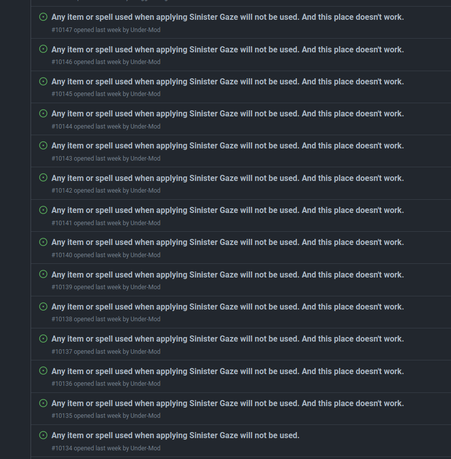

很遗憾的，我们没有生活在可以完全只使用开源软件的世界里，所以有时候不得不忍受一些闭源拖拉机的傲慢。一个经典的情况就是明明用户花了钱，还是得当孙子——我指的是用户反馈完全没有开发者看这件事情。或者更进一步，我认为 GitHub 或者 GitLab 的 issue （或者 bugzilla）是比用户论坛更好的反馈工具。

<!--more-->

一个发生在我身上的例子是 PowerAMP，我曾经是它的付费用户（现在也是付费用户，但并不是活跃用户）。PowerAMP 有这样一个问题，当你搜索一首歌的时候，你必须输入两个或以上的字符搜索才会启动。这对于英语歌来说不是什么问题，因为大部分单词都是两个字符以上，几乎不会出现需要依靠一个字符查找歌曲的情况。但假如你是一个不会假名的日语歌爱好者，你想要依赖标题里某个你认识的汉字搜索到你想要的歌，这时候 PowerAMP 的搜索就是完完全全的废物。至少对于我自己来说这个需求曾经切实存在了很长一段时间。我不是没有尝试给开发者反馈，PowerAMP 有一个自己的论坛用作用户反馈工具，但过了两年也没有人回复 [我的帖子](https://forum.powerampapp.com/topic/20907-start-searching-after-just-typing-1-character-instead-of-2/)。如果开发者完全不看用户反馈，或者只看热度高的用户反馈，那这论坛还有什么意义呢？

所以非常搞笑的结论发生了，我作为一个付费用户，最终的解决方案是我去学了五十音，不过这也没有完全解决问题，我意识到即使这样，仍然存在无法解决的情况：比如标题只有一个汉字的歌，你永远也不可能在 PowerAMP 里通过标题搜索到它（那英点了个赞并评论“最烦装逼的播放器作者”）。我甚至已经脑补出了作者洋洋自得地写下 `if (str.length < 2) return;` 以为自己对搜索做了天才般的优化，但在他可怜的脑袋里却找不到高德纳那句著名的“过早优化是万恶之源”，甚至用户的反馈也被他忽略掉了。最终我选择放弃这个自以为是的闭源拖拉机，换了一些功能没这么多，但却没有这个过早优化的替代品。

另一个我亲身经历的问题是 DaVinci Resolve，但是好话说在前头，比起大部分不友好的闭源软件开发商，BlackMagic
 Design 已经是班级里的三好学生了，我们就不提比如官方支持 Linux 这样大家都知道的优点，而是说一下同样的论坛反馈问题。Linux 版本的 DaVinci Resolve 不支持 Linux 上两种常见的输入法，而作为购买了 Studio 版的付费用户，我自然是积极的在官方论坛反馈了这个问题，结果嘛比 PowerAMP 好那么一点，一个 BlackMagic Design 的员工看到了我的帖子并把它移动到了 Feature Request 分区，然后就没有然后了。

在某些人试图为拿走他们钱的闭源软件开发商找“也许是 Linux 输入法太多支持起来太麻烦他们真的没有足够人力做”的借口之前，我要先发制人说明一下，这其实也是个“一行代码”就能解决的问题，甚至并不需要 BlackMagic Design 写实际的代码。DaVinci Resolve 使用 Qt 作为界面库，Qt 本身就做好了 Linux 下面常见输入法的支持，只要在构建时候打开开关就可以，所以问题的关键在于他们的团队里没有人意识到 Linux 下面的 CJK 用户需要打开这个开关，也没有人愿意去做打开构建开关这个简单的工作，只是让反馈的帖子烂在论坛里。甚至更进一步，为什么我这么确定只需要做这么简单的工作呢？因为我自己发现了一个 workaround，只要把系统里 Qt 输入法插件的 `.so` 文件复制到 DaVinci Resolve 自带的 Qt 的对应目录，一切就完全工作了，所以可以充分说明并不是存在什么难以克服的障碍。（如果你也需要解决这个问题，具体的操作请阅读 [DaVinci Resolve 在 Linux 下的输入法支持](../Input-Method-Support-for-DaVinci-Resolve-on-Linux/)。）

说到 DaVinci Resolve，他们还有一个令人迷惑的坐标计算问题。比如你在尺寸为 3840x2160 的画布里放进一个 200x200 的图片素材，然后想让这个图片向右移动这个图片的宽度，你应该输入多少呢，答案并不是 200，而是 3840。具体的计算逻辑大概是 `f(x) = x / clip_width * canvas_width`（计算纵坐标则需要换成高度，这样你横纵坐标看起来和实际位移完全不成比例），而这只是最简单的情况，如果你再对素材进行缩放，然后再进行裁切，那计算逻辑我也说不清楚是怎么回事了。如果你访问它的用户论坛，你会发现需要精确输入坐标的用户都对这个计算逻辑感到迷惑（相关的内容聚集在 [这个帖子（英语）](https://forum.blackmagicdesign.com/viewtopic.php?f=21&t=166202&sid=be6eee42737d87cb59463a6f3f3069c0)），并且这还导致了其它问题（用这个算法你可能需要输入极大的数值来挪动一个很小的素材，于是就会撞到输入框的数字上限）。但 BlackMagic Design 完全没有修改这个逻辑的想法。我可以理解为是怕影响兼容性，但完全可以添加一个设置项，如果勾选就保持以前的计算逻辑。这又是一个用户反馈了却被忽略的例子。

但如果你读到这里觉得闭源软件的用户论坛就是最烂的反馈工具，那你还是太高估了闭源软件开发商的下限了。另一个我亲身经历的例子来自亲爱的 Micro$oft，作为 RDP 的标准制定者，微软的 Android RDP 客户端基本可以认为是实质上的官方实现，但 gnome-remote-desktop 的开发者遇到了 [客户端内不能正确显示视频（英语）](https://gitlab.gnome.org/GNOME/gnome-remote-desktop/-/issues/99) 的问题，导致这个问题的原因是 Microsoft 的 Android RDP 客户端写死了 image stride，导致读取错误，老实说这不是什么大不了的问题，改掉就好了嘛。于是我就积极主动的去该 app 的 Play Store 页面打算写评论，但是我看到应用简介里说“我们不会看 Play Store 评论，如果你要反馈问题，请发送至 `rdandr@microsoft.com`”，于是我又写了封邮件描述相关的问题，然后被气了个半死：一封自动回复的邮件告诉我你应该到这个链接反馈问题，点开那个链接我得到一个大大的 `Error 404 This UserVoice instance is no longer available.`。说不定这些傲慢的开发者还在沾沾自喜：我们的软件质量真好，竟然没有用户反馈问题！（不过我刚才又查看了一下 Play Store 页面，现在他们换成了一个反馈链接，我暂时还没有测试这个链接是否可用。）

所以这其实是我推崇开源软件的原因之一：通常来说开源软件的开发者都很重视用户反馈，并且会建立良好的反馈渠道。即使你遇到了一个“知道错了，但我不改”的开发者，你也可以尝试自己动手修改代码解决问题，然后提交给他或者自己维护 patch。但对于闭源软件这显然不现实，你只能希望开发者大发慈悲常来看用户论坛并注意到你的反馈。

另一方面，issue 大概是比用户论坛更好的反馈工具。虽然对于闭源软件开发商，很难找到相关的例子，不过 Valve 就是这么一个独特的例子。以前他们使用 GitHub Issue 作为 DOTA 2 和 CSGO 的 Linux / macOS 版本的反馈渠道，后来更进一步鼓励玩家在 GitHub Issue 上反馈 DOTA 2 的 bug。虽然 Valve 也存在“知道错了，但我不改”这种情况（比如 Steam Linux 版的输入法支持，但这个和他们使用了自己编写的 UI 框架有关系，大概解决起来有难度），但他们的开发者确实会看 GitHub Issue，并处理玩家的反馈（比如在官网 [最新的一篇文章（英语）](https://www.dota2.com/newsentry/3640648066072340345) 里提到很多用户在 GitHub 上反馈了炸弹人的新 bug）。

  

但，是什么导致 issue 在用户反馈上比用户论坛效果更好呢？毕竟本质上二者都是“发帖”“回复”的流程，我尝试分析一下其中的不同。

一个我认为很重要的区别是社区文化，或者说是谁在使用相关的工具：2023 年，完全没有接触过开源项目的程序员应该是不存在的，也就是说如果你是开发者，你大概率早就使用过 GitHub 或者 GitLab 这样的工具，issue 对你来说是一个你会去重视或至少会去看的东西。而论坛更大概率不是开发者直接运营，也许是什么专门的论坛客服在处理，他们可能并不懂技术，或者就算开发者会参与进用户论坛，论坛帖子对程序员来说也不是什么一定要看的东西。当用户遇到问题的时候，向开发者直接反馈应当是解决问题最直接的途径，如果在用户和开发者之间插入一层不懂技术的客服，那大概率是场灾难。（我真的没有在针对什么“微软社区支持专员”哦，真的没有。）

另一个可能的原因也许是排序方式：issue 默认是按发布时间而不是回复时间排列的，因此开发者大概率会逐个查看新出现的 issue 并处理。但论坛通常默认以回复时间排列，更加重视“热度”，于是很容易出现一个问题不太热门就完全被忽略掉的情况，但对于软件开发而言，不应该因为一个问题热度不高就完全置之不理，因为热度可能受很多其它因素影响，比如用户主要使用的语言和开发者不同，反馈时存在语言或者网络障碍，热度不能直观地反映出程序本身的问题。

但也许上述区别只决定了开发者能不能看到用户反馈，另一个决定性因素是开发者想不想看到用户反馈。我个人是觉得对于软件质量的追求应该是程序员自发的而不是被迫的，所以对用户反馈更应当积极处理。不得不承认，相似体量的项目，开源项目的开发者比起闭源项目的开发者好像确实是更有责任感一点。
