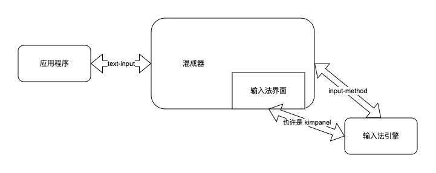
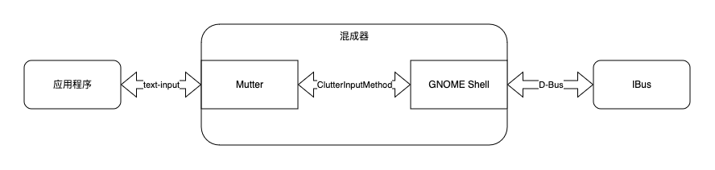

长久以来，用户对于 GNOME 的输入法是怎么实现的有着各种各样的误解，比如误以为 IBus 掌控从界面到引擎的全部逻辑。而我最近尝试给 GNOME 添加了 text-input-v1 支持，以便用户可以在运行于 Wayland 下的 Chromium/Electron 程序中使用输入法（Chromium 只支持 text-input-v1，而不是大部分其它程序都在用的 text-input-v3），这个过程中我阅读了大量和输入法相关的代码，打算把具体的结构写下来，这样如果有人想尝试修改，可以从我这里参考，而不是阅读错误的资料，找不到应该修改的位置，同时也防止自己某天想重新改的时候想不起来是怎么回事（实际上在我打算写这篇文章的时候发现自己已经开始忘记了，好恐怖）。

Wayland 下面标准的输入法结构分为三个部分，应用程序和混成器和输入法，其中应用程序通过 text-input 协议和混成器交换数据，混成器通过 input-method 协议和输入法交换数据。但假如你简单地把混成器对应成 GNOME Shell，输入法对应成 IBus，那就大错特错了。实际上 GNOME Shell 和 IBus 共同组成了这个结构里的“输入法”，而 Mutter 则实现了 text-input 和应用程序通过 Wayland 交互，也就是“混成器”，GNOME Shell 和 Mutter 则通过 ClutterInputMethod 这个接口交换数据，而不是 input-method 协议。下面我逐个解释具体的细节。

首先是“输入法”部分，IBus 本身是可以当作完整的输入法使用，也就是既包含界面又包含引擎，但实际上的运行方式是 IBus 只负责引擎部分，和界面有关比如候选词提示框和切换输入法的逻辑全部是在 GNOME Shell 里面实现的。这样做的原因是在 Overview 模式下所有客户端的窗口都会被重定向，GNOME Shell 抢占了输入焦点，而 IBus 自己绘制界面时也被认为是客户端窗口之一，目前的设计不会对输入法客户端窗口做什么特殊处理，所以这里是 GNOME Shell 负责界面逻辑，然后通过 D-Bus 和 IBus 通信，获取到输入法的数据填充到输入法的界面里。题外话就是经常有人吐槽为什么 GNOME 要使用 IBus 提供的 D-Bus 协议而不是使用 Wayland 标准的 input-method 协议，但实际上 GNOME Shell 和 IBus 之间的 D-Bus 连接传输的是“输入法内部的数据”，而 input-method 协议传递的是“输入法和混成器之间的数据”，这两者显然不是一个东西。

因此，如果你想修改 GNOME 下面输入法的界面，那需要修改的可能不是 IBus，而是 GNOME Shell 下面的 [`js/ui/ibusCandidatePopup.js`](https://gitlab.gnome.org/GNOME/gnome-shell/-/blob/main/js/ui/ibusCandidatePopup.js)，这个文件包含候选框界面，或者 [`js/ui/status/keyboard.js`](https://gitlab.gnome.org/GNOME/gnome-shell/-/blob/main/js/ui/status/keyboard.js)，这个文件包含输入源选择框。

然后 GNOME Shell 需要和 Mutter 交换数据，这样才能通过 text-input 协议把数据从 Mutter 传送到应用程序里。如果打算实现 input-method 协议，你应该整个替换掉 GNOME Shell 和 IBus 组合起来实现的“输入法”，而非拿着输入法内部的 D-Bus 连接大做文章。实现起来并不困难，Mutter 本身使用 Clutter 作为图形库，Clutter 有 ClutterInputMethod 这个接口管理输入法，无论你是什么来头，最后都要回到这个接口，只有这样才能保证对 GNOME Shell 自己的 UI 也能实现文本输入（因为它们最后都是使用 Clutter），因此主要工作是把 input-method 的接口和 ClutterInputMethod 的接口连接起来。但这是理想情况，实际为什么没人这么做呢……因为 Wayland 实际上提供的是进程间通信，input-method 协议说到底只是给输入法和混成器两个不同进程提供一个通过 Wayland 进行进程间通信的方案而已……但 Mutter 是个库而不是单独的进程，GNOME Shell 和 Mutter 直接链接，属于同一个进程，因此完全没必要再绕一圈进程间通信啊……所以你可以看到 GNOME Shell 直接继承了 ClutterInputMethod 接口然后在里面对接 IBus 的 D-Bus 协议传过来的数据……

如果你对这一部分有兴趣，可以直接查看 GNOME Shell 下面的 [`js/misc/inputMethod.js`](https://gitlab.gnome.org/GNOME/gnome-shell/-/blob/main/js/misc/inputMethod.js)。如果你仍然坚持应当实现 input-method 协议的话，你可以尝试按我说的去改，但我仍然认为这样收益不大，因为只是解决了输入法从混成器获取数据的问题，也就是说是让 GNOME 支持 IBus 以外的输入法的方案之一，为什么说是之一呢，因为实际上目前 Linux 的输入法也只剩 IBus 和 Fcitx 两个，而 [@CSSlayer][@CSSlayer] 已经通过在 Fcitx 里实现 IBus 和 GNOME Shell 之间的 D-Bus 协议的方式解决了这个问题……因此我选择对他心怀感激然后接受现状。

但除此之外你还需要解决输入法自己绘制界面在 Overview 下面会被 GNOME Shell 忽略的问题，如果你仔细阅读过 [@CSSlayer][@CSSlayer] 关于 Fcitx 开发的博客文章，你就会意识到最大的限制是在 Wayland 下面一个客户端程序没办法决定自己的全局坐标，而输入法也只是个普通的客户端窗口，解决这个需要混成器对输入法的窗口进行特殊处理，因此你需要在 Mutter 里面给 input-method 专门打洞来实现单独处理输入法窗口的 `wl_surface` 这部分。但对于 GNOME 来说，输入法界面已经是在混成器进程里实现的了，所以你可能需要从头写一大堆代码来处理这个并且和现有的输入法界面代码没有任何地方能复用，上游也自然没有很强烈的意愿合并这个，而对于 Fcitx 来说也可以通过 kimpanel 的 GNOME 扩展把 Fcitx 的界面嵌入到混成器进程里，这实际上和 GNOME Shell 对于输入法界面的处理方式是类似的……已经有可用的解决方案，实现 input-method 我觉得是有点吃力不讨好，至少你不能要求我去做这个……

至于程序和混成器之间就没那么多事情了，这里就是通过标准的 text-input 协议进行，对于 Mutter 来说，仍然是把 ClutterInputMethod 的接口和 text-input 协议的接口对接起来，我做的主要是这一部分的工作。

当然还有一种办法是 IM Module，因为说到底 text-input 和 input-method 只是为了想办法在程序和输入法之间交换数据，而你也可以绕过 Wayland，绕过混成器，IM Module 就是这样的方式，应用程序的图形库使用 IM Module 通过 D-Bus 直接和输入法交换数据，告诉输入法应该在哪里显示界面，有哪些按键事件，输入法再把候选词传回来。对于 GNOME，这个情况下只是用到了 GNOME Shell 里面关于输入法界面的部分，和 Mutter 以及 Wayland 就关系不大了。

最后如果你还是看不懂，那我画了几个框图：

你想象中的唯一的 Wayland 输入法架构：

可能实际正在运行的架构：

GNOME 只是在上面的基础上进行了一点点点点点变化：

至于你问我 GNOME 为什么这么设计输入法结构？这不是我能回答你的问题，也许是历史原因，也许是特殊结构（毕竟 Clutter 这个图形库一开始是个客户端的图形库），我这篇文章只是讲述现状，希望能减少一些以讹传讹。

[@CSSlayer]: https://www.csslayer.info/wordpress/
