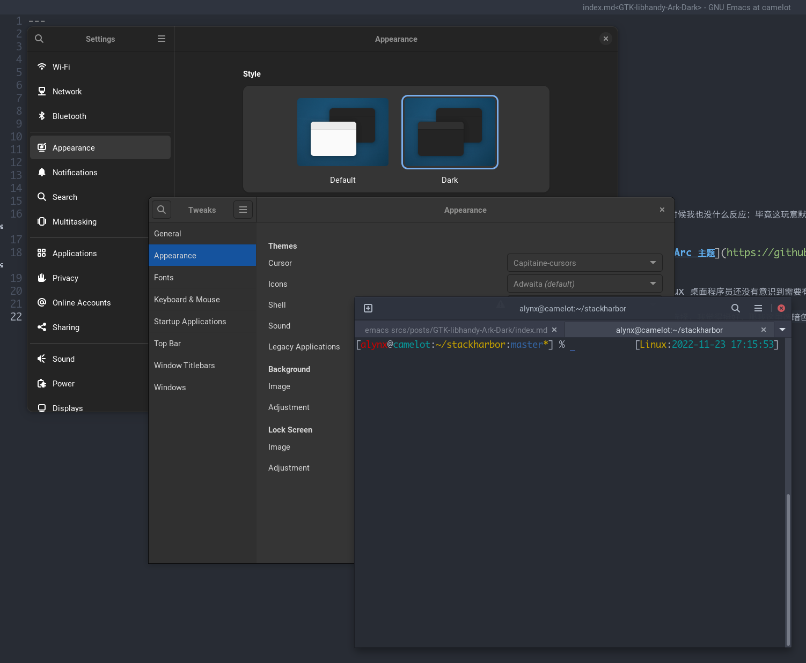
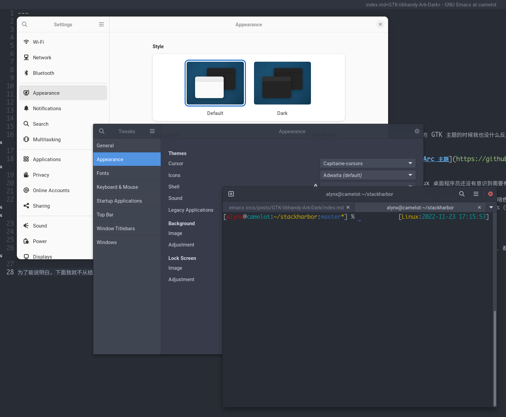
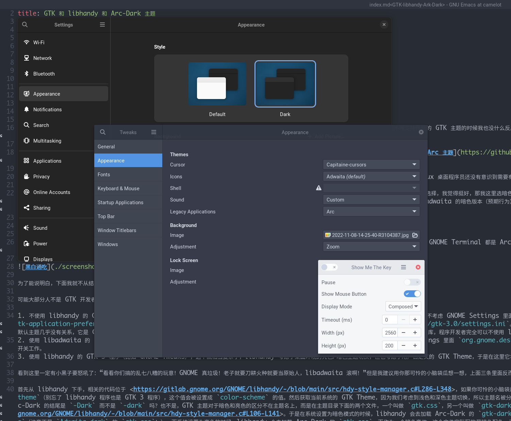

<blockquote class="center-quote">黑夜让我选了黑色的主题，但是有些程序非要寻找光明？</blockquote>

我自认为不是个对应用程序外观有着病态一致性要求的人，我也从不介意一些个性化的程序选择自己的特殊样式。所以当 GTK 4 推荐的 libadwaita 不再支持传统的 GTK 主题的时候我也没什么反应：毕竟这玩意默认的样式看起来还挺好看的。但即使是我这样宽容的人，对于 GTK 3 那个熟的不能再熟的 Adwaita 主题也审美疲劳了，那个银色和棕色会让所有手机厂笑话的，即使有些手机厂的审美还不如这玩意。

我个人最喜欢的配色其实是 Atom 的 One Dark 和 One Light，但我没那个精力利用调色盘自己维护一份主题，所以我退而求其次选择了在观感上比较接近的 [Arc 主题](https://github.com/jnsh/arc-theme)，这个主题其实是一个系列，我自己只在乎里面的两个变体：全亮色的 Arc 和全暗色的 Arc-Dark（似乎它自己 README 里面给的截图也有点问题）。

我自己是一个暗色模式爱好者，毕竟长时间面对屏幕，白底黑字实在是太刺眼了，相对而言，深蓝色做背景色浅灰色做前景色要好看很多。在很久很久以前混沌初开，Linux 桌面程序员还没有意识到需要有个全局的暗色/亮色开关的时候，设置主题非常简单粗暴，打开 GNOME Tweaks 把 GTK Theme 设置为 Arc-Dark，我就心满意足了。

可能是 libadwaita 不能更换主题导致很多反对的声音，并没有太多人谈论随之而来的全局暗色模式开关，但是某天我更新了系统之后发现设置里多了一个亮色/暗色选择，我觉得挺好，那我这里选暗色就行了嘛，果然所有用了 libadwaita 的程序都跟着变了亮暗，不过我用着用着就感觉不对劲了——怎么以前那些 GTK 3 的程序不用 Arc-Dark 而是用 Adwaita-dark 了，这和我想的不一样啊？然后我研究了一下，觉得更奇怪了，GTK 4 + libadwaita 的 GNOME Settings 用的是 libadwaita 的暗色版本（预期行为），GTK 3 的 GNOME Tweaks 用的是 GTK 3 的 Adwaita-dark（不对劲），但是同样是 GTK 3 的 GNOME Terminal 用的是我设置的 Arc-Dark（预期行为）。好家伙好家伙，我这一个桌面上三花聚顶了。



总这么待着我觉得怪怪的，于是我研究了一下，如果我要是选亮色模式呢？现在 GNOME Settings 是 libadwaita 的亮色版本了，然后 GNOME Tweaks 和 GNOME Terminal 都是 Arc-Dark，虽然好像一致了，又好像有点不一致，这回从三花聚顶变成黑白通吃。总之我忍受了很久 GTK 4 程序 **大部分** 是白的而 GTK 3 程序是黑的，直到我再也受不了决定翻开代码看看这些人是怎么写的。



为了能说明白，下面我就不从结果反推原因了，毕竟大家看到这里可能已经云里雾里，没必要和我再重复一遍破案过程了。

可能大部分人不是 GTK 开发者也不使用 GTK，对这玩意怎么调用主题存在一定的误区。实际上可以分为以下几类：

1. 不使用 libhandy 的 GTK 3 程序（比如 GNOME Terminal）和不使用 libadwaita 的 GTK 4 程序（比如 Show Me The Key），这一类程序不考虑 GNOME Settings 里面的亮色/暗色开关（指的是 GSettings 里面 `org.gnome.desktop.interface` 的 `color-scheme` 选项），而只考虑 `gtk-application-prefer-dark-theme`，这个值属于 `GtkSettings`，需要编辑 `~/.config/gtk-4.0/settings.ini` 和 `~/.config/gtk-3.0/settings.ini`。以及是的你没看错，GTK 4 不一定非要用 libadwaita，实际上虽然这个库叫 libadwaita，但它和 GTK 3 那个叫做 Adwaita 的默认主题几乎没有关系，它是 GTK 3 的组件库 libhandy 的进化版本。GNOME 推荐使用这个以便让整个桌面有统一的风格，但是 GTK 4 仍然是个完整的 UI 库，程序开发者完全可以不使用 libadwaita。
2. 使用 libadwaita 的 GTK 4 程序（比如 GNOME Settings），这一类程序不考虑 GNOME Tweaks 里面的 GTK Theme 选项（实际上是 GSettings 里面 `org.gnome.desktop.interface` 的 `gtk-theme` 选项），只使用 libadwaita 内置的配色，所以我们也完全不需要关心它，它永远按照设置里的开关工作。
3. 使用 libhandy 的 GTK 3 程序（比如 GNOME Tweaks），这个就相当复杂了，libhandy 考虑了桌面环境的亮色/暗色主题切换，但也考虑了用户自定义的 GTK Theme，于是在这里它华丽的乱套了。
4. 还有最后一类程序，它们出于特定需要自己给自己套了自定义的 CSS，所以你拿它一点办法也没有，直接忽略（比如 Show Me The Key 的悬浮窗口）。

看到这里一定有小黑子要怒吼了：“看看你们搞的乱七八糟的玩意！GNOME 真垃圾！老子就要刀耕火种就要当原始人，libadwaita 滚啊！”但是我建议用你那可怜的小脑袋瓜想一想，上面三条里面反而 libadwaita 是最符合预期的一个（亮色模式用亮色，暗色模式用暗色），所以我不会解决第二个，而是解决另外的两个。

首先从 libhandy 下手，相关的代码位于 <https://gitlab.gnome.org/GNOME/libhandy/-/blob/main/src/hdy-style-manager.c#L286-L348>，如果你可怜的小脑袋瓜也没耐心看看代码的话，那么我大发慈悲替你读了一遍。相关的逻辑大概是说首先覆盖掉当前程序的 `gtk-application-prefer-dark-theme`（别忘了 libhandy 程序也是 GTK 3 程序），这个值会被设置成 `color-scheme` 的值。然后获取当前系统的 GTK Theme，因为我们考虑到浅色和深色主题切换，所以主题名被分成基础名和种类名两部分，如果系统的主题以 `-dark` 结尾，那就去掉这个后缀，得到基础名，并设置为当前程序的主题。那问题难道出在 Arc-Dark 的结尾是 `-Dark` 而不是 `-dark` 吗？也不是，GTK 主题对于暗色和亮色的区分不在主题名上，而是在主题目录下面的两个文件，一个叫做 `gtk.css`，另一个叫做 `gtk-dark.css`，如果 `color-scheme` 是 `prefer-dark`，libhandy 就会加载后者而非前者，这部分的代码在 <https://gitlab.gnome.org/GNOME/libhandy/-/blob/main/src/hdy-style-manager.c#L106-L141>。于是在系统设置为暗色模式的时候，libhandy 会去加载 Arc-Dark 的 `gtk-dark.css`，但 Arc-Dark 作为一个暗色变体，只有 `gtk.css`，所以加载失败，libhandy 回退到 `Adwaita` 的 `gtk-dark.css`。而系统设置为亮色的时候，libhandy 会去加载 Arc-Dark 的 `gtk.css`，而作为一个暗色变体，这个文件实际写的是暗色配色，于是看起来正常了。（以及如果你 GTK Theme 设置为 `Adwaita-dark` 从这里你就会发现实际上加载的是 `Adwaita` 的 `gtk-dark.css`，而不是 `Adwaita-dark` 的 `gtk.css`，即使它们的配色是一样的。）

那么显然又有另一个问题，既然主题是靠内部的两个文件区分亮色和暗色的，为什么又会有 `Adwaita-dark` 和 `Arc-Dark` 这种名字里带暗色后缀的变体呢？并且还要在 `libhandy` 里面处理这个后缀，是不是多此一举？我们可以暂时先不考虑这个问题，而先简单解决第三条。从上面的分析可以得知为了能正常支持系统的亮色暗色切换，我们需要的是一个同时包含亮色暗色的主题，而不是一个只有暗色变体的主题，于是我们不能把 GTK Theme 设置为 Arc-Dark，而应该使用 Arc，但假如你在 GNOME Tweaks 里面设置好之后，你会发现仍然是黑白通吃：GNOME Settings 是 libadwaita 的暗色版本，GNOME Tweaks 是 Arc 的暗色版本，而 GNOME Terminal 和 Show Me The Key 却变成了亮的 Arc！



我知道有的小黑子要迫不及待开始炮轰 GNOME 了：“什么玩意，整来整去不还是整不好吗，不如来当原始人。”但问题其实就是原始人留下的。现在我们回头看第一条：不使用 libhandy 的 GTK 3 程序和不使用 libadwaita 的 GTK 4 程序，这一类程序不考虑 GNOME Settings 里面的亮色/暗色开关，而只考虑 `gtk-application-prefer-dark-theme`。所以这个奇怪的表现恰好验证了这一条，同时也解释了“既然主题是靠内部的两个文件区分亮色和暗色的，为什么又会有 `Adwaita-dark` 和 `Arc-Dark` 这种名字里带暗色后缀的变体”这个问题：因为在一开始的设计里并没有什么全局亮色/暗色开关，也就没有要求主题同时提供 `gtk.css` 和 `gtk-dark.css`，那么为了让用户可以自选亮色暗色，只有提供两个不同的主题来解决问题。这也就是在 `Adwaita` 和 `Arc` 都提供了 `gtk-dark.css` 的情况下仍然存在 `Adwaita-dark` 和 `Arc-Dark` 的原因。然后在主题添加了 `gtk-dark.css` 之后，为了让 libhandy 的程序能够跟随系统开关切换亮色和暗色，就不能为了那些传统程序把 GTK Theme 设置为暗色变体的主题了，此时如果设置为同时包含两个文件的主题，默认这些程序会选择 `gtk.css`，也就会出现上面截图里的情况。解决这个的方案也不是很困难，`gtk-application-prefer-dark-theme` 就是为此添加的，支持它的 GTK 程序会按照这个选项来加载 `gtk.css` 或 `gtk-dark.css`。如果你像我一样平时主要用暗色模式，那就手动编辑 `~/.config/gtk-4.0/settings.ini` 写入以下内容（GTK 3 的话就是 `~/.config/gtk-3.0/settings.ini`）：

```ini
[Settings]
gtk-application-prefer-dark-theme=1
```

你要是亮色爱好者，那就改成 `0`。这下倒是满足原始人的刀耕火种需求了哈，毕竟他们看起来也不想要系统的亮色/暗色开关的样子，不过说不定以后哪天系统的亮色/暗色开关也会同时修改这个选项呢？只是读取这个选项的 GTK 程序不会像 libhandy/libadwaita 的程序那样会动态切换，必须要关了重开才行。

还有一个奇怪的问题要注意，通常我们是在 GNOME Tweaks 里面设置 GTK Theme，不过根据 <https://gitlab.gnome.org/GNOME/gnome-tweaks/-/blob/master/gtweak/tweaks/tweak_group_appearance.py#L75-L88>，它会把上面那个 `gtk-application-prefer-dark-theme` 设置成 `0`，看注释里面的 BUG 描述，应该也是为了某种刀耕火种的情况解决的（甚至那时候还推荐搞个单独的暗色主题，并且删除了全局的倾向暗色的开关），大概那时候还没推荐用 libhandy，也没有 libadwaita，也没有设置里这种全局暗色/亮色的开关。总之我不建议经常修改 GTK 主题，并且每次修改之后记得手动修改这个选项。如果你觉得这种反复横跳又要保证兼容以前的决策的行为很蠢，那我只能说毕竟你不能要求以前的开发者预见到未来的人们怎么定义桌面的功能。

当然如果你毫不在乎亮色暗色切换（我就是要一直用暗色，所以你暗色模式给我选对了暗色主题就行了！），那还有个比较投机取巧的解决方案：把 Arc-Dark 的 `gtk.css` 复制并改名 `gtk-dark.css` 就可以了，原理不难理解。并且 Arc 主题已经做了这样的修改，只是还没有 Release（参见 <https://github.com/jnsh/arc-theme/commit/73ada8563591fa48ae365686a358e874ca12edad>）。
