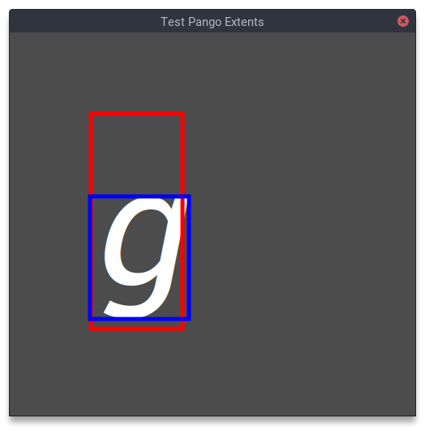

如果你尝试过自己在程序里绘制一段字符串，你就会发现你得到的 buffer 的高度并不总是你设置的字号大小，特别是英文。这个现象的原因是英文在书写的时候并不像汉字一样高矮都一样，而是有上有下，比如 g 这个字符的尾巴总是向下伸出来一点，这些字符通常是基线对齐的，也就是说主体部分会躺在一条基线上，尾巴和头发则可能会伸出来。而就算是方块造型的汉字，字体也可能会在上下留下一定的空间，导致实际排版的尺寸比设置的字号要大。（我不是专业的排版工作者或者字体设计师，如果说错了希望大家指正。）

通常来说这种多占用一点空间的行为不会有什么问题，因为只有这样渲染一排字符的时候看起来才会比较自然。但假如你像我一样希望在字符串周围绘制边框的话，事情就变得麻烦起来了，如果你只是按照你设置的字号大小去绘制边框，你会发现这个字号大小被 Pango 这样的排版库当作基线以上的高度，所以字母的尾巴会出现在边框外面，这是绘制下划线的方式而不是绘制边框的方式。当然你可以从 Pango 获取一些有用的数据，有两个矩形尺寸可以获得，一个是 logical，这个是 Pango 用来排版的矩形，它是按照基线安排的，所以你使用这个绘制会保证字符主体都在一条直线上，多个字符串绘制出来的效果比较接近书写的习惯，也因此它的 x 和 y 坐标总是 0，是绘制的基准点。另一个是 ink，这个是“着墨”区域，也就是说把所有字符包进去的最小矩形，由于字符书写的时候是错落有致的，x 和 y 坐标并不总是 0，而是相对 logical 基准点的 offset，比如一个斜体的字符的 x 坐标很可能是负数，因为书写的时候它是倾斜到左边的字符下面的。

对于这两个矩形，官方文档基本没有解释，而网上查到的很多解释是错的，实际上可以用下面的程序把它们绘制出来：

```c
#include <gtk/gtk.h>

static void draw(GtkDrawingArea *drawing_area, cairo_t *cr, int width, int height, gpointer user_data)
{
	PangoLayout *layout = pango_cairo_create_layout(cr);
	pango_layout_set_ellipsize(layout, PANGO_ELLIPSIZE_NONE);
	PangoFontDescription *font = pango_font_description_new();
	pango_font_description_set_family(font, "serif");
	pango_font_description_set_style(font, PANGO_STYLE_ITALIC);
	pango_font_description_set_absolute_size(font, 200 * PANGO_SCALE);
	pango_layout_set_font_description(layout, font);

	PangoRectangle string_ink;
	PangoRectangle string_logical;
	pango_layout_set_text(layout, "g", -1);
	pango_layout_get_pixel_extents(layout, &string_ink, &string_logical);
	g_print("Logical: x is %d, y is %d, width is %d, height is %d.\n", string_logical.x, string_logical.y, string_logical.width, string_logical.height);
	g_print("Ink: x is %d, y is %d, width is %d, height is %d.\n", string_ink.x, string_ink.y, string_ink.width, string_ink.height);

	cairo_set_source_rgb(cr, 0.3, 0.3, 0.3);
	cairo_paint(cr);

	const int x = 100;
	const int y = 100;
	cairo_move_to(cr, x, y);
	cairo_set_source_rgba(cr, 1.0, 1.0, 1.0, 1.0);
	pango_cairo_show_layout(cr, layout);

	cairo_set_line_width(cr, 5);
	cairo_set_source_rgba(cr, 1.0, 0.0, 0.0, 1.0);
	cairo_rectangle(cr, x + string_logical.x, y + string_logical.y, string_logical.width, string_logical.height);
	cairo_stroke(cr);

	cairo_set_source_rgba(cr, 0.0, 0.0, 1.0, 1.0);
	cairo_rectangle(cr, x + string_ink.x, y + string_ink.y, string_ink.width, string_ink.height);
	cairo_stroke(cr);
}

static void on_activate(GtkApplication *app, gpointer user_data)
{
	GtkWidget *window = gtk_application_window_new (app);
	gtk_window_set_title(GTK_WINDOW(window), "Test Pango Extents");
	gtk_window_set_default_size(GTK_WINDOW(window), 500, 500);
	GtkWidget *area = gtk_drawing_area_new();
	gtk_drawing_area_set_draw_func(GTK_DRAWING_AREA(area), draw, NULL, NULL);
	gtk_window_set_child(GTK_WINDOW(window), area);
	gtk_window_present(GTK_WINDOW(window));
}

int main(int argc, char *argv[])
{
	GtkApplication *app = gtk_application_new("one.alynx.test-pango-extents", G_APPLICATION_DEFAULT_FLAGS);
	g_signal_connect(app, "activate", G_CALLBACK(on_activate), NULL);
	int status = g_application_run(G_APPLICATION(app), argc, argv);
	g_object_unref(app);
	return status;
}
```

下面是编译命令：

```shell
$ gcc -o test-pango-extents `pkg-config --cflags --libs gtk4` test-pango-extents.c
$ ./test-pango-extents
```

输出的尺寸是这样：

```
Logical: x is 0, y is 0, width is 113, height is 265.
Ink: x is -1, y is 102, width is 122, height is 151.
```

得到的结果是这样的：



但是这两个都不符合我的需求，因为我希望字符串按照边框对齐而不是按照基线对齐，同时边框看起来都一样高，直接绘制 logical 矩形实际仍然是基线对齐，比我想要的大了很多。而按照 ink 绘制不能保证边框一样高。最后的做法是使用 ink 的宽度绘制边框的宽度，然后利用 ink 的高度重新计算绘制位置将字符放在底边上，这里要注意的是因为默认绘制是以 logical 矩形左上角作为基准点，需要减去 ink 矩形的左上角 offset 才能从 ink 的左上角开始绘制。具体的修改在 <https://github.com/AlynxZhou/showmethekey/commit/f1a2a5a995d6c224700b376b287c7aaff512d365#diff-295efe2fde895e5fedc8e4194f1be7ba064dc9787643139520f7913541aee1f6>，这里就不赘述了。
