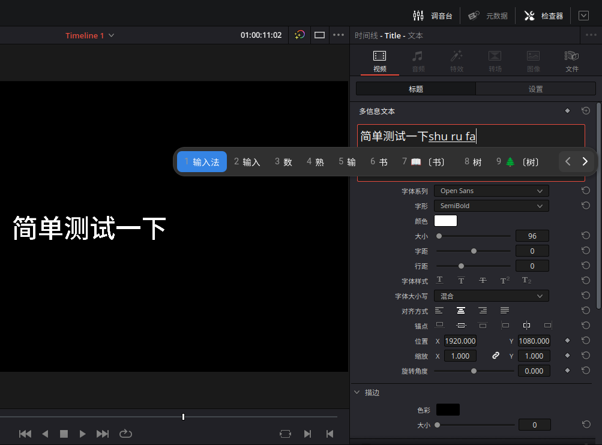

令人出乎意料，我竟然是 DaVinci Resolve（后面都简称达芬奇了）的付费用户。虽然它不是开源软件，但是有很好的 Linux 支持，使用体验和功能都是同类中的佼佼者，而且收费也相当合理。我选择付费一个原因是你支持我，我就支持你，这其实和我支持 Steam 和 Valve 的理由差不多。另一个原因是众所周知的由于什么所谓系统专利许可证的原因达芬奇 Linux 版本不能解码 H264 和 H265 这两种常见的视频编码，只能使用 NVIDIA 显卡的 NVENC 和 NVDEC 来处理，而达芬奇将显卡加速功能作为收费的卖点。于是我就这样半自愿的上了贼船。

当然排除掉解码问题之后还有另一个比较难受的地方，就是达芬奇 Linux 版没有输入法支持，于是完全没办法输入中文。我猜测不像是某些故意恶心人的企业对 Linux 不友好，而单纯是因为英语开发者没有“输入法”这种概念。毕竟达芬奇的图形界面是基于 Qt 的，而 Qt 直接有现成的输入法支持，构建的时候打开开关就可以了嘛。为此我甚至专门跑到 BlackMagic Design 的用户论坛发了个帖子（<https://forum.blackmagicdesign.com/viewtopic.php?f=33&t=150886>），作为付费用户，我给你钱，你就得给我办事，就是这么硬气。显然某位员工看到了我的帖子并把它移动到了 Feature Requests 版面，然后就没有然后了。闭源拖拉机总是这样，我看到了，但我懒得改，你给我等着吧。我倒不是说开源拖拉机的维护者都比较勤快，但是至少代码放在那里，说不定用户自己就给你改了送到你面前了，一般再懒的维护者都乐意接受。谁叫我没找到和达芬奇一样好用的开源视频剪辑软件呢。

不过从它用的 Qt 这一点上来看，应该是有什么办法可以 hack 一下让它支持输入法的。虽然我不是很熟悉 Qt，但是 Fcitx 的开发者 [@csslayer](https://www.csslayer.info/) 给了我一个方案，他之前写了一篇博客是关于给 Mathematica 添加输入法支持的（<https://www.csslayer.info/wordpress/fcitx-dev/a-case-study-how-to-compile-a-fcitx-platforminputcontext-plugin-for-a-proprietary-software-that-uses-qt-5/>），他觉得达芬奇也可以如法炮制，于是我阅读了一下，简单地概括就是首先查出来软件用了什么版本的 Qt，然后下载对应的源码，因为输入法支持属于 Qt 的某种插件，所以只要构建插件的时候链接到软件自带的 Qt，再把得到的插件复制到软件的 Qt 目录就可以了。一般来说软件就算修改了自带的 Qt，也不会修改有关插件的部分，所以我打算如法炮制一下。

首先是查看达芬奇自带的 Qt 的版本，这个非常简单：

```
% strings /opt/resolve/libs/libQt5Core.so.5 | rg 'Qt 5'
Qt 5.15.2 (x86_64-little_endian-lp64 shared (dynamic) release build; by Clang 9.0.1 )
This is the QtCore library version Qt 5.15.2 (x86_64-little_endian-lp64 shared (dynamic) release build; by Clang 9.0.1 )
If that is not possible, in Qt 5 you must at least reimplement
```

到这里应该就是去下载 Qt 5.15.2 版本的源码了，不过我突发奇想看了一眼系统安装的 Qt 版本：

```
% pacman -Qi qt5-base | rg Version
Version         : 5.15.7+kde+r176-1
```

一般来说主次版本号不变的话不会有什么不兼容的改动，会不会我直接把系统的 `.so` 文件复制过去就可以用了呢？Qt 5 的 ibus 支持已经是 Qt 本身代码库的一部分了，安装到系统的路径是 `/usr/lib/qt/plugins/platforminputcontexts/libibusplatforminputcontextplugin.so`，我尝试直接把它链接过去：

```
% sudo mkdir /opt/resolve/libs/plugins/platforminputcontexts
% sudo ln -s /usr/lib/qt/plugins/platforminputcontexts/libibusplatforminputcontextplugin.so /opt/resolve/libs/plugins/platforminputcontexts
```

然后就没有然后了，我启动达芬奇之后 ibus 就直接工作了。没想到他们虽然不太了解 Linux 输入法，Qt 版本跟的倒是还挺新的。



对于 Fcitx5 用户的话，首先要注意 Qt 5 的 Fcitx5 支持并不在 Qt 的代码库里，所以你需要安装 `fcitx5-qt`。不过文件路径的话都是一样的，只要把文件名里的 `ibus` 改成 `fcitx5` 就可以了。如果直接链接不能用，需要按照老 K 博客里的办法自己编译的话，需要下载单独的 `fcitx5-qt` 代码库。当然从根源上解决问题的话还是希望大家去论坛回复我的帖子，让 BlackMagic Design 开启构建开关，就不需要用奇怪的办法 hack 了。
