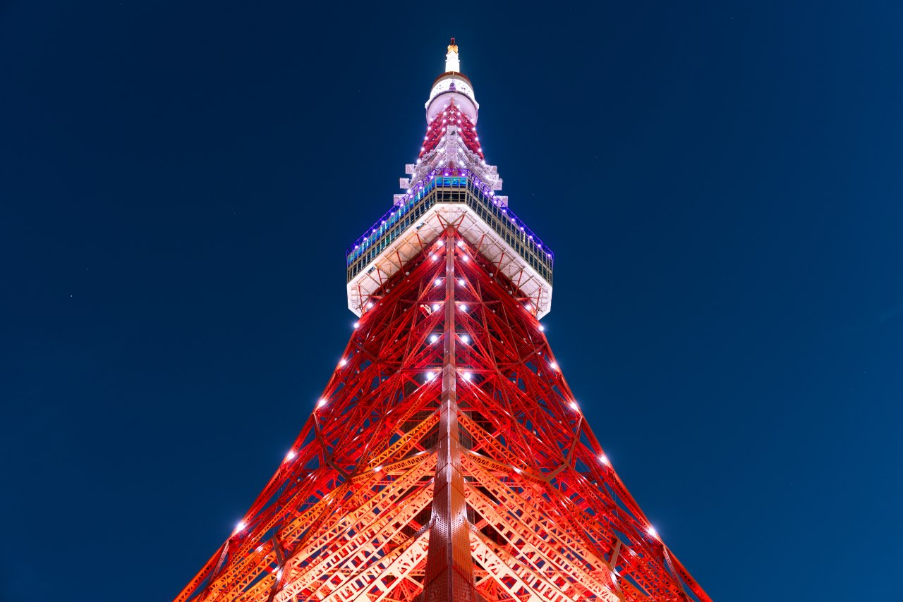
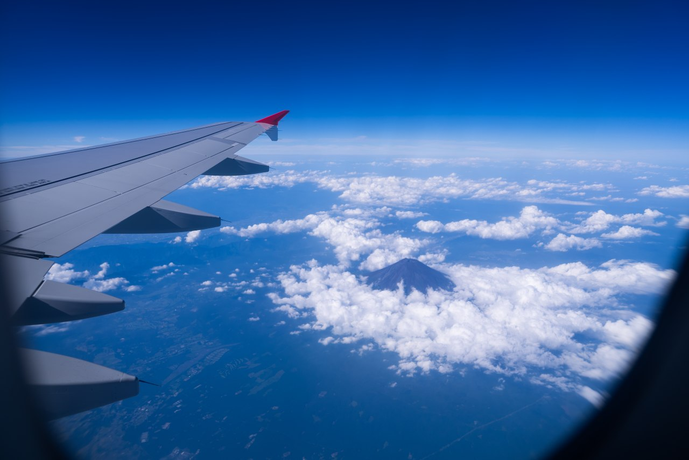

题外话：本来应该去年九月从东京回来就写的，但由于一些不是很众所周知的原因我很久没更新了。昨天回家看到影视飓风发了去东京拍的样片，又想起来之前拍的照片，所以决定还是写一下。

--------

我其实是特别懒得出门的人，不是不想，只是嫌麻烦，而且其实我也没有特别想去的地方，除了日本。毕竟如果你也像我一样是个动漫爱好者的话你就很难不想去日本看看。所以董老师问我要不要一起去东京玩的时候，我做了足够久的心理建设。搞定签证机票住宿等等一系列麻烦的东西之后，我终于要进行人生第一次出国旅行了。在北京待了太久，早就想拍点不一样的东西，所以这篇主要是贴一些我出门玩拍的照片。

买机票的时候没有买直飞，因为我也没有去过香港，所以买了中午到香港然后午夜飞东京的转机，到了香港凭护照和离开香港的机票就可以办进入香港的手续，并不需要港澳通行证。然后把在深圳的高中同学喊了过来一起吃了晚饭，我还是第一次见依山而建的城市。

晚上两个人随便走走于是去拍了维多利亚港。

由于一些众所周知的原因，在香港坐地铁的时候感觉非常熟悉好像回到了北京地铁一样（或许应该说北京某些地铁像香港地铁才对）。

然后午夜飞东京第二天早上落地成田机场，经过一系列入境手续之后坐电车去酒店，虽然我的日语远没到能日常交流的水平，但靠着比划和英语大概也没什么问题。而且很大概率你能碰到会中文的工作人员。由于前一天很早出发然后午夜才睡觉所以这一天根本没拍什么照片，下午到酒店能入住之后直接就躺了。董老师来东京的目的是去看魔法未来，所以我们前几天住了一个很偏的酒店，与其说离东京近不如说是离千叶近，而且主要是房间真的小啊！

落地东京的第一天除了吃饭睡觉什么也没干，第二天起来我坐电车去了御茶水的乐器街（说起来知道这边是乐器街还是因为听丸之内虐待狂），虽然距离很远但感觉并没有花很久，也许是人在北京住久了就会对通勤变得宽容？虽然这边大部分卖的都是我不会弹的吉他贝斯类的，但还是看得眼花缭乱。这边有一家很出名的 ESP 店，我走到二楼的时候应该是有个店员看出来我是中国游客所以用中文问我“你想找什么？”，但我一下子就听出来他应该是会说中文的日本人，因为母语者发音不会这么刻意。同学想要一个国内还没上市的效果器，问了一下价格，比闲鱼代购便宜太多了，于是我非常乐意的帮他代购了一个。但我拍的不是乐器而是那个好像很著名的电车机位，铃芽之旅里面出现过的。

由于台风要来，第一天和第二天都在下雨，虽然我是很喜欢下雨，但是鞋子湿透了还是很痛苦。

第三天白天去了魔法未来的展览，因为很喜欢赛车初音于是买了一把 24 款赛车初音的雨伞，结果临走的时候人在去机场的电车上想起来把伞落在酒店了，于是赶紧给酒店发邮件，他们对于处理外国游客遗落的物品有成熟的流程，所以后面我付了邮费提交了地址他们把伞给我寄到了家里。以及因为发现酒店楼下的罗森有赛车初音的一番赏所以每天晚上都去抽两发还和便利店打工的中东小哥聊了几次。晚上我意识到这个酒店离海边很近于是就跑去海边，然后拍到了海边散步的情侣 T_T 作为内陆长大而又很少去海边的人，晚上走到海边的时候感觉非常空旷，如果有幽闭恐惧症的反义词的话，应该可以更好的描述我当时的体验。

第四天我决定把来拍照的目的贯彻到底，中午先去了川崎站进行了一个 Girls Band Cry 的打卡，结果在丸福咖啡店遇到了另外两个说中文的游客，全都是看了 GBC 来打卡的！可惜我在川崎站外面没有遇到什么弹吉他的大姐姐。买了下午天空树的门票，直接冲到最高进行一个俯瞰风景。天空树上面有个许愿台，可以买扭蛋然后把愿望写在里面的彩带上，于是我一边想着 *“把愿望写在离天空更近的地方实现的会不会更快一点”* 一边买了两个扭蛋，不过现在想想感受还是很复杂。我这个时候还没看过龙族，看完了觉得还好当时临时决定去天空树，下次一定还会再去。

出来的时候又开始下小雨！这就是临海城市的感觉吗？但是我抬头向上看的时候发现云雾围绕的天空树于是拍下了绝佳的照片。

由于这里是地标性建筑，所以下面有一个购物中心有很多专门的周边店，方便来玩的游客，我在里面转了很久，但由于一些原因不是很开心。但是接下来在商场里吃了一份寿喜锅，很好吃！

第五天我们换到了市区里的酒店，住在浅草桥附近去哪里都很方便！而且房间面积竟然比第一家酒店要大。这一天我去了东京塔！我这次来其实没有制定什么旅游计划，单纯是给出国玩做一次可行性验证，所以其实落地东京就算是阶段性胜利了。但如果有什么一定要拍的，那就是东京塔了，因为我喜欢红色！

转来转去找了好久附近哪里的楼上有东京塔的倒影，结果我低头发现东京塔的倒影就在东京塔的底座上。

第六天我好像没有拍什么照片，因为酒店离秋叶原只有一站路所以我就早起去了秋叶原，二次元怎么能不去秋叶原电器街呢！但是这里甚至走路都能听到人说中文，“你买的这个东西 90% 是 Made in China！"。

没记错的话中午吃了一家叫做 468 的寿司，这家的老板人很好很有意思，见到我们是外国人于是拿出一张纸在上面画一盘寿司和一碗汤然后写上价格，还问我们是哪里来的。汤是一种粘稠的淀粉汤，尝起来大概是用胡椒调味，中间有一颗炸过的土豆泥丸子，是他家的招牌菜“芋吸”，感觉就是明明是普通的食材普通的调味，但能想到这样做确实是别出心裁，从来没有在别的地方尝过类似的，非常喜欢于是跟老板说每人再点一份。

晚上我们根据排行榜去吃了和牛烧肉！来日本怎么能不吃和牛烧肉呢！店很小所以排队花了一些时间，但是吃到的时候感觉确实是非常值得，缺点的话……大概只有因为是炭火烤肉所以如果有顾客没搞好肉被点着了屋里就会很大浓烟吧。

第七天我们去了涩谷附近，先去了明治神宫但这里没有人举行婚礼。

然后在原宿买了一件我以前根本不会买的衣服，白色的衣服上面是各种蓝色的带子，当时莫名其妙的想到明日方舟的服装风格，然后店员小哥又很喜欢初音所以和我们聊了一会于是就买了（但是衣服很贵 T_T）。接着去了附近的稳田神社，好像设定上是平安名堇住在这里所以甚至有上面画着她的御守，所以我给列表里推平安名堇的 coser 带了一个。原宿这边有 Fender 的旗舰店，进去转了一圈，但我又不会弹这个。

晚上去了涩谷，这里可能是这几天见过人最多的地方了。董老师跟我说有什么稀奇的感觉和西直门差不多，我说西直门哪有这么多人，董老师想了一会说那三里屯，三里屯倒是稍微有点这个意思。

第八天去了之前在上野的时候去了一次的矢先稻荷神社，当时只是在地图上看到附近有神社就想去看看，结果一路上很想去厕所又找不到，走到神社门口发现有牌子说最近的厕所在哪里，感觉非常有缘分，但是第一次去身上没有多少硬币，所以又去了一次。

下午又去了秋叶原，拍到一张很好看的逆光照片。

傍晚的时候从酒店窗户看出去云很好看。

这次其实没安排去富士山的计划，但想去东京的一个理由是因为富士山下这首歌，回程的飞机特地选了能看见富士山的一侧。

最奇妙的感受其实是以前只在动漫里听过的地名突然有了实感，去过之后再看到这些地名，就会想起当时的感觉。它们不再是几个音节的排列组合，而是变成了无数个真实的细节。

我其实很想多录一些视频，但是一个人暴走的结果就是没有什么体力拿出相机了……最后还是用拍到的一些片段剪了个 vlog 出来。

<iframe src="//player.bilibili.com/player.html?isOutside=true&aid=113162573585735&bvid=BV1VCtneGE3g&cid=25918505203&p=1" scrolling="no" border="0" frameborder="no" framespacing="0" allowfullscreen="true"width="640" height="480"></iframe>

还会再去的。
