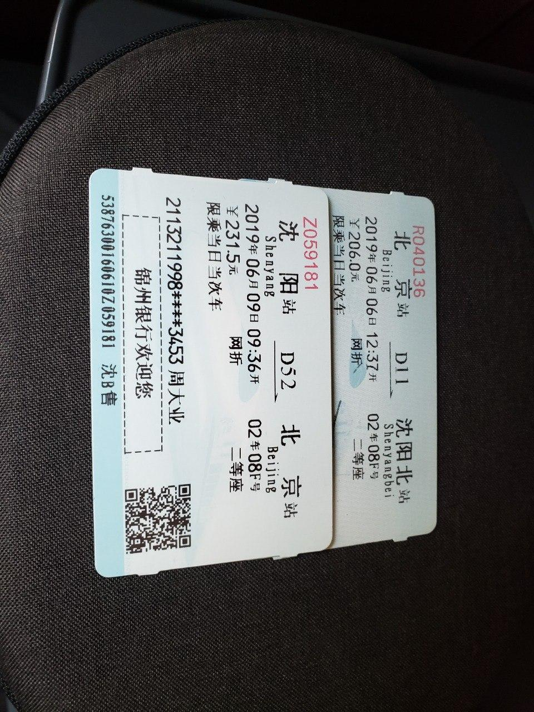

> One day I wake up,
> finding that I am on one of the most crazy trips in my life.
> It has been into my dream for many times,
> but now it comes into reality,
> which becomes the best birthday present.

<!--more-->

距离上次更新大概一个半月了，主要是因为考试周太忙所以没心情写博客。实际上有好多东西可以写。

首先是端午节去了沈阳，不过很遗憾的是我不太喜欢拍景点照片（当然这也不是什么重点内容），所以只有一些稀松平常的照片。

然后是有关实习的内容了，很幸运的拿到了 SUSE 北京的实习，环境超级好，而且最关键的还是找到一个自己比较感兴趣又有了解的实习。

接下来就是 FGO 抽卡！盼了一年之后终于如愿以偿抽到了蓝呆！而且还是先出老福然后连续出蓝呆！没有看到金卡面之前完全没有意识到是什么，就算看到金卡还以为又是兰斯洛特或者式姐（兰斯洛特四宝的我），结果翻过来的时候完全呆住了不知道该怎么反应（抽到老福的快乐还没过去）。

以及买到了 Yuki Kajiura Live 15 上海的票（因此变得超级贫穷），虽然对我这个纯 Kalafina 粉来说性价比不是很高，但由于没去过 Kalafina 的 Live（并且再也没有了）而十分后悔，因此抱着这样的想法毅然决然的自己买了票，也算是圆多年的梦吧，毕竟可以说我整个的音乐审美都来自于梶浦由纪和 Kalafina。

最后附上沈阳故宫墙里奇怪的石头照片。

*Alynx Zhou*

**A Coder & Dreamer**
