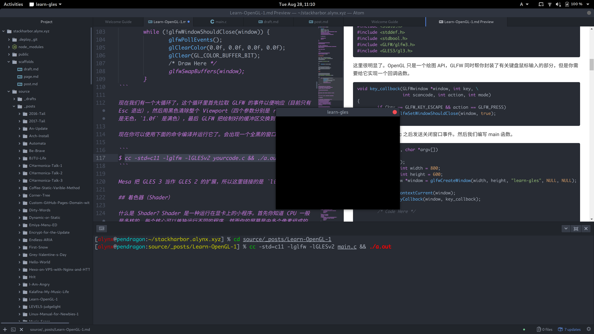
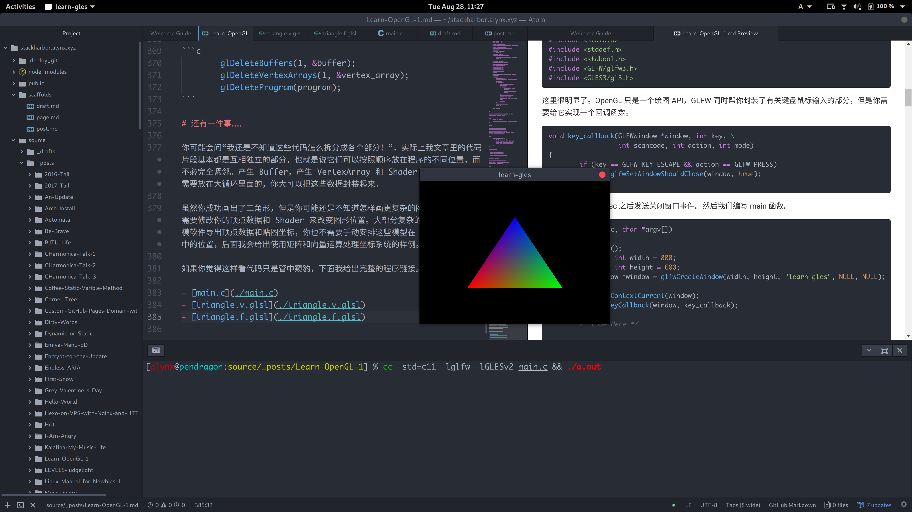

我花了好久来阅读和实践 [Learn OpenGL CN](https://learnopengl-cn.github.io/) 上面的 OpenGL 教程，尽管它是大家推荐的最容易懂也比较新的教程，里面一些东西还是会让人觉得一头雾水。我用了很长的时间来尝试那些教程没有写成文字的部分并确定它们是如何工作的。也许对于一个有足够经验的人来说这些看起来并不是什么大问题，但我觉得新人知道这些以后可以更快的继续学习，而不是花费时间在诸如“这段代码干了什么？”“为什么我的黑屏了？”“如果我想编写一个更复杂的图形程序，该怎么把这些复制过来的代码拆开？”的问题上。

<!--more-->

话先说在前面，虽然标题我写了 OpenGL，但是我实际上使用的是 OpenGL ES —— 你可以把它当作是 OpenGL 的一个子集，只包含基于可编程管线的部分 API，去掉了那些过时的旧模式。虽然 OpenGL ES 主要为移动设备设计，但是在电脑上也能正常使用。Wayland 和 Weston —— Linux 的下一代桌面协议以及它的简单实现 —— 为了去掉 Xorg 的依赖就使用了 OpenGL ES（Linux 下的 libGL 总会引入 X）。

我使用的是 OpenGL ES 3，最新版本，而且我觉得这里的 OpenGL ES 程序只要做一点简单的改动就可以变成 OpenGL 的程序 —— 毕竟 OpenGL ES 使用的函数就是 OpenGL 的一部分。

# OpenGL 是什么？

简单来说，OpenGL 是一套 API（废话），它把你传输的三维坐标交给显卡运算并映射到显示器的二维平面上。实际上它仅仅做了这些 —— 和你的显卡交流。使用 OpenGL ES 3 的好处是它没有早期版本中 OpenGL 的立即渲染模式，通常来说这个模式很容易使用（就像 Canvas 绘图）但是效率低下。一些人不会使用核心模式（可编程管线）而是使用旧的模式也导致了所谓的 OpenGL 性能差，但实际上 OpenGL 只是一个规范，具体的性能很容易受到不同厂家实现不同编写人员的影响（给猴子一把磨得很快的斧头的直接后果很可能是猴子砍了自己的脚）。如果打开一份教程上面出现 `glBegin()`、`glEnd()` 我建议你立即关掉。

# 创建窗口

首先既然我们要绘图，需要先有窗口。窗口创建之后才可以创建一个 OpenGL 的 Context。对于这个需求不同的平台有不同的方案，比如 Windows 的 WGL，Xorg 的 GLX，以及为了独立于各个平台使用的 EGL（Wayland 为了摆脱 Xorg 使用的就是 EGL），但我们在这里使用一个简单高效的封装库 GLFW。

首先需要你自己安装 GLFW 库到你的系统中，Linux 用户可以使用包管理解决这个问题，Windows 用户就需要自己下载并放置到你工具指定的位置了（注意头文件的位置并修改 IDE 的搜寻路径 —— 异常麻烦的事情）。

对于 OpenGL 本身而言，如果你安装了 Mesa（Linux），你应该有一个开源的实现了。Windows 用户可能需要一些处理以保证自己用的是最新版本（据说微软为了推广 D3D 打压 OGL Windows 系统只包含旧的 OpenGL 库，不知道是不是真的），我没有在 Windows 下面编写过，不能给你建议。

对于 OpenGL 大部分函数地址是运行时确定的（各个驱动的实现不一样），所以需要类似于 GLEW 或者 GLAD 之类的库来在代码中搜寻保存函数指针，但我这里使用 OpenGL ES 似乎是可以直接链接的，所以我没有使用（有错误请告诉我，我好改正）。

然后我们打开一个 C 文件 —— OpenGL 库是用 C 编写再封装到其它语言的。

```c
#include <stdio.h>
#include <stddef.h>
#include <stdbool.h>
#include <GLFW/glfw3.h>
#include <GLES3/gl3.h>
```

这里很明显了。OpenGL 只是一个绘图 API，GLFW 同时帮你封装了有关键盘鼠标输入的部分，但是你需要给它实现一个回调函数。

```c
void key_callback(GLFWwindow *window, int key, int scancode, int action, int mode)
{
	if (key == GLFW_KEY_ESCAPE && action == GLFW_PRESS)
		glfwSetWindowShouldClose(window, true);
}
```

只是简单实现了按 Esc 之后发送关闭窗口事件。然后我们编写 main 函数。

```c
int main(int argc, char *argv[])
{
	glfwInit();
	unsigned int width = 800;
	unsigned int height = 600;
	GLFWwindow *window = glfwCreateWindow(width, height, "learn-gles", NULL, NULL);
	glfwMakeContextCurrent(window);
	glfwSetKeyCallback(window, key_callback);

	/* Code Here */

	glfwDestroyWindow(window);
	glfwTerminate();
	return 0;
}
```

先别急着编译它，因为你还没有正确链接。如果你编译好了，这个程序运行之后窗口一闪而过就会消失，但你已经完成了窗口创建。

如果是 macOS 请在 `glfwInit()` 之后添加 `glfwWindowHint(GLFW_OPENGL_FORWARD_COMPAT, GL_TRUE);`，并咒骂苹果为什么去掉了 OpenGL 支持。

接下来我们进行 OpenGL 代码的编写。

# 绘制三角形

三角形是计算机图形学里基本的图元，更复杂的模型通常都是用三角形拼合的，这也是为什么人们会用 *每秒渲染多少个三角形* 来表示显卡性能。

## 创建视口（Viewport）

首先我们创建 OpenGL 的 Viewport，事实上不管你的窗口分辨率是多少，OpenGL 都会把这个平面映射到 `-1.0f` 到 `+1.0f`，你使用时候的坐标都是在这个范围内，而不是屏幕上的像素点数目。

下面的代码需要插入到上面 `/* Code Here */` 的上面。

```c
	glViewport(0, 0, width, height);
```

因为我们的程序太过简单，就不需要开启其它特性了，否则在这里你可以开启一些 OpenGL 的特性比如背面剔除（如果你玩 CS，你会发现死亡画面你的摄像机经常会穿进敌人体内，这时候敌人的后背变成了透明的，这就是背面剔除，可以减少绘制的图形的数量。

## 大循环

如果你对游戏引擎有所了解，应该知道整个流程就是一个大循环：引擎不断地绘制图案并把它更新到屏幕上，每一帧我们更新一些数据，就会形成动画。我们这里也是这样进行，在 `glViewport()` 和 `glfwTerminate()` 之间插入这个。

```c
	while (!glfwWindowShouldClose(window)) {
		glfwPollEvents();

		glClearColor(0.0f, 0.0f, 0.0f, 0.0f);
		glClear(GL_COLOR_BUFFER_BIT);

		/* Draw Here */

		glfwSwapBuffers(window);
	}
```

现在我们有一个大循环了，这个循环里首先拉取 GLFW 的事件以便响应（目前只有 Esc 退出），然后用黑色清除整个 Viewport（四个参数分别是 rgba，`0.0f` 是无色，`1.0f` 是满色），最后 GLFW 把绘制好的缓冲区交换到窗口上。

现在你可以使用下面的命令编译并运行它了。会出现一个全黑的窗口。

```
$ cc -std=c11 -lglfw -lGLESv2 yourcode.c && ./a.out
```



Mesa 把 GLES 3 当作 GLES 2 的扩展，所以这里链接的是 `libGLESv2`。

## 着色器（Shader）

什么是 Shader？Shader 是一种运行在显卡上的小程序。首先你知道 CPU 一般是多核的，每个核心可以单独运行不同的程序。然而你的屏幕是由多个像素组成的，在运行游戏的时候每个像素的数据都需要单独计算，即使每个都是简单的乘法，CPU 也很难在短期内全部处理完毕（几十万个像素是很难由八个核心在 16ms 之内解决掉的），所以 GPU 为了解决这个问题，带有许多互相独立的小核心，每个核心的性能是远远不如 CPU 的，但它们处理的问题也没有 CPU 复杂，所以可以很快的处理掉屏幕上全部的像素。

一般你的数据只会包含几个顶点的位置，这时候你可以编写小程序去处理这些顶点的数据，比如位移或者从数据中获取颜色，这一步的程序叫做 Vertex Shader（顶点着色器），然后 OpenGL 会把首先把这些顶点连接起来，再计算出中间的范围，对中间的部分进行插值，然后把它们映射到一个一个的像素点上，这个过程叫做 **光栅化**，然后接下来 GPU 中的每个小核心就开始单独处理一部分像素了，为了增加效率和创造更好地效果（光照效果之类的影响最终颜色的），你可以编写小程序交给这些小核心运行，这一步的程序叫做 Fragment Shader（片段着色器）（在 Direct3D 里面叫 Pixel Shader 像素着色器）。OpenGL 使用一种叫 GLSL 的语言编写着色器，在这一步你需要建立两个文件，首先是 `triangle.v.glsl`（名字可以随意）的顶点着色器。

```glsl
#version 300 es
layout (location = 0) in vec3 pos;
layout (location = 1) in vec3 color;
out vec3 pass_color;
void main()
{
	gl_Position = vec4(pos, 1.0f);
	pass_color = color;
}
```

第一行的预处理指令表明了我们使用的是 3.00 版本的 OpenGL ES，如果是 OpenGL 可以使用 `#version 330 core`，然后二三行声明了输入变量，前面的 `layout (location = 0)` 指定了它们的位置，也可以省略，但是就需要在程序里手动查找位置了。后面的 `in` 表明是输入变量，`vec3` 表明是由三个数字组成的向量，后面是变量名，我们用到了位置和颜色。然后下面 `out` 表明是输出变量，很明显 Vertex Shader 是不能控制颜色的，Fragment Shader 才控制颜色，所以我们在这里把传进来的颜色再输出，下一步传给 Fragment Shader。

然后程序从 main 开始执行，这里 **不需要返回值**，`gl_Position` 是内置的变量，你需要把顶点的最终变换完的位置赋给它，这里我们没有变化，直接把三元坐标转换成四元的齐次坐标。然后把输入进来的颜色传出去。总之，如果你保证 Vertex Shader 输出的变量和 Fragment Shader 输入的变量名字一样，OpenGL 就会把它们连接起来。

接下来我们建立 `triangle.f.glsl`，如下。

```glsl
#version 300 es
precision mediump float;
in vec3 pass_color;
out vec4 frag_color;
void main()
{
	frag_color = vec4(pass_color, 1.0f);
}
```

第二行表明的是设置精度为 `float`，OpenGL ES 要求 Fragment Shader 必须有这一条，标准 OpenGL 可以去掉，与 `gl_Position` 不同，为了满足多样化的需求，Fragment Shader 的输出变量需要自己声明，然后我们给输入的颜色加上 `1.0f` 的 Alpha 值输出。

接下来类似于我们编译 C 程序的过程，不同的是我们要编写 C 代码读取文件，分别编译并链接为一个程序。我在这里直接给出我封装好的过程来简化代码量，具体说明参见注释。你可以把它们添加到 main 函数外面（上面）。

```c
#include <stdlib.h>
#include <string.h>
#define LINE_LENGTH 512

GLuint make_shader(GLenum type, const char *const shader_src)
{
	GLuint shader = 0;
	GLint compiled = 0;
	// 创建 shader。
	if (!(shader = glCreateShader(type))) {
	    fprintf(stderr, "Shader Create Error.\n");
	    return 0;
	}
	// 加载 shader 内容。
	glShaderSource(shader, 1, &shader_src, NULL);
	// 开始编译。
	glCompileShader(shader);
	// 检查编译结果。
	glGetShaderiv(shader, GL_COMPILE_STATUS, &compiled);
	// 编译失败的话读取错误输出。
	if (!compiled) {
	    GLint info_len = 0;
	    glGetShaderiv(shader, GL_INFO_LOG_LENGTH, &info_len);
	    if (info_len) {
		char *info = malloc(info_len * sizeof(*info));
		if (!info) {
			fprintf(stderr, "Malloc Error.\n");
			glDeleteShader(shader);
			return 0;
		}
		glGetShaderInfoLog(shader, info_len, NULL, info);
		fprintf(stderr, "Compile Error: %s\n", info);
		free(info);
	    }
	    glDeleteShader(shader);
	    return 0;
	}
	return shader;
}

GLuint load_shader(GLenum type, const char *const shader_path)
{
	GLuint result = 0;
	FILE *fp = NULL;
	size_t file_length = 0;
	char *file_content = NULL;
	char temp_line[LINE_LENGTH];
	// 读取文件不用解释了吧……
	if (!(fp = fopen(shader_path, "r"))) {
		fprintf(stderr, "Open file %s failed.\n", shader_path);
		return 0;
	}
	fseek(fp, 0l, SEEK_END);
	file_length = ftell(fp);
	rewind(fp);
	if (!(file_content = malloc(file_length))) {
		fprintf(stderr, "Malloc Error.\n");
		fclose(fp);
		return 0;
	}
	file_content[0] = '\0';
	while (fgets(temp_line, LINE_LENGTH, fp))
		strncat(file_content, temp_line, LINE_LENGTH);
	fclose(fp);
	result = make_shader(type, file_content);
	free(file_content);
	return result;
}

GLuint load_program(const char *const vshader_path, const char *const fshader_path)
{
	GLint linked = 0;
	GLuint vshader = 0;
	GLuint fshader = 0;
	GLuint program = 0;
	// 加载类型为 GL_VERTEX_SHADER。
	vshader = load_shader(GL_VERTEX_SHADER, vshader_path);
	// 加载类型为 GL_FRAGMENT_SHADER。
	fshader = load_shader(GL_FRAGMENT_SHADER, fshader_path);
	if (!vshader || !fshader)
		return 0;
	// 创建 Shader Program。
	if (!(program = glCreateProgram())) {
		fprintf(stderr, "Program Create Error.\n");
		return 0;
	}
	// 给 Program 添加 Shader。
	glAttachShader(program, vshader);
	glAttachShader(program, fshader);
	// 将两个 Shader 链接成 Program。
	glLinkProgram(program);
	// 链接完成可以删除 Shader 了。
	glDeleteShader(vshader);
	glDeleteShader(fshader);
	// 检查链接状态。
	glGetProgramiv(program, GL_LINK_STATUS, &linked);
	// 链接失败读取错误输出。
	if (!linked) {
		GLint info_len = 0;
		glGetProgramiv(program, GL_INFO_LOG_LENGTH, &info_len);
		if (info_len) {
			char *info = malloc(info_len * sizeof(*info));
			if (!info) {
				fprintf(stderr, "Malloc Error.\n");
				glDeleteProgram(program);
				return 0;
			}
			glGetProgramInfoLog(program, info_len, NULL, info);
			fprintf(stderr, "Link Error: %s\n", info);
			free(info);
		}
		glDeleteProgram(program);
		return 0;
	}
	return program;
}
```

有了这个之后只需要在 `glViewport()` 和 `/* Code Here */` 之间调用 `load_program()` 生成 Shader Program。

```c
	unsigned int program = load_program("triangle.v.glsl", "triangle.f.glsl");
```

## 顶点数据

接下来我们需要准备绘制的数据了，对于一个三角形来说，需要三个顶点来确定它的位置，每个顶点需要三个坐标，同时我们还要给它们创建不同的颜色，让我们的三角形变的多彩一点，所以需要像下面一样组织数据。把这段插入到之前 `/* Code Here */` 和 `glViewport(0, 0, width, height);` 之间。对于 3D 程序来说 float 的精度足够了，double需要更多的运算时间。

```c
	const float vertices[] = {
		// 坐标	       颜色
		-0.5f, -0.5f, 0.0f, 1.0f, 0.0f, 0.0f,
		0.5f, -0.5f, 0.0f, 0.0f, 1.0f, 0.0f,
		0.0f,  0.5f, 0.0f, 0.0f, 0.0f, 1.0f
	};
```

OpenGL 的坐标是这样安排的：

- 从左到右对应 X 坐标 `-1.0f` 到 `1.0f`。
- 从下到上对应 Y 坐标 `-1.0f` 到 `1.0f`。
- 从外到里对应 Z 坐标从负到正，需要注意这个可能会被以后的数学变换改变。

我们这里是平面的所以 Z 坐标都是一样的。

现在我们把数据存储到了内存里面，但是很显然我们需要把数据传给显卡。这时候我们需要创建一个 OpenGL 的 Buffer 对象，并把数据写进去。也有人管这个叫 VBO，但是我觉得这个缩写还没有 Buffer 来的直观。

```c
	unsigned int buffer;
	glGenBuffers(1, &buffer);
	glBindBuffer(GL_ARRAY_BUFFER, buffer);
	glBufferData(GL_ARRAY_BUFFER, sizeof(vertices), vertices, GL_STATIC_DRAW);
	glBindBuffer(GL_ARRAY_BUFFER, 0);
```

这里的 `buffer` 只是一个符号，真正的空间分配我们是不能干预的。`glGenBuffers()`可以生成多个 Buffer，这里我们只生成一个，所以第一个参数设置为 1，第二个则是一个指针，我们这里只有一个所以没有使用数组，而是直接取了地址。

接下来我们把这个 `buffer` 用 `glBindBuffer()` 绑定到 `GL_ARRAY_BUFFER` 表示这里是放置顶点的数组。`glBufferData()` 则会把数据写入到刚才绑定好的 `buffer`，所以要先进行绑定，这里第一个参数表示写入的目标，就是刚才的 `GL_ARRAY_BUFFER`，第二个则是写入数据的大小，第三个是写入数据的指针，第四个 `GL_STATIC_DRAW` 表示写入的数据是用来绘图的，不会经常改变。做完这一切我们取消绑定，把 `GL_ARRAY_BUFFER` 绑定到默认的 `0`。

题外话：经常有人吐槽 OpenGL 这个状态机的设定，觉得绑来绑去很麻烦，但是你可以封装一下让它变的好用点。关键要记得处理完就解绑，避免状态混乱。至于 D3D 是什么样子的，我不知道，我也并不关心，就算 D3D 再好，不能让我在 Linux 下使用就是致命的，OpenGL 也许不完美，但它能用，我觉得也挺好。

接下来还有个关键问题：显卡不知道我们传进去的数据是什么，怎么解释它。它不知道前三列是坐标后三列是颜色，甚至不知道这些数据是整数还是浮点数。所以我们需要使用 VertexArray 来解释 Buffer 中数据的含义，继续插入下面这部份。

```c
	unsigned int vertex_array;
	glGenVertexArrays(1, &vertex_array);
	glUseProgram(program);
	glBindVertexArray(vertex_array);
	glBindBuffer(GL_ARRAY_BUFFER, buffer);
	glVertexAttribPointer(0, 3, GL_FLOAT, GL_FALSE, 6 * sizeof(float), (void *)0);
	glEnableVertexAttribArray(0);
	glVertexAttribPointer(1, 3, GL_FLOAT, GL_FALSE, 6 * sizeof(float), (void *)(3 * sizeof(float)));
	glEnableVertexAttribArray(1);
	glUseProgram(0);
	glBindVertexArray(0);
	glBindBuffer(GL_ARRAY_BUFFER, 0);
```

首先我们还是创建一个标记符。然后使用 `glGenVertexArrays()` 生成，因为这里的数据要输入给 Program，在对 Program 操作之前先要绑定当前 Program，所以调用 `glUseProgram(program);`，接下来把 `vertex_array` 绑定到当前状态，然后我们要告诉 OpenGL 这个 VertexArray 对应的是哪个 Buffer，所以也要把刚才的 `buffer` 绑定到当前状态让它们关联。

然后调用 `glVertexAttribPointer(0, 3, GL_FLOAT, GL_FALSE, 6 * sizeof(float), (void *)0);` 传递坐标的信息，第一个参数表明这里的数据会被传递到 Vertex Shader 里面 `location = 0` 的地方，第二个参数表示一次传递三个数据（对应 `vec3`），第三个表示传进去的是 `float` 类型，第四个表示是否进行标准化（缩放到 0 和 1 之间），很显然我们不需要，第五个是步长，表示传递完一组数据之后 **从这一组数据开头跳过多长会到下一组数据的开头**，我们这里是三个坐标三个颜色，所以是六个 `float`，最后一个是偏移量 Offset，因为我们坐标是从第一个开始，所以是 `(void *)0`。最后用 `glEnableVertexAttribArray(0);` 启用位置 0。

接下来用 `glVertexAttribPointer(1, 3, GL_FLOAT, GL_FALSE, 6 * sizeof(float), (void *)(3 * sizeof(float)));` 传递颜色的信息，这次是位置 1，区别在于第一个颜色是在第四个数据开始的，所以偏移量设置为 `(void *)(3 * sizeof(float)))`。最后用 `glEnableVertexAttribArray(1);` 启用位置 1。

最后不要忘记解绑。

## 绘制三角形

一切准备就绪，终于可以开始和绘制三角形了，下面我们进入循环，在 `/* Draw Here */` 那里插入如下代码。

```c
	glUseProgram(program);
	glBindVertexArray(vertex_array);
	glDrawArrays(GL_TRIANGLES, 0, 3);
	glUseProgram(0);
	glBindVertexArray(0);
```

简单多了对不对！因为我们已经准备好了一切，所以这里只要加载你的 Shader Program，然后绑定你的 VertexArray，用 `glDrawArrays(GL_TRIANGLES, 0, 3);` 告诉 OpenGL 绘制当前 Array 即可，第一个参数 `GL_TRIANGLES` 表示我们要画三角形（还记得吗，大部分复杂图形都可以用三角形近似拼出来，所以这里有复数），第二个表示从第几个顶点开始，第三个则表示画几个顶点。然后 OpenGL就会按你的要求去画图。最后不要忘记解绑。

# 清理

在退出程序之前最好清理掉你分配的空间，所以在循环后面和 `glfwDestroyWindow(window);` 之间插入如下部分。

```c
	glDeleteBuffers(1, &buffer);
	glDeleteVertexArrays(1, &vertex_array);
	glDeleteProgram(program);
```



# 还有一件事……

你可能会问“我还是不知道这些代码怎么拆分成各个部分！”，实际上我文章里的代码片段基本都是互相独立的部分，也就是说它们可以按照顺序放在程序的不同位置，而不必完全紧邻。产生 Buffer，产生 VertexArray 和 Shader Program 不是需要放在大循环里面的，你大可以把这些数据封装起来。

虽然你成功画出了三角形，但是你可能还是不知道怎样画更复杂的图形，实际上你不需要修改你的顶点数据和 Shader 来改变图形位置。大部分复杂的模型由相应的建模软件导出顶点数据和贴图坐标，你也不需要手动安排这些模型在 OpenGL 坐标系中的位置，后面我会给出使用矩阵和向量运算处理坐标系统的样例。

如果你觉得这样看代码只是管中窥豹，下面我给出完整的程序链接。

- [main.c](./main.c)
- [triangle.v.glsl](./triangle.v.glsl)
- [triangle.f.glsl](./triangle.f.glsl)

*Alynx Zhou*

**A Coder & Dreamer**
