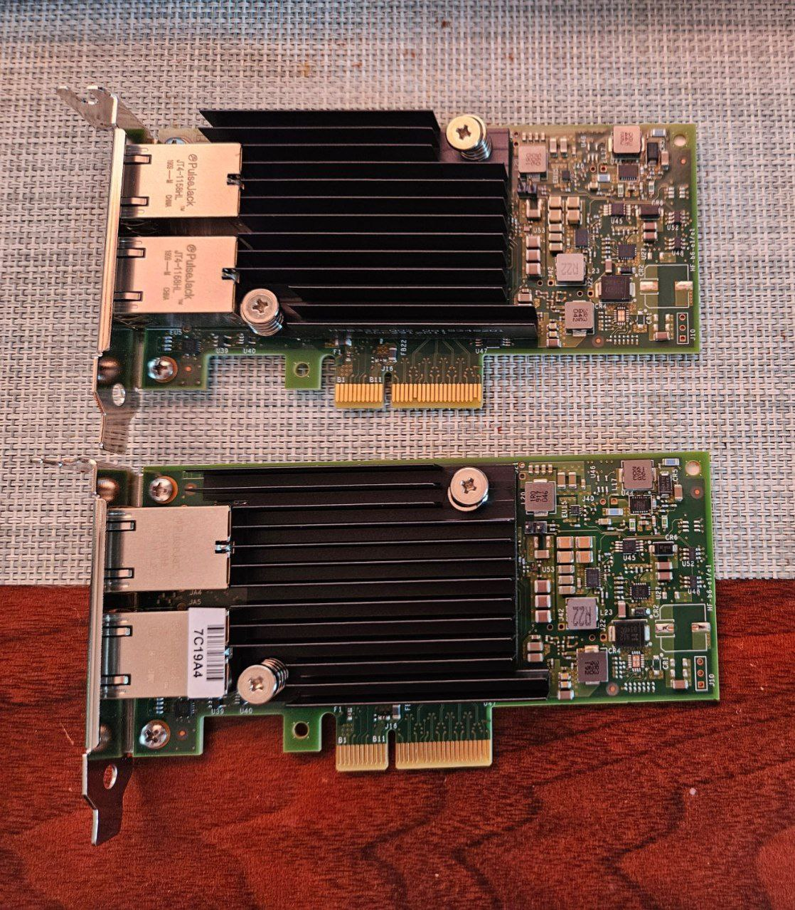

其实我一开始决定升级到万兆的原因不是觉得 2.5G 网络不够用，毕竟 btrfs 并没有内建 SSD 缓存的功能，甚至都没有 RAID1 的读取速度优化，所以机械硬盘顶天也就 300M/s 而已（何况我之前的 NAS 硬件也没有添加 SSD 的空间了，更何况建立 bcache 缓存需要清空当前的阵列从头开始，考虑到已有的数据量这显然不现实）。原因其实只是因为我以比较低的价格捡漏了一台 Mac mini 开始日常使用，而 Finder 在使用无线网络的时候访问 Samba 的性能实在不敢恭维（即使是有线网，Finder 在访问内容比较多的目录的时候加载速度也显著慢于 Nautilus，但至少比无线网好很多）。所以我考虑要不再从 NAS 拉一根网线到 Mac mini。但是我的 NAS 上已经没有多余的网口了，如果只是把原来接台式机的单口 2.5G PCIe 网卡换成双口 2.5G PCIe 网卡未免有些太过无聊，何况 Mac mini 本身也只有千兆网口，无论如何都得配个外接网卡，索性全部战未来换成万兆网卡吧。

万兆网卡分成光口和电口两种。光口网卡温度比较低，但是较长距离需要使用光纤，布线的时候就得非常小心，较短距离可以使用某种封装好的铜线，但是为了不影响睡眠我把 NAS 放在卧室门外，又要绕过门缝又要贴墙，总距离有个小十米，所以感觉不是很适合我。电口网卡温度比较高，但可以使用普通的网线（虽然有人说需要什么六类七类线，但实际上家庭使用不超过 30 米的距离只要普通的五类线就完全可以跑满万兆了），而且考虑到如果以后升级新的 Mac mini 可以直接选配万兆网卡，那个也是电口的，所以我还是买了电口的万兆网卡。

Mac mini 这边其实没什么好选的，雷电口的万兆网卡一共也就那么几款，因为本身这个品类针对的就是各种 Mac，需要使用 Mac 能支持的芯片。我选择了一款 AQC113 芯片的，这款也是带万兆网卡的 Mac mini 内置的型号，因为市场比较小所以价格相比 PCIe 的服务器网卡要贵一些。如果你胆子大你也可以考虑自己购买雷电转 PCIe 的转接卡和 PCIe 万兆网卡拼一个，但可能需要专门处理散热。AQC113 已经是电口网卡里面据说“不那么热”的型号了，但我买的这款运行时候摸上去还是会感觉有点烫手，不过也可能是因为这款使用铝制外壳把热量传递出来的原因，反正雷电设备本身就很热，我的雷电 hub 平时摸上去也是会觉得很热的程度，还要考虑到 hub 使用的是塑料外壳，热量并不是完全传递出来。不过使用起来都一切正常，没有出现过那些发热比较严重的网卡因为不装风扇就过热卡死的问题。

台式机和 NAS 这边可选的就很多了，因为是 PCIe 可以购买服务器网卡，大部分都是半高和双口的。我只有三台设备，主要的需求是把 Mac 和 PC 分别连接到 NAS，就省了买万兆交换机的钱。最便宜的电口万兆网卡是 Intel 的 X540，但是这款出来的比较早，是 PCIe 2.0 x8，制程比较老发热也比较严重，很多人建议在散热片上加一个小风扇，不然会死机。但是小风扇是高频噪音重灾区，而且考虑到以后升级主板的话大部分主板 PCIe x8 是和第一条 x16 共享的，反而一般都有独立的 x4 插槽，所以我觉得为了这两个加点成本是可以接受的。最后我买了两张 PCIe 3.0 x4 的 Intel X550，不加独立风扇使用起来也没什么问题。

软件方面的话我在 NAS 上配了个桥接，倒不是因为我特别需要 Mac 访问 PC，只是我想让 NAS 的两个网口都用同一个 IP，而不是 Mac 和 PC 用不同的 IP 访问 NAS。因为我的 NAS 上面也用 Network Manager 所以建桥接也很简单。以及通过网络使用 `rsync` 复制文件的时候不要使用 `--sparse` 参数，尤其是在 macOS 上，这个参数会导致速度下降 100~200M/s。使用 `cp` 或者各种文件管理器的时候倒是没什么要注意的。

后面我还是把万兆网络利用了起来，因为我忍受不了 ITX 的 NAS 机箱完全没有一点扩展空间的现状很久了，同时我买了一块 2T 的 NVMe SSD，本来是格式化成 exFAT 格式装进 USB 硬盘盒打算剪辑的时候随插随用，后面发现 macOS 的 exFAT 驱动性能比 Linux 下差很多，所以一不做二不休给 NAS 买了新的 MATX 主板和机箱，然后把这块 SSD 装在 NAS 的第二条 NVMe 槽用作剪辑盘，结果 macOS 通过万兆网和 Samba 访问比通过 USB 和 exFAT 快很多……
