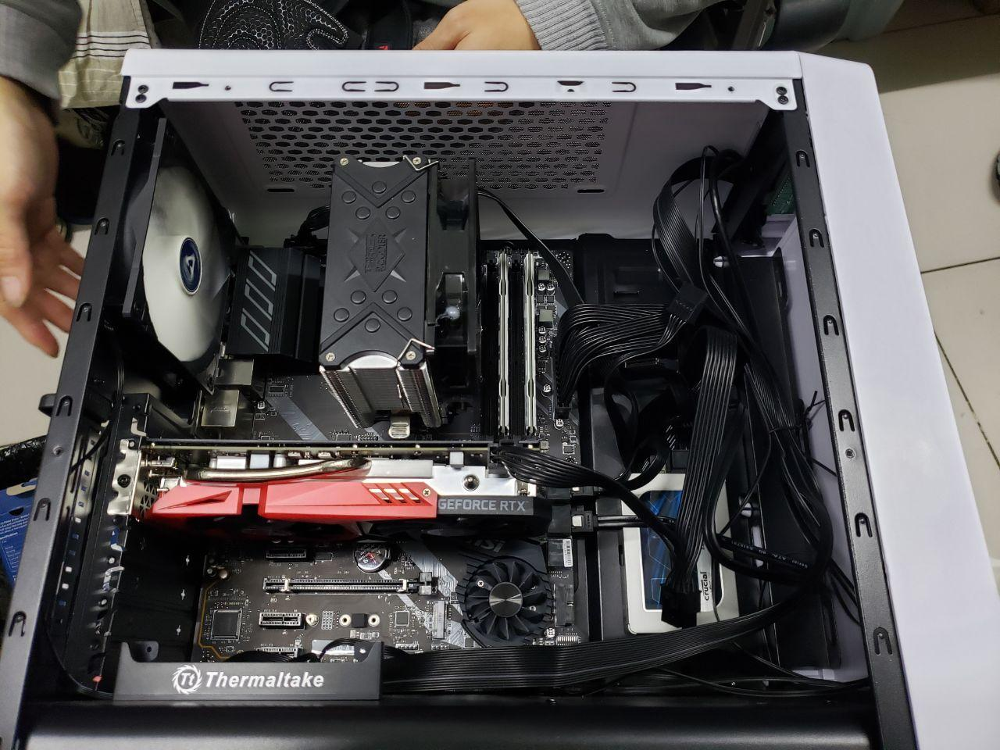
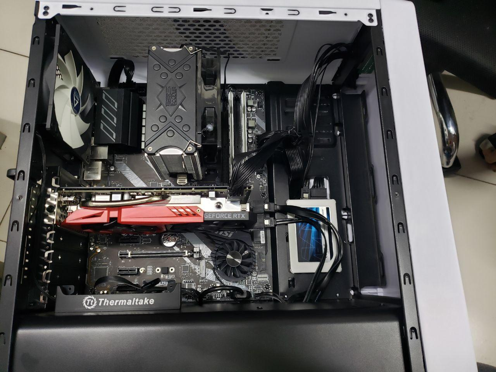
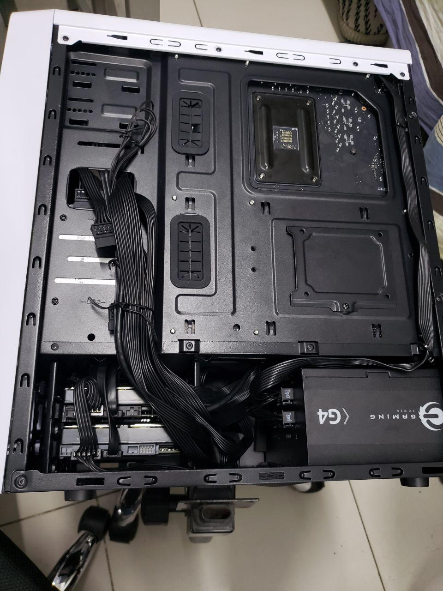
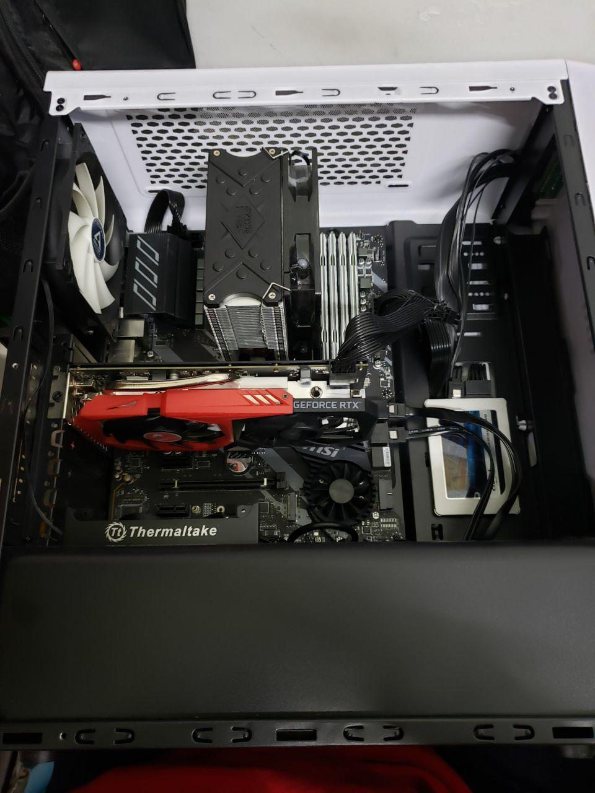
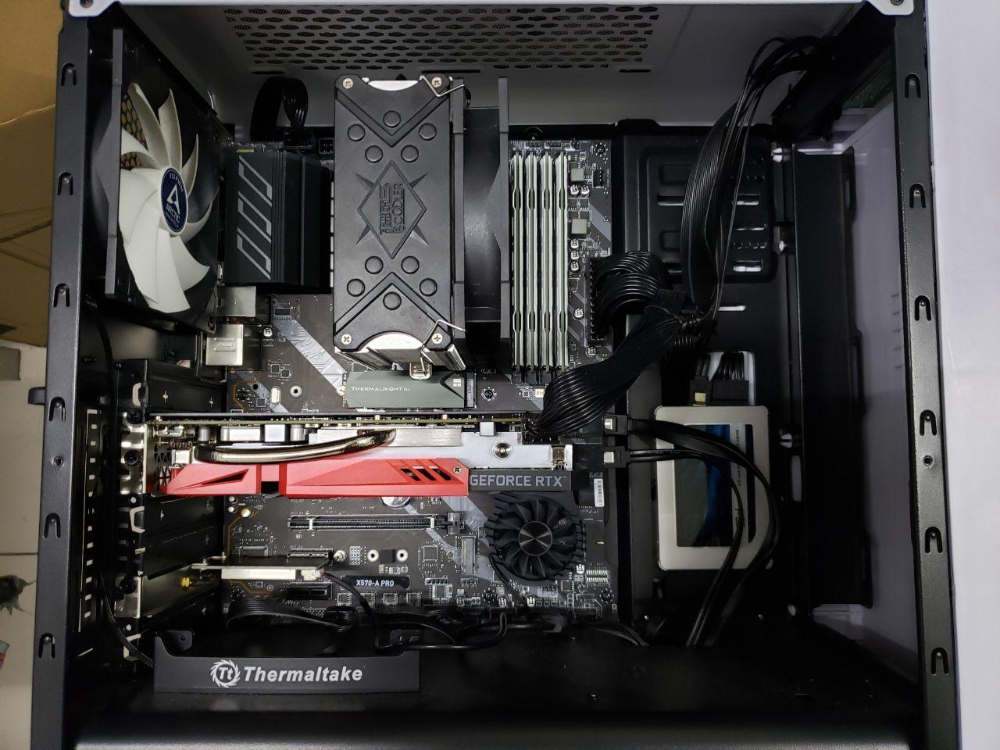

由于笔记本散热和性能实在是不适合打游戏（有一说一，Optimus 双显卡还是没有直接单卡来得爽），所以很早就想组装一台台式机。特别是最近一直和高中同桌玩 Dota2，我的笔记本如果直播 Dota2，直播推流就会十分卡顿，而我又不想像 CSGO 一样降低画质玩。

<!--more-->

作为计算机专业的学生，当然不打算直接淘宝整机啦。经过一番挑选和参考别人意见，最后成套配置是下面这样：

- CPU：AMD Ryzen5 3600X
- 主板：微星 X570 A-PRO 套装2349
- 显卡：七彩虹 2060 战斧 6G 2199
- 内存：铂胜 运动白 DDR4 3000 8G x4 1000
- 网卡：EDUP Intel AX200 150
- 硬盘：三星 970 EVO Plus 512G 769
- 硬盘：英睿达 MX500 1TB 799
- 电源：长城 450W 铜牌 329
- 散热：超频三 东海x5 89
- 散热：利民 M.2 硬盘散热片 39
- 机箱：启航者 S5 129
- 风扇：Arctic F12 温控 x2 80（一个被我用来替换散热器上的风扇了，就它带灯，好烦人。）

总计 7932。（有些具体价格我记不清了，而且京东价格总是波动。）性价比还可以。

选这样一套配置其实有原因，可能很多人觉得为什么要给 R5 配 X570 这种高端主板，不如换成 B450 然后把预算加到别的上面。但按照我朋友的使用经验，4 代和以前的 AMD 芯片组存在 USB 兼容性问题，而且我装好机器后就在 Arch Linux CN 群里看到有人遇到这种问题，5 代似乎重新设计了 USB 控制器，目前一切正常。

如果仅仅是打游戏也可以把 R5-3600X + X570 换成 i5-9600KF + Z390，大概可以便宜一点然后升级一下显卡？我觉得差价是不够 2060 换 2060S 的。或者如果要求不高换成 R5-3600 也行。但 R5-3600(X) 是 12 线程而 i5-9600KF 只有 6 线程，所以我还是选择了 Ryzen，反正 AMD CPU 最近表现都很不错，没必要给 Intel 掏更多的钱。如果你在京东买，建议自己翻翻店铺，一般买主板 CPU 套装更便宜，但是它不会摆出来……

显卡一开始我是打算买个 1999 的 GTX 1660Ti 的，反正我玩的游戏也不需要光线追踪（难道真相不是本来就没几个游戏支持光线追踪嘛？），然而看到七彩虹最便宜的 2060 正在特价 2199，果断少买一条内存，加钱上这个。反正 1999 的 1660Ti 也是便宜货，而且看了一下视频似乎这块卡也不是丐中丐中丐，质量还可以（同价位索泰铭瑄也不能说是什么高端货吧？），反正内存可以再插新的，而显卡二手不值钱。什么你说 A 卡？虽然 A 卡对于 Linux 的驱动支持更好一点，但是 N 卡也不是不能用，而且我要开直播的话 NVENC 编码挺香的，而且对我的 Steam 库存来说 N 卡也更友好一点（但是骂老黄还是要骂的）。另外虽然我不做机器学习，但万一室友毕设需要的话，反正我上班也不用台式机，装个 CUDA 让他 SSH 上去用岂不是你好我好大家好。

内存其实没什么特别要求，不过由于 Ryzen 的设计，频率越高越好，但按照这一代的设计，最佳频率是 3600 左右，再高反而会下降，我是买不起那么奢侈的内存，甚至 3200 的都买不起，但这款 3000 的也不错，据说颗粒是镁光创下超频记录的那一批，所以就买了四条。我也不需要 RGB，这款的马甲还挺好看的。当然 3000 是 XMP 频率，需要在 BIOS 里打开 XMP，不然默认只有 2400。

硬盘不多说了，买 MX500 还是看中一个稳，我还是不放心买同价位国产白片……而且作为一个 2016 年就在笔记本上使用 NVME SSD 的人，表示并没感觉出 NVME 和 SATA 有什么使用差别……我也不渲染视频，写写代码打打游戏都不卡。

电源有点买亏了，买完了发现同系列 550W 的电源当时也是 329，都怪京东迷一样的定价策略，好在我这一套功耗并不是很高。开始我听说原装散热器也能压住 3600X，所以就没打算换，但后来发现刀法还是精准啊，3600X 带的散热器竟然不是铜芯的，再加上 Ryzen 三代的电压控制比较激进，待机温度有时候超过 50，打游戏时候机箱上方有点烤腿，所以还是换了个塔式散热器，风道科学了不少，温度控制也更好了。而且 AMD 原装风扇转速太高，3000rpm 的时候机箱都在震，换了之后安静了很多。顺便安原装散热器时候拆下来的螺丝卡扣不要扔，万一换塔式散热器，好多都是需要装在这个卡扣上的。

说到机箱和风扇我就一肚子气！本着对京东自营品质和速度的信赖，我全套都是在京东买的，结果拿到手全部安装上之后发现机箱开机跳线是短路的，插上电源就开机，开一会因为短路主板以为你在长按电源又关了！开始我还以为是主板坏了，结果发现螺丝刀手动碰一下开机跳线开关是可以正常开机的！于是又费了九牛二虎之力拆下来退货，主板散热器显卡都在盒子里椅子上放了两天，还好新机箱没问题，但是我买风扇的时候又给我发了个断轴的！东哥呀东哥，我拿你当兄弟，你拿我当代价？你是盯上我了？虽然我平时说你两句坏话但是对京东的服务还是好评的，但是经过这次之后我还是得重新考虑考虑了……顺便据说启航者 S5 这个机箱前面板音频口有的是 HD Audio 有的是老版 AC97，涉嫌虚假宣传，如果你遇到 AC97 的大概可以换货，麻烦一点，不过反正便宜货就这样子，我的抽奖抽到 HD Audio 了。

其他的外设我自己都有，显示器就是之前买的优派 XG2402，1080p@144Hz 并且自带扬声器，鼠标就卓威 EC1-B CSGO 特别版（这个版本已经停产了，而且有偶尔指天/指地的 bug，建议买新的 EC1/2 或者 DIVINA 版本），键盘则是前段时间买的 ikbc C87 红轴，便宜还好用。

顺便由于我手残以及力气小和室友跃跃欲试，很多东西都是他装的，非常感谢。话说回来装这东西还真是个力气活，毕竟接口都有防呆设计仔细看看不会装错，但是真的很紧很难拔……非常担心把主板搞坏了。

更新：

更新：避免你们说我灵魂走线，重新整理了一下，线太硬了。

更新：内存插满

更新：NVMe + 蓝牙无线网卡的完全体

这个机箱 CPU 线走上面是要把主板拿下来才能穿过去的，而且右边两个有硅胶垫的孔 ATX 完全不能用，只能用一个孔，而且不能把线固定在机箱中间，很难盖上。

接下来是喜闻乐见的 debug 时间，首先是 Linux 下的，相对比较好调：

三代 Ryzen 有一个 [每次都返回 0xFFFFFFFF 作为随机数的 BUG](https://www.infoq.cn/article/BRebwaBfJ9eP28X9wQQc)，在我这主要影响 wireguard，巧的是购买前几天我刚读过这篇文章，AMD 已经发了新的固件修正错误，建议更新到主板厂家提供的最新 BIOS 版本一般即可解决，如果主板厂家最新的 BIOS 还没更新固件建议联系售后催一下。

在我这不知道为什么 GDM 有时候没法自动启动，但是手动切 tty start 又可以显示，查了一下 [ArchWiki 的 GDM 页面](https://wiki.archlinux.org/index.php/GDM#GDM_freezes_with_systemd) 发现有解决方案，但是并没有原因，搜索了一下也没发现原因是什么。

我还发现有时候刚开机没多久很快就关机会卡在什么 systemd-udevd 进程没结束，最后 event loop failed + timed out，大概要卡好几分钟才关机，但如果你用一会再关机就没问题。检查好几次关机日志没发现问题，后来群友火眼金睛对比了完整日志发现有个叫 `ucsi_ccg` 的模块开机加载了两分钟，猜测是这个的问题，搜索一下发现是 [5.3 内核里 NVIDIA 添加的相关代码](https://github.com/torvalds/linux/blob/da94001239cceb93c132a31928d6ddc4214862d5/drivers/usb/typec/ucsi/ucsi_ccg.c)，用来控制 NVIDIA 显卡上的 Type-C 接口的，可是我这块显卡根本就没提供 Type-C 接口！（以及很多笔记本内置的有输出的 N 卡也有这个问题。）临时在 `/etc/modprobe.d/` 里加了个 `blacklist ucsi_ccg` 的 conf 屏蔽了这个，好像没什么不良影响……

然后是奇怪的 Windows 的问题，我一开始装的 LTSC，不知道怎么回事输入法没了……折腾无果只能重装。以及现在除了不要联网装 Windows 之外（否则会强制你登录微软账户然后用你名字拼音前五位做用户名），还得不要联网装 NVIDIA 驱动，否则 Win10 自动更新驱动会给你安装 DCH 版的，虽然没什么影响（只是在 NVIDIA 官网升级驱动时候不能选标准选 DCH），但是就是让人很不爽。声卡驱动要装主板厂商的，Win10 自带的只能输出，不能接麦克风录音。还有要关掉快速启动，不然直接开机会卡在黑屏一个鼠标光标……反正就很烦人。

更新：还有一个奇怪的问题是 Win10 关机重启也要卡很久，上网搜了一下全是一些忽悠小白的办法，经过我不懈搜索发现了一个熟悉的名字 `UCSI`！微软承认存在 `UCSI` 问题，既然又是这个 `UCSI`，多半还是 NVIDIA Type-C 的问题！反正我没这个接口，果断重新安装 N 卡驱动，选择清洁安装（删除旧驱动）并不勾选 Type-C Driver，问题解决……

最后既然设备到位了，大概就每周一三四五晚上八点半在 [Bilibili 4312991 直播间](https://live.bilibili.com/4312992) 播一个半小时游戏，反正我玩什么播什么，大概就 CSGO Dota2 PUBG 什么的吧，尼尔也有可能，反正不是恶心反胃的就可以。周末随缘直播，如果没什么事情白天就播一会，周二可能晚一点开播因为有课。

*Alynx Zhou*

**A Coder & Dreamer**
