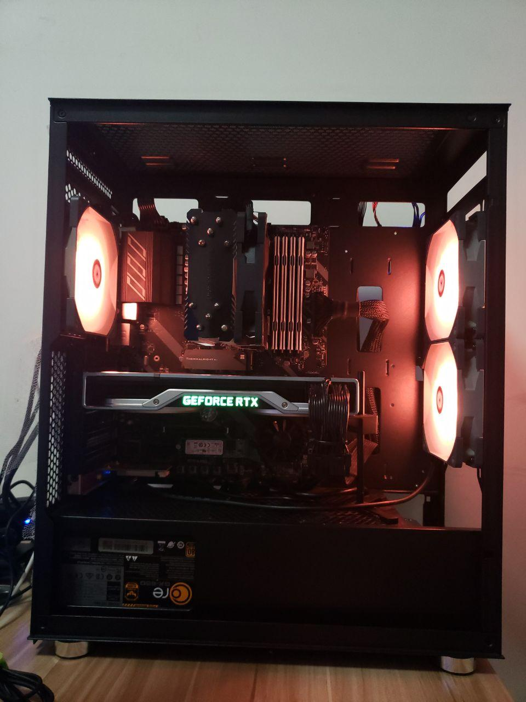

由于笔记本散热和性能实在是不适合打游戏（有一说一，Optimus 双显卡还是没有直接单卡来得爽），所以很早就想组装一台台式机。特别是最近一直和高中同桌玩 Dota2，我的笔记本如果直播 Dota2，直播推流就会十分卡顿，而我又不想像 CSGO 一样降低画质玩。

<!--more-->

作为计算机专业的学生，当然不打算直接淘宝整机啦。经过一番挑选和参考别人意见，最后成套配置是下面这样：

- CPU：AMD Ryzen5 3600X
- 主板：微星 X570 A-PRO 套装 2349
- 显卡：NVIDIA Geforce RTX 2070 SUPER 4300（之前是 七彩虹 RTX 2060 战斧 6G 2199）
- 内存：铂胜 运动白 DDR4 3000 8G x4 1000
- 网卡：Intel AX200 150
- 硬盘：三星 970 EVO Plus 512G 769
- 硬盘：英睿达 MX500 1TB 799
- 电源：海韵 CORE GX650 650W 金牌 549（特价）
- 散热：利民 AK120 145（之前是 超频三 东海x5 89）
- 散热：利民 M.2 硬盘散热片 39
- 机箱：先马 鲁班1 209
- 风扇：利民 TL-C12R-S x2 + 利民 TL-C12S 418（TL-C12R-S 只有 299 的三联包）（之前是 Arctic F12 PWM 温控 x3 120）

总计 10727。（有些具体价格我记不清了，而且京东价格总是波动。）性价比一般，因为我在其它人觉得没必要的地方分了很多预算比如主板风扇和硬盘，选 B450M 和西数的 NVMe 以及随便买个不带温控但是带灯的风扇的大有人在。

选这样一套配置其实有原因，可能很多人觉得为什么要给 R5 配 X570 这种高端主板，不如换成 B450 然后把预算加到别的上面。但按照我朋友的使用经验，4 代和以前的 AMD 芯片组存在 USB 兼容性问题，而且我装好机器后就在 Arch Linux CN 群里看到有人遇到这种问题，5 代似乎重新设计了 USB 控制器，目前一切正常。

如果仅仅是打游戏也可以把 R5-3600X + X570 换成 i5-9600KF + Z390，大概可以便宜一点然后升级一下显卡？我觉得差价是不够 2060 换 2060S 的。或者如果要求不高换成 R5-3600 也行。但 R5-3600(X) 是 12 线程而 i5-9600KF 只有 6 线程，所以我还是选择了 Ryzen，反正 AMD CPU 最近表现都很不错，没必要给 Intel 掏更多的钱。如果你在京东买，建议自己翻翻店铺，一般买主板 CPU 套装更便宜，但是它不会摆出来……

显卡一开始我是打算买个 1999 的 GTX 1660Ti 的，反正我玩的游戏也不需要光线追踪（难道真相不是本来就没几个游戏支持光线追踪嘛？），然而看到七彩虹最便宜的 2060 正在特价 2199，果断少买一条内存，加钱上这个。反正 1999 的 1660Ti 也是便宜货，而且看了一下视频似乎这块卡也不是丐中丐中丐，质量还可以（同价位索泰铭瑄也不能说是什么高端货吧？），反正内存可以再插新的，而显卡二手不值钱。什么你说 A 卡？虽然 A 卡对于 Linux 的驱动支持更好一点，但是 N 卡也不是不能用，而且我要开直播的话 NVENC 编码挺香的，而且对我的 Steam 库存来说 N 卡也更友好一点（但是骂老黄还是要骂的）。另外虽然我不做机器学习，但万一室友毕设需要的话，反正我上班也不用台式机，装个 CUDA 让他 SSH 上去用岂不是你好我好大家好。

内存其实没什么特别要求，不过由于 Ryzen 的设计，频率越高越好，但按照这一代的设计，最佳频率是 3600 左右，再高反而会下降，我是买不起那么奢侈的内存，甚至 3200 的都买不起，但这款 3000 的也不错，据说颗粒是镁光创下超频记录的那一批，所以就买了四条。我也不需要 RGB，这款的马甲还挺好看的。当然 3000 是 XMP 频率，需要在 BIOS 里打开 XMP，不然默认只有 2400。

硬盘不多说了，买 MX500 还是看中一个稳，我还是不放心买同价位国产白片……而且作为一个 2016 年就在笔记本上使用 NVMe SSD 的人，表示并没感觉出 NVME 和 SATA 有什么使用差别……我也不渲染视频，写写代码打打游戏都不卡。但是后来打脸了，公司发了新年福利于是还是上了个 NVMe 硬盘。顺便还配了个无线网卡用来接蓝牙和 WiFi，似乎 Intel AX200 是对 Linux 支持比较好的，就随便买了个 PCI-E 的插上了（御三家集齐了！）（ATX 的好处终于用上了，多出来的 PCI-E 随便插）。

电源有点买亏了，买完了发现长城同系列 550W 的电源当时也是 329，都怪京东迷一样的定价策略，好在我这一套功耗并不是很高，当然最后趁着福利 + 打折还是换成了海韵一元一瓦的金牌全模组，带我这套绰绰有余。开始我听说原装散热器也能压住 3600X，所以就没打算换，但后来发现刀法还是精准啊，3600X 带的散热器竟然不是铜芯的，再加上 Ryzen 三代的电压控制比较激进，待机温度有时候超过 50，打游戏时候机箱上方有点烤腿，所以还是换了个塔式散热器，风道科学了不少，温度控制也更好了。而且 AMD 原装风扇转速太高，3000rpm 的时候机箱都在震，换了之后安静了很多。顺便安原装散热器时候拆下来的螺丝卡扣不要扔，万一换塔式散热器，好多都是需要装在这个卡扣上的。

说到机箱和风扇我就一肚子气！本着对京东自营品质和速度的信赖，我全套都是在京东买的，结果拿到手全部安装上之后发现机箱开机跳线是短路的，插上电源就开机，开一会因为短路主板以为你在长按电源又关了！开始我还以为是主板坏了，结果发现螺丝刀手动碰一下开机跳线开关是可以正常开机的！于是又费了九牛二虎之力拆下来退货，主板散热器显卡都在盒子里椅子上放了两天，还好新机箱没问题，但是我买风扇的时候又给我发了个断轴的！东哥呀东哥，我拿你当兄弟，你拿我当代价？你是盯上我了？虽然我平时说你两句坏话但是对京东的服务还是好评的，但是经过这次之后我还是得重新考虑考虑了……顺便据说启航者 S5 这个机箱前面板音频口有的是 HD Audio 有的是老版 AC97，涉嫌虚假宣传，如果你遇到 AC97 的大概可以换货，麻烦一点，不过反正便宜货就这样子，我的抽奖抽到 HD Audio 了。但是这个机箱设计的很抠门，比如主板装上了就没法在上面走 CPU 电源线了，有两个走线口直接被 ATX 主板盖住，所以主板和显卡的电源线只能从一个口里挤出去，然后固态硬盘就在这个口下面所以也很难接线……而且机箱侧板是个黑色半透明的亚克力（那就别宣传透明啊！），金属外壳感觉也不是很厚实。所以最后还是换了先马的鲁班 1，各种设计都宽松了许多，装起来也很好看。

其他的外设我自己都有，显示器就是之前买的优派 XG2402，1080p@144Hz 并且自带扬声器，鼠标就卓威 EC1-B CSGO 特别版（这个版本已经停产了，而且有偶尔指天/指地的 bug，建议买新的 EC1/2 或者 DIVINA 版本），键盘则是前段时间买的 ikbc C87 红轴，便宜还好用。

顺便由于我手残以及力气小和室友跃跃欲试，很多东西都是他装的，非常感谢。话说回来装这东西还真是个力气活，毕竟接口都有防呆设计仔细看看不会装错，但是真的很紧很难拔……非常担心把主板搞坏了。

-------

更新：

-------

更新：避免你们说我灵魂走线，重新整理了一下，线太硬了。

-------

更新：内存插满。

-------

更新：NVMe + 蓝牙无线网卡的完全体。

这个机箱 CPU 线走上面是要把主板拿下来才能穿过去的，而且右边两个有硅胶垫的孔 ATX 完全不能用，只能用一个孔，而且不能把线固定在机箱中间，很难盖上。

-------

再更新：新机箱比原来的好看多了也宽敞多了。

公司的蜥蜴（明明是变色龙！）玩偶太高了，显卡下面放不开，挂着我又不放心，盖盖子之前还是拿出来了。

-------

更新：换上了公版 2070 SUPER 和利民 AK120。

-------

更新：冬天到了，还是换了几个支持 ARGB 的风扇，我个人不喜欢蓝光紫光夜店土嗨风，所以就弄了点温暖的颜色假装是个电暖气。前面是利民 TL-C12R-S，后面是利民 TL-C12S，虽然是三联包，但是似乎螺丝有问题，有一个风扇螺纹被拧花了，而且后面的风扇竟然少一个角上的橡胶减震垫，于是我就没装拧花的那个，并且把它的减震垫安装到后面了。反正考虑到我最下面是机械硬盘，装上这个风扇风道也不畅通，而且那里并没有什么需要散热的设备，电源风道是独立的。每把风扇两根线，ARGB 线要串联，PWM 线要一分三，而且有前有后，风扇线还有编织保护套，还要防止线材打到风扇扇叶。理线花了好久，最后把他们用扎带固定到下面和前面空的风扇挂架上。而且我还有三个 SATA 硬盘打算换一下 SATA 线……我真的想不出来那些水冷排且上下左右全都是 ARGB 风扇的人怎么理线的。

我不会告诉你其实我是想调出我 TB 至宝的颜色：

一开始我以为需要用 OpenRGB 这个项目才能在 Linux 下控制颜色，但是这种 ARGB 风扇好像有存储机制，会自动记住上次的设置。于是就在 Windows 下面安装了一个有一大堆乱七八糟组件和功能的 MSI Dragon Center，其实我只需要调成长亮，然后重启进 Linux 颜色就一直是我设置的，然后我想关掉 Dragon Center 的自启动因为反正也用不到，但是微星的软件自己拉跨，重启进 Linux 灯光不变，重启进 Windows 又变呼吸彩虹灯光了。最后发现 Dragon Center 里面有一个类似“覆盖第三方RGB软件”的选项……好像他把他自己上次存储的结果也当第三方软件了，关掉就好了。原理我猜因为 Dragon Center 只是个 Client，真正控制颜色的是他某个 SDK 里面的 Daemon，这个选项的意思其实就是 Daemon 每次启动都按照 Dragon Center 设置的颜色重新设置风扇就实现覆盖功能了……但是 Dragon Center 的启动被我关了所以就默认了，不管了，统统关掉就 OK。

-------

接下来是喜闻乐见的 debug 时间，首先是 Linux 下的，相对比较好调：

三代 Ryzen 有一个 [每次都返回 0xFFFFFFFF 作为随机数的 BUG](https://www.infoq.cn/article/BRebwaBfJ9eP28X9wQQc)，在我这主要影响 wireguard，巧的是购买前几天我刚读过这篇文章，AMD 已经发了新的固件修正错误，建议更新到主板厂家提供的最新 BIOS 版本一般即可解决，如果主板厂家最新的 BIOS 还没更新固件建议联系售后催一下。

在我这不知道为什么 GDM 有时候没法自动启动，但是手动切 tty start 又可以显示，查了一下 [ArchWiki 的 GDM 页面](https://wiki.archlinux.org/index.php/GDM#GDM_freezes_with_systemd) 发现有解决方案，但是并没有原因，搜索了一下也没发现原因是什么。

我还发现有时候刚开机没多久很快就关机会卡在什么 systemd-udevd 进程没结束，最后 event loop failed + timed out，大概要卡好几分钟才关机，但如果你用一会再关机就没问题。检查好几次关机日志没发现问题，后来群友火眼金睛对比了完整日志发现有个叫 `ucsi_ccg` 的模块开机加载了两分钟，猜测是这个的问题，搜索一下发现是 [5.3 内核里 NVIDIA 添加的相关代码](https://github.com/torvalds/linux/blob/da94001239cceb93c132a31928d6ddc4214862d5/drivers/usb/typec/ucsi/ucsi_ccg.c)，用来控制 NVIDIA 显卡上的 Type-C 接口的，可是我这块显卡根本就没提供 Type-C 接口！（以及很多笔记本内置的有输出的 N 卡也有这个问题。）临时在 `/etc/modprobe.d/` 里加了个 `blacklist ucsi_ccg` 的 conf 屏蔽了这个，好像没什么不良影响……

然后是奇怪的 Windows 的问题，我一开始装的 LTSC，不知道怎么回事输入法没了……折腾无果只能重装。以及现在除了不要联网装 Windows 之外（否则会强制你登录微软账户然后用你名字拼音前五位做用户名），还得不要联网装 NVIDIA 驱动，否则 Win10 自动更新驱动会给你安装 DCH 版的，虽然没什么影响（只是在 NVIDIA 官网升级驱动时候不能选标准选 DCH），但是就是让人很不爽。声卡驱动要装主板厂商的，Win10 自带的只能输出，不能接麦克风录音，然后如果麦克风声音很小就打开 Realtek 的声音控制程序，在右上角齿轮里取消掉什么把所有输入结合到一起的设定（什么乱七八糟的玩意！）。还有要关掉快速启动，不然直接开机会卡在黑屏一个鼠标光标……反正就很烦人。

更新：还有一个奇怪的问题是 Win10 关机重启也要卡很久，上网搜了一下全是一些忽悠小白的办法，经过我不懈搜索发现了一个熟悉的名字 `UCSI`！微软承认存在 `UCSI` 问题，既然又是这个 `UCSI`，多半还是 NVIDIA Type-C 的问题！反正我没这个接口，果断重新安装 N 卡驱动，选择清洁安装（删除旧驱动）并不勾选 Type-C Driver，问题解决……

最后既然设备到位了，大概就每周一三四五晚上八点半在 [Bilibili 4312991 直播间](https://live.bilibili.com/4312992) 播一个半小时游戏，反正我玩什么播什么，大概就 CSGO Dota2 PUBG 什么的吧，尼尔也有可能，反正不是恶心反胃的就可以。周末随缘直播，如果没什么事情白天就播一会，周二可能晚一点开播因为有课。

*Alynx Zhou*

**A Coder & Dreamer**
