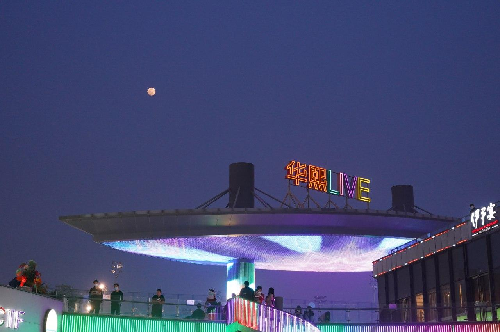
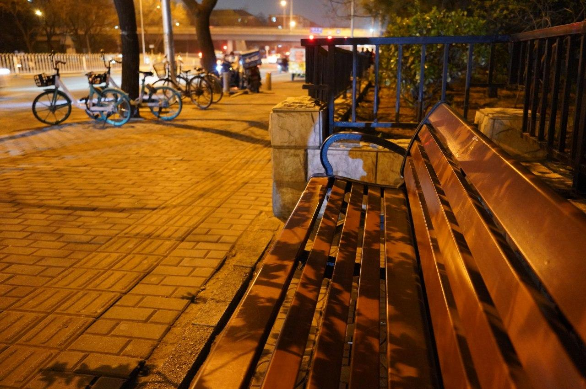
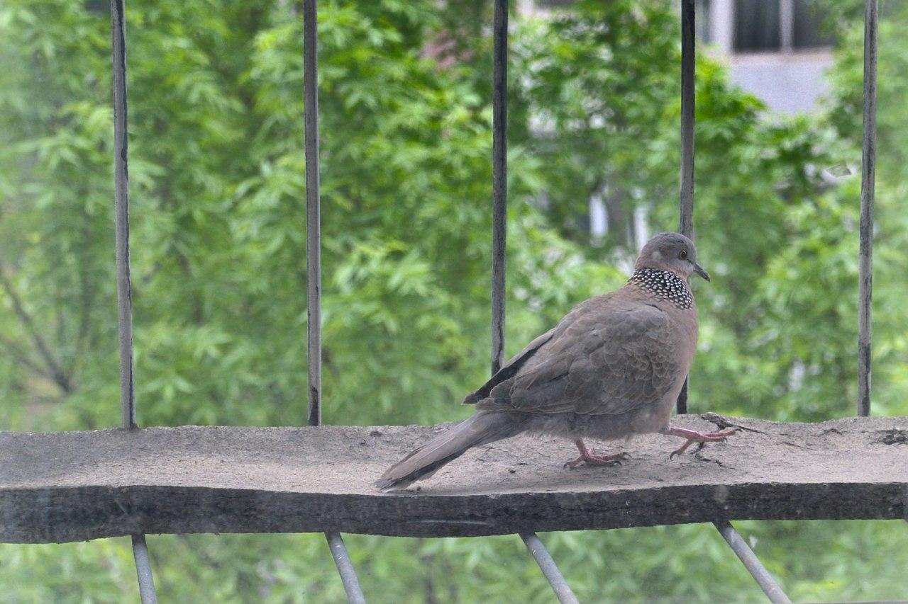
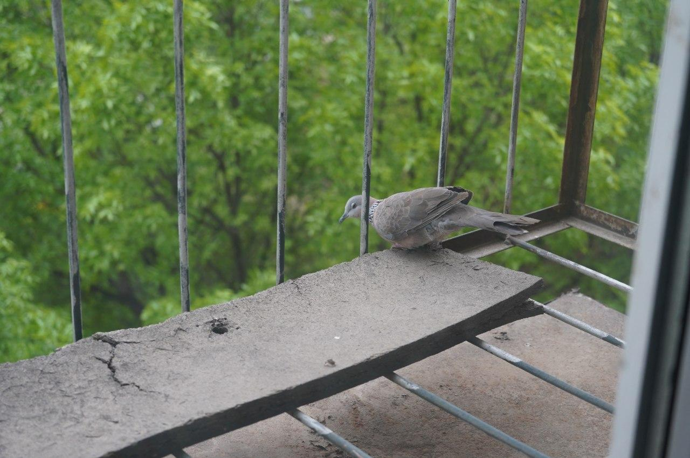

本来之前是想等新开的项目搞差不多了就来更新博客，结果没想到越写 TODO 越多一直搞到这个月才搞定，所以到现在才更新。

# 新项目

从家里回来北京之后第一件事情就是 SUSE 的 HackWeek，我之前大致想好了要做什么，我用过 screenkey 这个项目，但它使用了 X11 的 API，所以不支持 Wayland，我简单调查了一下，发现其实是可以绕过显示部分直接读取输入设备的事件的，于是就打算造一个替代品。

读取键盘事件的部分其实很容易，简单试了一下就完成了。但是反而是显示部分比较难搞。一开始我打算用刚发布稳定版的 GTK4，结果发现 GTK4 在 NVIDIA 驱动的 Wayland 会话下面反而是有问题的，只能回退到没问题的 GTK3。我原本以为一周的时间做出一个能用的程序还是挺充足的，但是后来发现中间有各种各样的问题和奇怪的 work around。比如涉及到 GObject 对象在什么时候释放，有些文档说的也不是很清楚。以及因为要用单独的子进程执行需要 root 权限的后端读取输入事件和用单独的子线程查询后端输出带来的进程/线程间通信问题。篇幅有限，打算后续再开一篇博客来介绍这里面的经验。在一周的时间里勉强做出了能用的 demo 参加了 HackWeek 的成果展示环节（给有始有终的参与者的小礼物大概还放在我公司的桌子上，我都不知道是什么，因为一直没去取），然后用了几周打游戏的时间整理代码里面的问题（主要是各种资源释放），以及做一下翻译工作和打包工作，终于在上周达到基本稳定了。如果有兴趣，可以访问 <https://showmethekey.alynx.one/> 或者观看 [我发在 B 站上的介绍视频](https://www.bilibili.com/video/BV1EB4y1A7QN)。

# 新相机

之前一直想提升视频的画质，但是还有一个想法是想玩玩摄影，因为平时周末经常是起得很晚然后在家里玩游戏，感觉也挺无聊的，所以打算买个相机，这样周末就有理由出去走走了。拍出来什么东西无所谓，主要是找点乐趣。然后朋友建议我买黑卡，虽然这个玩意确实很黑科技，但我并不是太感兴趣。很久以前我家里有一个数码相机，不是卡片机，是一个能变焦变很长的型号，但是后来智能手机出现之后就很快的不用它了，因为没有手机轻便的同时也没有足够的专业程度。所以我对相机的看法就是要么就搞高级一点的，肯定不会被手机取代，要么就用手机算了，而且说实话最高端的黑卡价格也都达到微单的价格区间了。考虑到要拿来录视频，很多录视频的 UP 主选择的都是微单而不是单反，再查找了一下发现很多人都用的索尼 A73，那选一个大家都在用的总是错不了的吧，于是初步选定了目标。然后又开始考虑是 A73 还是 A7C，虽然很多人对于 A7C 只是缩小体积然后价格却比 A73 高感到不满，但我阅读了一个对比表格之后，觉得还是 A7C 更适合我这种有录视频需求的人，于是就选择了 A7C。

我个人是对 A7C 相比 A73 砍掉的部分没什么需求的，只看参数很容易会变成那种“这个也想要那个也想要”的情况，虽然作为消费者而言，当然是希望厂家提供越多的功能越好。但是在只有这几个选项的情况下还是得考虑需求做一下取舍。比如去掉 MicroUSB 接口导致只能接一些 USB-C 接口的配件，看了看配件价格，短期内我大概是不会考虑这些配件的……去掉前拨轮和摇杆对我来说也不是不能接受，毕竟触摸对焦也挺好用的。虽然少了很多自定义按键，但是方向键现在都是可以自定义的，其实差别也不大。反而轻巧的体积和翻转屏，以及没有录制时间限制于我来说很重要。有人说没有双卡槽不够专业，万一给别人录东西丢了数据没有冗余，但可以预见的未来我不会靠这玩意获得收入，录我自己的话丢了也不算什么无法挽回的后果（反正自己选的）。

看点作品？虽然我就是随便拍拍，还是有几张觉得好看的。

之前去五棵松玩，想试试夜拍效果，结果套头的焦段显然不够拍月亮，不过回家看看感觉这张图还不错。

某天吃完饭散步，坐在长椅上拍了一张，莫名觉得很好看。

之前经常来我窗口咕咕咕叫吵我清梦的珠颈斑鸠，我管它叫大鸽，经常我拿着相机走到窗口它跑了，这张一开始其实拍到了部分室内，导致窗外的部分有点过曝，不过好在 RAW 可以调整，拉低了一些曝光然后裁掉窗户周围的部分，就变得很生动了。

最近大鸽不怎么来了，是不是因为楼下在锯树，大鸽的家没了？（虽然我对珠颈斑鸠再造一个窝需要花的时间表示怀疑。）

买完了 A7C 莫名开始种草 A7S3，4K 60 帧看起来真诱人啊……1080P 60 帧和 4K 30 帧只能二选一到底是谁想出来的牙膏啊！

说起来最近拍照片之后发现存储空间的需求还是很大啊，虽然我两块 2T 的机械应该还足以满足短期内的需求。最近挖矿导致大容量硬盘也涨价了，估计更新存储设备也不太现实，还是有空精简一下吧。NAS 的问题我也考虑过，但是后来想想还是放弃了把星际蜗牛重新搞起来的想法，因为看了很多视频/数码 UP 工作室的介绍之后意识到 NAS 比起存储的用途，更大的用途还是共享，比如多个剪辑师可以同时访问 NAS 上面的一份素材，不用在每台电脑上都复制一份。但我显然没这个需求也没这个网速，只是存储一些数据的话，还是直接插台式机里面比较方便吧！

顺便我朋友一直怂恿我买一个大光圈定焦镜头，我也确实心动了，比较了一下之后打算先入 FE 55 F1.8 ZA，然后再考虑 FE 24-105 G F4 代替套头，不过因为一些原因还是暂时搁置了，原因的话就是下一部分。

# 新住处

当初因为时间比较紧所以选的这个住处，有几个不太满意的地方：房间太小了，放下柜子床电脑桌就没什么地方了。为了节约空间我是把桌子沿着床边摆的，我自己坐在桌子和衣柜之间，所以如果我要打开衣柜找东西就要把椅子推到桌子下面。然后在我 B 站录的视频里也能看出来，有朋友不止一次吐槽过我录视频环境过于混乱了。房子太旧了，实在是让人连做饭的想法都没，又破又旧，同时上班的话也比较麻烦，不是说交通不便，而是这个房子在一个院子的深处，出门坐公交或者去超市都要走很长一段距离。再加上我的卧室是直接挨着楼道，隔音又比较差，有时候午睡就会被上下楼的脚步声打扰。以及说实话我想要个稍微便宜点的房子，谁不想呢？

所以今年快到期的时候我就在考虑搬家的问题。我们现在还是在家办公的状态，所以相对来说位置不太重要，虽然还是想尽可能找个上班方便的地方。但是很少有人和我一个方向上班，所以折腾了很久。本来是打算搬到更西南边的，甚至这一个月跑了好几个不同地方看房子，但是都因为各种原因没有选中，比如同学上班太远，周围没什么生活设施（虽然就在路边但是出门走好远好远才有超市到底是怎么搞的啊，为什么北京这边经常小区靠着路的一侧都是围墙，没有什么商业网点之类的，真的很没生活感），离地铁站太远，小区门禁是人脸识别（谁允许你们随便采集人脸信息的，而且约朋友来我家还要登记算几个意思啊）。而且想一起合租的同学以后可能考了教师资格证之后回老家工作，那样到时候就要再找人合租，我实在是不抱信心，所以还是决定再找别人合租。

最后和有猫的孙老师在交大附近找了另一个房子。看了一上午最后直接选中的原因只有一个：实在是太新了，刚装修完，非常干净，而且卫生间和厨房都有采光。让我这个饱受破旧和阴暗厨房之苦的人非常满意。同时面积分配也非常科学，孙老师希望要有阳台的卧室，养猫比较方便，我希望卧室面积别太小，这样我录视频的时候把电脑桌当作背景，可以有一定的景深，让桌子在焦外就不会显得太乱。很多房子都是有阳台的卧室大得不得了而另一个卧室只能放个床，这个房子的次卧则不一样，有充足的地方放桌子。所以我们就敲定了这个，兜兜转转还是没离开学校周边。

当然也没有完美的事情，满足了空间和干净和隔音（卧室并不是直接挨着楼道），价格和位置也就不能太强求了，交通的话看起来还好，离路边不会太远，大学周围也不至于太荒凉吧（街头生活感本来就和整齐不沾边，城市到底是让大人物拿来看的地方还是让小人物生活的地方呢？）。虽然考虑到更高的房租+中介费让我感到心疼肉疼（感觉镜头离自己远去了）……但是安慰自己多花几百块买来了刚装修完崭新的房子其实也很赚了对吧！

所以希望接下来能轻松地搬家，毕竟我东西还是挺多的，有了空间就可以仔细布置一下了，让视频看起来更精致一点。

总之还是要对生活有希望吧。

*Alynx Zhou*

**A Coder & Dreamer**
