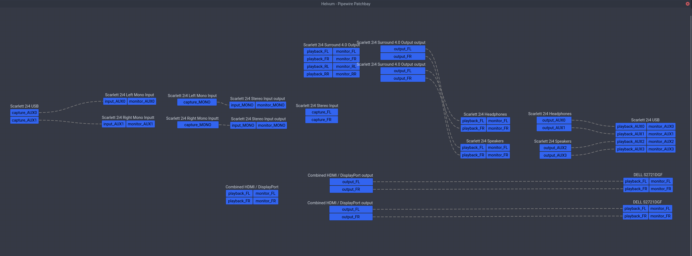
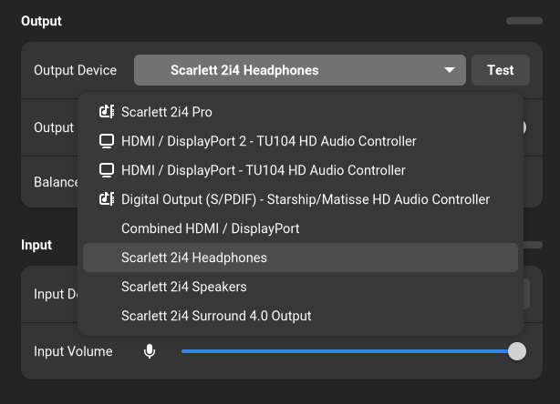
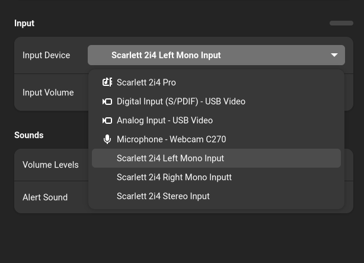

认识的朋友里很少有人有像我这么复杂的音频系统。长话短说，为了能让 PS4、Switch 和电脑分享一个扬声器，我把它接在了显示器上而不是电脑的内置声卡上，这样所有设备都通过 HDMI/DP 输出音频到扬声器。一开始这也没什么，后来我又添置了一块显示器，我发现在 Linux 下面经常搞不清楚究竟哪一个音频设备才是连接着扬声器的显示器，可能上周还是 HDMI 1，这周就变成 HDMI 2，而且也不是每次都会变，导致我经常需要试试才知道哪一个是我需要的。直到前天我忍不了了，决定发挥动手能力解决这个问题。

一开始我以为是 PipeWire 给设备排序的时候是随机排序的，那简单，只要我找到每个设备对应的 ID，然后关掉没有扬声器的那个 HDMI 输出就可以了。但是我发现似乎 PipeWire 只是按照 ALSA 给出的设备编号来排序，并没有自己编号，于是就算关闭一个设备，下次被关闭的也可能是另一个。然后我就在想难道 ALSA 没有固定 HDMI 音频设备的功能吗？毕竟就算是显示器也是有 EDID 这种东西的，于是我查了各种 ALSA 的资料，确实是可以通过 udev 指定不同声卡的顺序，但对于 HDMI 这种属于同一个声卡的不同端口的设备没什么办法。我甚至查到了 NVIDIA 关于显卡音频的文档，里面说每个端口会有一个叫做 ELD 的数据，描述了连接的显示器信息，不过通过 `cat /proc/asound/cardX/eld*` 查看之后我发现这个标准最多只给到显示器的型号，而我为了不在多显示器缩放上浪费精力，买了两台同样型号的显示器，没有序列号字段就还是没办法分辨不同的显示器！当然如果你的 HDMI 设备的型号不同，那其实就简单了，ALSA 现在会读取 ELD 里面的显示器型号，然后 PipeWire 会把这个作为 `node.nick` 属性，你可以直接通过这个属性分辨设备，也可以利用这个属性写 WirePlumber 重命名规则修改你的桌面环境会用到的属性，就可以固定名称了。不过我还得继续寻求帮助。

于是我就在公司的 research 邮件列表发了封邮件讲述了我的设备连接方式和需求，结果 Takashi Iwai（内核音频子系统的维护者之一）回复我说确实没有什么办法，音频驱动只是按照显卡给的顺序分配编号，所以大概率是随机的。特别是我还发现这玩意好像也不一定按照显示器输出的顺序来排号，于是 Plan A 是彻底行不通了。那我还有 Plan B 和 Plan C。

和其它同事给的建议一样，其中一个想法是购买一个硬件的混合器，把两台显示器的音频输出硬件连接到同一个扬声器的输入，甚至一个同事还给我画了电路图说你只要这样就能自己做一个了。不过这个方案既有优点也优缺点，优点是电脑和游戏机可以同时发声，缺点是我要在电脑上修改音量就得始终记得把两个音量都改成一样的。我对前者需求不大，所以打算最后再尝试这个。

当然有硬件的解法就有软件的解法，PipeWire 和 JACK 一样可以进行基于图的连接，那我只要搞一个虚拟的输出设备然后把两个 HDMI 设备跟它连一起不久行了？Arch Wiki 上恰好有一段 [同时向一块声卡上的不同端口输出音频](https://wiki.archlinux.org/title/WirePlumber#Simultaneous_output_to_multiple_sinks_on_the_same_sound_card) 的文档，我本来以为照做即可，但发现还是不对，并没有出现我想象中的一个新音频设备。不过后来我仔细研究，搞懂了里面各种术语，才知道是怎么回事。

首先我发现这一段文档其实只是描述如何创建一个“能同时显示两个 mapping 的 profile”，那到底什么是 mapping 什么是 profile？Mapping 可以理解成声卡上的某一种输入/输出组合，然后 profile 决定当前可以在哪几种组合中选择。举例来说就是假如你有一个 2 进 4 出的音频设备，那它可以是只有双声道输出，只有四声道输出，或者双声道输入四声道输出等等组合，这就是不同的 profile。为什么要同时输出不同端口需要创建一个 profile 呢，因为默认 ALSA 采用的是 auto-profile，会给每一个 mapping 创建一个 profile，而默认的一个 mapping 就是一个 HDMI 端口，因此假如你打开 pavucontrol 或者 Helvum，会发现如果不切换 profile，两个 HDMI 设备只能显示一个，也就没法给它们同时连接。当然你可能又会问为什么 GNOME Shell 里面又能显示两个 HDMI 设备？因为 `libgnome-volume-control` 是先枚举设备然后枚举端口，并没有经过 profile 这一步，选择端口的时候再自动切换 profile。

所以第一步是创建一个新的 profile sets，比如我创建的是 `/usr/share/alsa-card-profile/mixer/profile-sets/hdmi-multiple.conf`：

```
[General]
auto-profiles = no

[Mapping hdmi-stereo]
description = Digital Stereo (HDMI)
device-strings = hdmi:%f
paths-output = hdmi-output-0
channel-map = left,right
priority = 9
direction = output

[Mapping hdmi-stereo-extra1]
description = Digital Stereo (HDMI 2)
device-strings = hdmi:%f,1
paths-output = hdmi-output-1
channel-map = left,right
priority = 7
direction = output

# If you have more HDMI devices, add them here.

# Show multiple HDMI mappings so I could connect to them all.
[Profile hdmi-multiple]
description = Multiple Digital Stereo (HDMI)
output-mappings = hdmi-stereo hdmi-stereo-extra1
```

上面的 mapping 是直接从 `default.conf` 里面抄的，下面那个 profile 就是包含上面的两个 mapping，然后需要写 WirePlumber 规则来给显卡上的声卡套用这个 profile。我把它写到 `/etc/wireplumber/main.lua.d/51-hdmi-multiple.lua`：

```
rule = {
  matches = {
    {
      { "device.name", "matches", "alsa_card.pci-0000_0b_00.1" },
    },
  },
  apply_properties = {
    ["api.alsa.use-acp"] = true,
    -- By default, it creates profiles for each mappings, so one profile has one
    -- mapping, but I want to combine 2 mappings, so I have to manually create
    -- a profile to show 2 mappings.
    ["api.acp.auto-profile"] = false,
    ["api.acp.auto-port"] = false,
    ["device.profile-set"] = "hdmi-multiple.conf",
    ["device.profile"] = "hdmi-multiple",
  },
}

table.insert(alsa_monitor.rules, rule)
```

然后执行 `systemctl --user restart wireplumber`，Helvum 里面应该就能同时看到两个显示器的 HDMI 音频设备了。

接下来是 Wiki 里面没有提到的部分，如何同时向两个设备输出音频？最简单的就是像 JACK 一样直接把输出的程序同时连接到两个音频设备上就行了，但这样既不能持久化，也不能在桌面环境里调节音量。阅读了 PipeWire 的文档之后发现这部分可以通过虚拟设备来解决，有一个叫做 combine-stream 的模块就可以创建这样的复合设备，于是参考 [combine-stream 的文档](https://docs.pipewire.org/page_module_combine_stream.html)，我创建 `/etc/pipewire/pipewire.conf.d/10-hdmi-combined-sink.conf` 并写入如下内容：

```
context.modules = [
    {   name = libpipewire-module-combine-stream
        args = {
            combine.mode = sink
            node.name = "combined-hdmi-stereo"
            node.description = "Combined HDMI / DisplayPort"
            combine.latency-compensate = false
            combine.props = {
                audio.position = [ FL FR ]
                # Those could be added here, but libgnome-volume-control only
                # read those for ports from cards, not for virtual / network
                # devices.
                #device.description = "TU104 HD Audio Controller"
                #device.icon-name = "audio-card-analog-pci"
            }
            stream.props = {
                # Link matching channels without remixing.
                stream.dont-remix = true
            }
            stream.rules = [
                {
                    matches = [
                        # Any of the items in matches needs to match, if one
                        # does, actions are emited.
                        {
                            # All keys must match the value. `~` in value
                            # starts regex. Match all HDMI devices on TU104.
                            media.class = "Audio/Sink"
                            node.name = "~alsa_output.pci-0000_0b_00.1.hdmi-stereo.*"
                        }
                    ]
                    actions = {
                        create-stream = {
                            combine.audio.position = [ FL FR ]
                            audio.position = [ FL FR ]
                        }
                    }
                }
            ]
        }
    }
]
```

逻辑很简单，就是创建一个复合设备，输入到该设备的音频会输出给给定显卡上的所有 HDMI 输出，然后 `systemctl --user restart pipewire wireplumber` 就可以在 GNOME 里选择这个输出设备并调节音量了，不管扬声器插在哪个 HDMI/DP 显示器上，都能工作。

解决了这个问题之后我发现利用 PipeWire 的虚拟设备还可以解决我声卡的通道问题。我现在用的是我上高三时候买的 Scarlett 2i4，有两个输入和四个输出，而 auto-profile 就会自动把它设置成一个四声道环绕声输出和一个立体声输入，但实际上这个四个输出是双声道的耳机和双声道的扬声器，两个输入通常会分别用来输入话筒和乐器，而不是作为双声道输入。于是长久以来我只能在各种软件里手动设置单声道音频解决这个问题。而这次读文档我发现 PipeWire 早就给出了例子，虽然是针对另一款声卡（[UMC404HD 的扬声器/耳机分离](https://gitlab.freedesktop.org/pipewire/pipewire/-/wikis/Virtual-Devices#behringer-umc404hd-speakersheadphones-virtual-sinks) 和 [UMC404HD 的话筒/乐器分离](https://gitlab.freedesktop.org/pipewire/pipewire/-/wikis/Virtual-Devices#behringer-umc404hd-microphoneguitar-virtual-sources)），不过总而言之是大同小异，我也参照着弄了一下我的声卡。

首先你想要手动分离声卡的各个通道，仍然需要换掉默认的 profile，不过这次不需要手动编写了，PipeWire 给所有音频设备都提供了一个叫做 `pro-audio` 的 profile，这个会直接暴露声卡的所有通道而不做额外的假设（显然桌面环境对于这种裸配置的支持并不好），而后我们就可以为所欲为了，所以先创建 `/etc/wireplumber/main.lua.d/51-scarlett-2i4.lua` 写入规则让它默认使用 `pro-audio`：

```
rule = {
  matches = {
    {
      { "device.name", "matches", "alsa_card.usb-Focusrite_Scarlett_2i4_USB-00" },
    },
  },
  apply_properties = {
    ["audio.rate"] = 48000,
    ["audio.allowed-rates"] = "44100,48000,88200,96000",
    --["api.alsa.period-size"] = 2048,
    --["api.alsa.headroom"] = 1024,
    ["api.alsa.use-acp"] = true,
    -- By default, it creates profiles for stereo input and surround 4.0 output,
    -- but actually the card is 2 inputs, stereo headphones output and stereo
    -- speakers output, so we disable auto profile here, and use the Pro Audio
    -- profile to expose all ports, and combine them manually.
    ["api.acp.auto-profile"] = false,
    ["api.acp.auto-port"] = false,
    ["device.profile"] = "pro-audio",
  },
},

table.insert(alsa_monitor.rules, rule)
```

然后 `systemctl --user restart wireplumber`，再打开 Helvum 应该能看到声卡不再被瞎推测为什么 LR RR 之类的声道，而是直接显示 AUX0~3，接下来就可以创建虚拟设备分别映射不同的通道了。

首先对于输出，我分离出耳机/扬声器两个不同的双声道虚拟输出设备，平时我只用耳机。这里和文档里声卡不同的地方是那款声卡后两个通道是耳机，而 Scarlett 2i4 前两个通道就是耳机，这也是为什么就算默认被当成四通道环绕声也能用的原因。总之在 `/etc/pipewire/pipewire.conf.d/10-scarlett-2i4-sinks.conf` 里面写入如下的配置就可以了：

```
context.modules = [
    # See <https://gitlab.freedesktop.org/pipewire/pipewire/-/wikis/Virtual-Devices#behringer-umc404hd-speakersheadphones-virtual-sinks>.
    #
    # Differs from UMC404HD, Scarlett 2i4 uses the first two outputs for headphones.
    {   name = libpipewire-module-loopback
        args = {
            node.description = "Scarlett 2i4 Headphones"
            capture.props = {
                node.name = "Scarlett_2i4_Headphones"
                media.class = "Audio/Sink"
                audio.position = [ FL FR ]
            }
            playback.props = {
                node.name = "playback.Scarlett_2i4_Headphones"
                audio.position = [ AUX0 AUX1 ]
                target.object = "alsa_output.usb-Focusrite_Scarlett_2i4_USB-00.pro-output-0"
                stream.dont-remix = true
                node.passive = true
            }
        }
    }
    {   name = libpipewire-module-loopback
        args = {
            node.description = "Scarlett 2i4 Speakers"
            capture.props = {
                node.name = "Scarlett_2i4_Speakers"
                media.class = "Audio/Sink"
                audio.position = [ FL FR ]
            }
            playback.props = {
                node.name = "playback.Scarlett_2i4_Speakers"
                audio.position = [ AUX2 AUX3 ]
                target.object = "alsa_output.usb-Focusrite_Scarlett_2i4_USB-00.pro-output-0"
                stream.dont-remix = true
                node.passive = true
            }
        }
    }
]
```

执行 `systemctl --user restart pipewire wireplumber` 应该可以看到现在你多了两个分别是 Scarlett 2i4 Headphones 和 Scarlett 2i4 Speakers 的音频输出设备。对于输入通道，我们也同理将它映射成两个单独的单声道虚拟输入设备，写到 `/etc/pipewire/pipewire.conf.d/10-scarlett-2i4-sources.conf`：

```
context.modules = [
    # See <https://gitlab.freedesktop.org/pipewire/pipewire/-/wikis/Virtual-Devices#behringer-umc404hd-microphoneguitar-virtual-sources>.
    #
    # Differs from UMC404HD, Scarlett 2i4 can be two mono inputs or one stereo
    # input, depends on how we wire it in software.
    {   name = libpipewire-module-loopback
        args = {
            node.description = "Scarlett 2i4 Left Mono Input"
            capture.props = {
                node.name = "capture.Scarlett_2i4_Left_Mono_Input"
                audio.position = [ AUX0 ]
                stream.dont-remix = true
                target.object = "alsa_input.usb-Focusrite_Scarlett_2i4_USB-00.pro-input-0"
                node.passive = true
            }
            playback.props = {
                node.name = "Scarlett_2i4_Left_Mono_Input"
                media.class = "Audio/Source"
                audio.position = [ MONO ]
            }
        }
    }
    {   name = libpipewire-module-loopback
        args = {
            node.description = "Scarlett 2i4 Right Mono Inputt"
            capture.props = {
                node.name = "capture.Scarlett_2i4_Right_Mono_Input"
                audio.position = [ AUX1 ]
                stream.dont-remix = true
                target.object = "alsa_input.usb-Focusrite_Scarlett_2i4_USB-00.pro-input-0"
                node.passive = true
            }
            playback.props = {
                node.name = "Scarlett_2i4_Right_Mono_Input"
                media.class = "Audio/Source"
                audio.position = [ MONO ]
            }
        }
    }
]
```

按理说到这里就结束了，但以防万一真的有人想用这款声卡做四声道环绕声输出，或者立体声输入，同理可以使用之前的 combine-stream 再把这些虚拟设备复合起来，可以在 `/etc/pipewire/pipewire.conf.d/10-scarlett-2i4-combined.conf` 写入如下配置：

```
context.modules = [
    # Is there anyone who really uses Scarlett 2i4 for surround 4.0 output?
    # Anyway, we could achieve this with PipeWire's combine stream.
    {   name = libpipewire-module-combine-stream
        args = {
            combine.mode = sink
            node.name = "Scarlett_2i4_Surround_4_0_Output"
            node.description = "Scarlett 2i4 Surround 4.0 Output"
            combine.latency-compensate = false
            combine.props = {
                audio.position = [ FL FR RL RR ]
                # Those could be added here, but libgnome-volume-control only
                # read those for ports from cards, not for virtual / network
                # devices.
                #device.description = "Scarlett 2i4"
                #device.icon-name = "audio-card-analog-usb"
            }
            stream.props = {
                # Link matching channels without remixing.
                stream.dont-remix = true
            }
            # To get better effect, treat headphones output as rear output.
            stream.rules = [
                {
                    matches = [
                        # Any of the items in matches needs to match, if one
                        # does, actions are emited.
                        {
                            # All keys must match the value. `~` in value
                            # starts regex. Match Scarlett 2i4 Speakers.
                            media.class = "Audio/Sink"
                            node.name = "Scarlett_2i4_Speakers"
                        }
                    ]
                    actions = {
                        create-stream = {
                            audio.position = [ FL FR ]
                            combine.audio.position = [ FL FR ]
                        }
                    }
                }
                {
                    matches = [
                        # Any of the items in matches needs to match, if one
                        # does, actions are emited.
                        {
                            # All keys must match the value. `~` in value
                            # starts regex. Match Scarlett 2i4 Headphones.
                            media.class = "Audio/Sink"
                            node.name = "Scarlett_2i4_Headphones"
                        }
                    ]
                    actions = {
                        create-stream = {
                            audio.position = [ FL FR ]
                            combine.audio.position = [ RL RR ]
                        }
                    }
                }
            ]
        }
    }
    # To make it easier, we also use PipeWire's combine stream to make a stereo
    # input, so we don't need to wire manually.
    {   name = libpipewire-module-combine-stream
        args = {
            combine.mode = source
            node.name = "Scarlett_2i4_Stereo_Input"
            node.description = "Scarlett 2i4 Stereo Input"
            combine.latency-compensate = false
            combine.props = {
                audio.position = [ FL FR ]
                # Those could be added here, but libgnome-volume-control only
                # read those for ports from cards, not for virtual / network
                # devices.
                #device.description = "Scarlett 2i4"
                #device.icon-name = "audio-card-analog-usb"
            }
            stream.props = {
                # Link matching channels without remixing.
                stream.dont-remix = true
            }
            stream.rules = [
                {
                    matches = [
                        # Any of the items in matches needs to match, if one
                        # does, actions are emited.
                        {
                            # All keys must match the value. `~` in value
                            # starts regex. Match Scarlett 2i4 Left Mono Input.
                            media.class = "Audio/Source"
                            node.name = "Scarlett_2i4_Left_Mono_Input"
                        }
                    ]
                    actions = {
                        create-stream = {
                            audio.position = [ MONO ]
                            combine.audio.position = [ FL ]
                        }
                    }
                }
                {
                    matches = [
                        # Any of the items in matches needs to match, if one
                        # does, actions are emited.
                        {
                            # All keys must match the value. `~` in value
                            # starts regex. Match Scarlett 2i4 Right Mono Input.
                            media.class = "Audio/Source"
                            node.name = "Scarlett_2i4_Right_Mono_Input"
                        }
                    ]
                    actions = {
                        create-stream = {
                            audio.position = [ MONO ]
                            combine.audio.position = [ FR ]
                        }
                    }
                }
            ] 
        }
    }
]
```

逻辑上来说，再创建虚拟设备直接连到物理通道应该也是可行的，但我尝试过之后连接图乱掉了，所以我换成 combine-stream 实现了。有一个要注意的点是我在环绕声里交换了一下通道，扬声器输出被我当作前面的音源，而耳机输出被我当作后面的音源，这样应该效果会更好，不过是和 auto-profile 假设的相反。

于是在购买这款声卡七八年之后我终于在 Linux 下面把它按我想要的用法划分了通道，同时发现 PipeWire 对复杂音频设备的处理确实比 PulseAudio 更加灵活，而和同样基于图和连接的 JACK 相比，又能同时控制不同的声卡，对于我这种硬件复杂软件却不复杂的用户而言显然更加方便。




