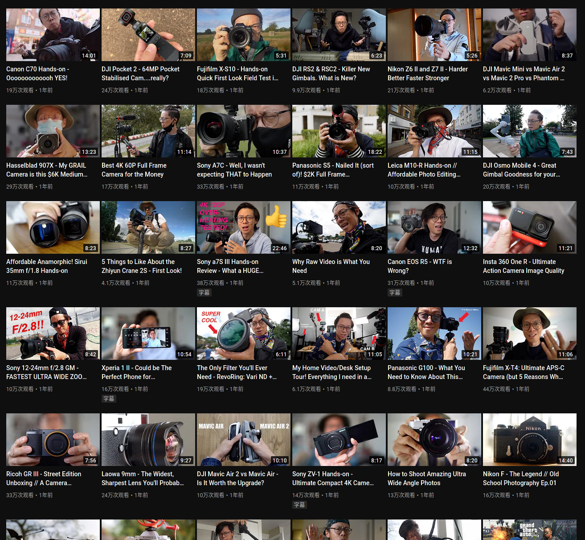

当然，我在标题里说的时间戳并不是狭义的 UNIX 时间戳，我只是想表达一下精确的时间记录而已。

不知道从什么时候开始，许多网站都不再显示 `2021-11-09 09:00:00` 这样精确的时间，而是开始显示“刚刚”、“5 分钟前”、“3 个月前”、“1 年前”，我能猜出来这又是哪些自以为聪明的产品经理以“对用户友好”的理由想出来的或者抄来的，但不幸的是大部分这种行为都很愚蠢。据我所知 Twitter 是这样，Twitter 做什么就抄什么的微博也是这样，令人难以忍受的是 GitHub 也是这样显示时间，以及今天彻底惹恼了我的 YouTube 在视频页面也是这样显示。

<!--more-->

如果你还没搞清楚我的愤怒来源，我实际上是想做这样的事情：我知道索尼 A7S3 是在 2020 年 7 月发布，我想快速找到相关的视频，请问我怎么在这一大片的“1 年前”里猜到去年 7 月的大致位置？

“1 年前”这个描述可以包含从“1 年零 1 天”到“1 年零 364 天”这样不精确的时间范围，我觉得和直接不显示时间范围也没什么区别了。或者像 GitHub 那样鼠标悬浮在上方显示时间戳的方案也不好，比如这个页面这么多视频，我的目的是一眼快速找到我需要的时间段，一个一个悬浮多慢？所谓的用户友好？不见得，用户要被气死了。人类的脑子还没弱到连算个大致的时间差都算不出来。从工程上来说，这还引入了额外的复杂度，比如有一个 JS 脚本是专门用来更新这些时间的，你需要引入额外的代码，才能保证从“刚刚”变成“7 秒前”、“10 秒前”、“不到一分钟”、“5 分钟前”（说的就是你 GitHub），哈哈，这简直太好笑了。更别提弱智的微博 API 竟然直接在 JSON 里面返回“X 分钟前”，不过反正这种互不联网说不定什么时候就把 API 给砍了。

我觉得 Twitter 和微博这种本身就是短平快讲究时效性的网站使用大致的时间差而不是时间戳还算可以理解，至于 YouTube、 GitHub 这种经常需要查看精确时间的显示大致的时间差纯粹是给用户填堵，这一点 B 站经常脑残的前端反而做得不错，在视频页面显示的是精确的日期。
