呐，眼看就要过年，本喵决定将去年失败的树莓派路由器计划重新提上日程，因为本喵过完年之后总要去姥爷家里住几天，他家里有网络，但是却没有路由器，而每天开着电脑插着随身WiFi实在太不环保。去年受到垃圾网卡坑害没有成功，幸好本喵朋友今年推荐了一个pi上使用超稳定的网卡，决定一不做二不休，干脆用OpenWrt和一直在吃灰的一代Pi B\+，组成一个易于配置和使用的路由器。来吧，带着你聪明的头脑和灵巧的双手，还有你的树莓派，我们来Happy Wi\-Fi！

<!--more-->

介绍下OpenWrt，它是一个针对路由器的Linux发行版，具有功能灵活强大，美观易于配置等特点，许多智能路由的固件也是基于OpenWrt修改，比如小米路由器，极路由。

工欲善其事，必先利其器，首先我们来准备下必要设备：

- Raspberry Pi一个（理论各版本均可，但考虑到USB无线网卡，Pi Zero可能有些不方便，另外我示范中用的Pi B\+，2B步骤相同，不过由于架构不同，下载的文件有区别。）。

- 装有Linux的电脑一台，当然你也要能熟练运用Linux（**别他喵的说你他喵玩Pi玩的是他喵的Win10 IOT，他喵的你看我他喵打这么多他喵就知道那货他喵的是微软他喵的糊弄人的东西！！！！！！！！！！！！！！！！！！！！！！！！！！！！！！！！！！！！**）。

- MicroSD卡一张（用做OpenWrt的TF卡不需要太大容量，毕竟img本身只有76M，但是玩Pi的都知道要选择一张大品牌高速的卡保证兼容性和性能，我一直用三星的卡觉得很好，根据大家评价闪迪的比较常用。）。

- 一台已经能正常使用的家用路由器，用于Pi的网线和电源（电源尽量选择5V 2A的，这样可以保证电流足够）。

- 一张无线网卡（**他喵的不要上了一些商家的当买那个他喵的EDUP的树莓派专用网卡！** 根本就是噱头！这货 **根本不是树莓派专用，只是能够被Linux直接驱动起来的一个，一些商家就骗新手说是树莓派专用。如果你用这货开AP就等着5秒钟必挂吧！** 尽量先试验你手头的所有无线网卡，确定都不可以之后再购买！Pi的配件也都是玩家们自己试出来的。我用的是朋友推荐的网件Netgear WNA1100无线网卡，不但稳定还比EDUP便宜。有需要的朋友可以私信或评论要购买地址。）

好啦，接下来介绍下正式过程：

1. 下载并刷入镜像；

   - Optional：调整分区大小；

2. 连接电脑进行初次必要调试；

3. 连接路由器进行主要调试；

   - Optional：自己编译并安装Shadow（河蟹）Socks，China（河蟹）DNS；

4. 建立AP并调节WiFi；

5. 分离广域网WAN接口和局域网LAN；

6. 连接ADSL开始工作！

7. 已知小问题及解决办法。

------------------------------------------------------------------

下面正式开始：

# 下载并刷入镜像

首先，我们要去[OpenWrt的官网](https://downloads.openwrt.org/chaos_calmer/15.05.1/brcm2708/)获取官方编译好的img镜像。下面有两个子目录，pi1对应的是`bcm2708`，pi2对应的是`bcm2709`，点击进入之后点击 `openwrt-15.05.1-brcm2708-bcm2708-sdcard-vfat-ext4.img` 即可开始下载，pi2对应的只是把2708全部换成了2709。

PS 请务必选择带有`sdcard-vfat-ext4`的镜像。

PPS 由于国内网络的特殊性，可能导致下载奇慢，可以复制下载地址之后利用百度云的离线下载。

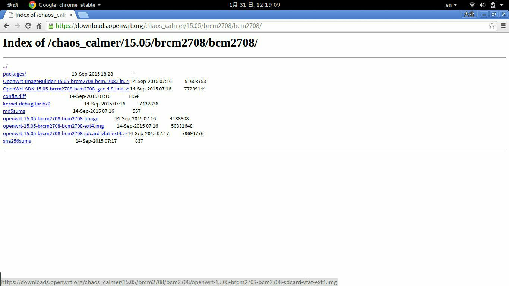

下载到本地之后呢，我们要用读卡器把MicroSD卡连接上电脑，用 `lsblk -f` 查看一下SD卡的设备名，一般是/dev/sdb，如果你的系统自动挂载了SD卡，请务必用umount卸载。

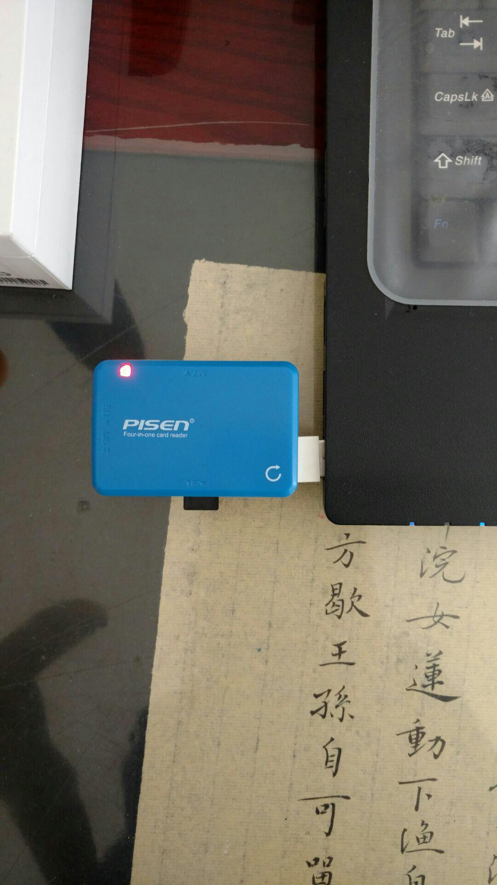

随后我们要用dd命令把img文件烧录进SD卡！命令如下：

````
# dd if=/你的/img文件/存放的/路径/openwrt-15.05-brcm2708-bcm2708-sdcard-vfat-ext4.img of=/dev/sd你的设备路径 conv=fsync
````

记住要用root用户或者sudo来执行才能具有权限！**Pi2用户记得把2708换成2709！**

PS 不要在意下图中有一个bs=2M的参数，那个是可选的！

PPS 好久之前B\+用OpenWrt不能启动的bug在15\.05里已经修复啦！如果你还遇到接电源后红绿灯都长亮不灭不能启动的话，可以试试重新刷写一次镜像，一般都会有效。

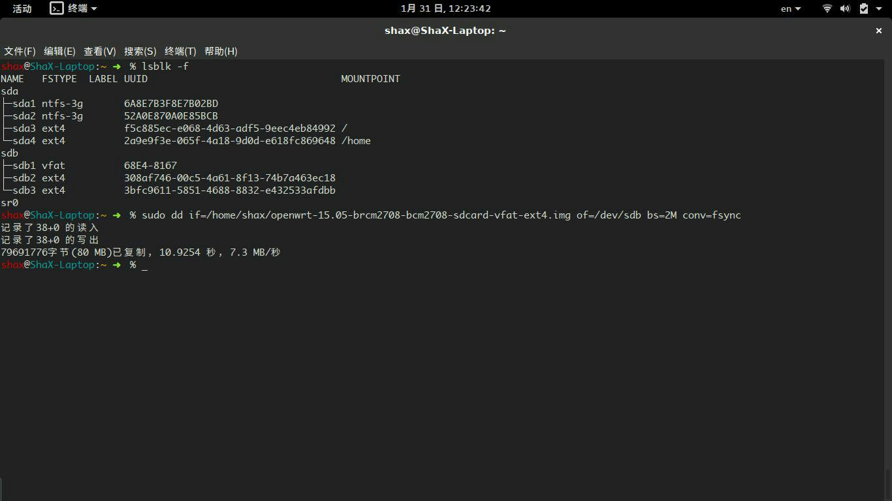

完事以后多执行几次sync是个好习惯：

````
# sync
````

下面可以把卡拔下来插到Pi里面啦！当然如果你想调整分区（可选）请往下看——

## 调节分区

为什么要调节分区呢？相信我，用一下

````
# fdisk -l /dev/sdb
````

你就明白了。。。

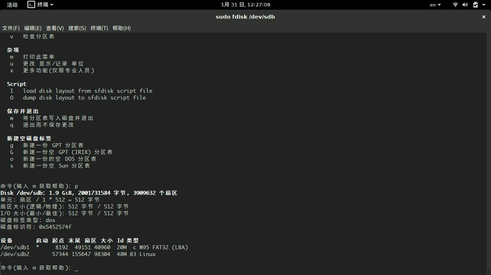

😂这磔磔磔磔这这。。。*这开发者是喝着冰啤酒吃着火锅唱着歌做的img吗？*（别看我！我写东西时候从来不吃东西不唱歌！！！别看我！！！真的没有……）这这这分区位置都是什么鬼！！！根本都不整齐强迫症不能忍！！！还有这么大点的根分区虽然绝对够用了但是怎么能体现本喵是用2GB存储卡的有钱人（*手动斜眼滑稽*）呢？

好了扯淡结束，调节分区大小的方法很多种，最简单的是用gparted图形化界面调整。但是我在这里用了笨方法，即fdisk\+tar。实际上会这个的人一定也会用gparted（“胡扯，你就没用过！”“嘘……我用Gentoo不想编译。”）。

首先我们要把读卡器接上电脑，之后把其中的文件备份出来，调整好分区大小后在放回去。

首先挂载boot分区并进入～

````
# mount /dev/sdb1 /mnt && cd /mnt
````

开始用tar备份～注意后面的几个参数，它们可以保证所有文件的属性不变之类的，我会告诉你我朋友把系统从hdd搬到ssd也用的这个命令？

````
# tar -cpvzf ~/opboot.tar.gz ./
````

之后回到家目录并卸载这个分区：

````
# cd ~ && umount /mnt
````

接着root分区也是一样：

````
# mount /dev/sdb2 /mnt && cd /mnt
# tar -cpvzf ~/oproot.tar.gz ./
# cd ~ && umount /mnt
````

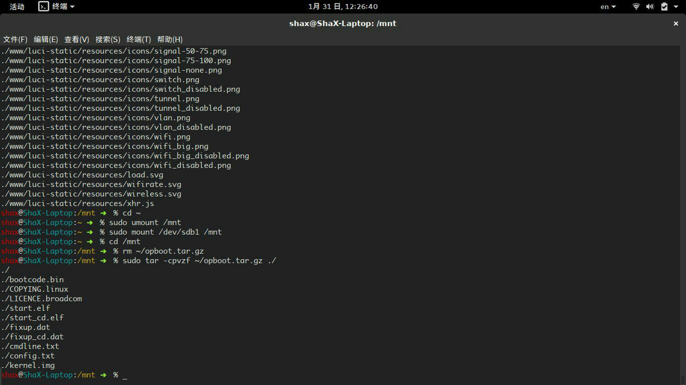

接下来就可以用fdisk了，这里我给boot分区分100M，root分区分768M（openwrt的软件都很小的，默认的分区大小就够用了。），剩下1G单独划分一个分区留着备用。

````
# fdisk /dev/sdb
````

首先按o新建一个分区表，之后按n新建分区，分区类型p，分区号1，起始位置默认，结束位置输入\+100M回车，之后按t，c，将分区类型修改为FAT。

再按n新建分区，分区类型p，分区号2，起始位置默认，结束位置输入\+768M回车.

最后再按n，一路回车默认即可。

之后按a，选择1，将boot分区的可启动标志打开。

按w退出并写入更改。

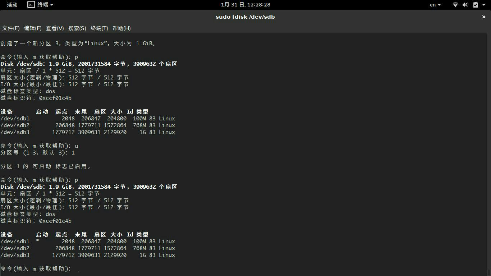

接下来我们用mkfs格式化分区～这里boot分区必须是vfat格式，root分区必须是ext4格式，第三个分区可以随意，但我也格式化成ext4。

````
# mkfs.vfat /dev/sdb1
# mkfs.ext4 /dev/sdb2
# mkfs.ext4 /dev/sdb3
````

接下来自然是把备份的文件放回去：

````
# mount /dev/sdb1 /mnt && cd /mnt
````

这次用`tar -x`：

````
# tar -xpvzf ~/opboot.tar.gz ./
# cd ~ && umount /mnt
# mount /dev/sdb2 /mnt && cd /mnt
# tar -cpvzf ~/oproot.tar.gz ./
# cd ~ && umount /mnt
````

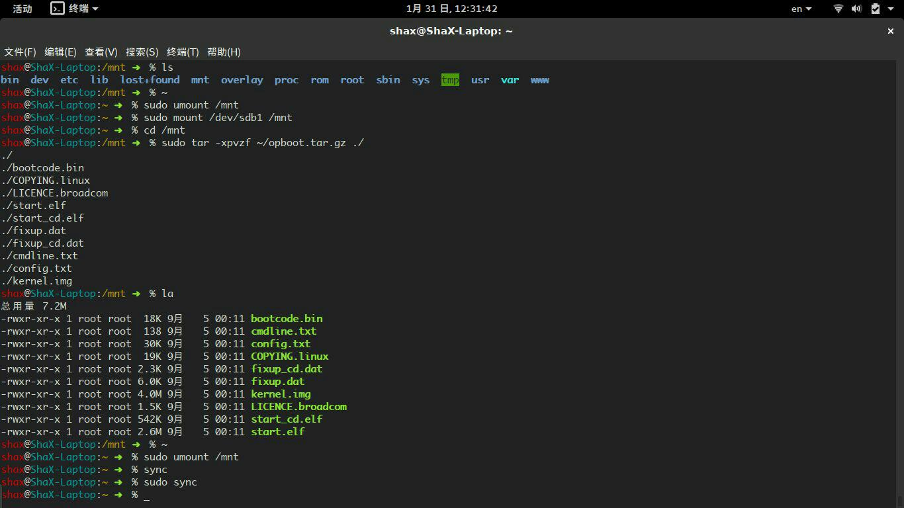

# 连接电脑进行初次必要调试

先别急着把你的pi插到路由器上，op默认pi的ip是192\.168\.1\.1，要知道大部分家里的路由器的ip也是这个，所以我们先把它用网线接到电脑上，开机后修改下ip。

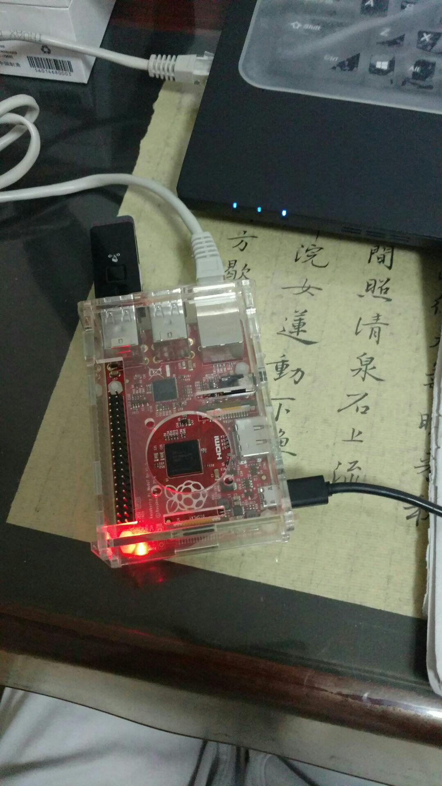

关掉你的无线连接，给pi连上电源，打开浏览器输入192.168.1.1回车，你会看到luci登陆界面，点击Login登入。

接着按照屏幕上指示，我们去设置路由器登陆的密码，点击`Go to password configuration`

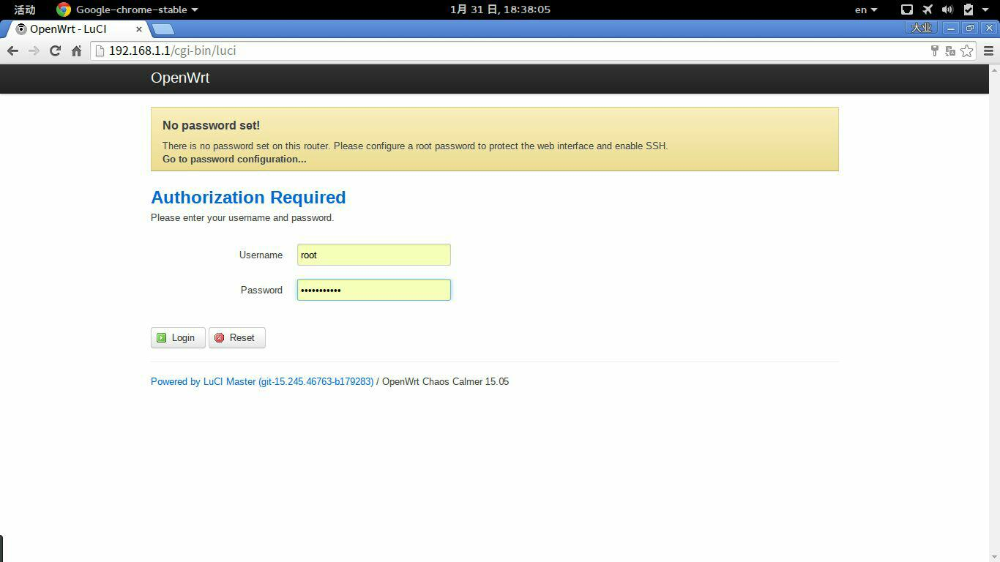

进入密码设置页面，在password里输入两次密码，滚动到最下端点击`Save and apply`。

接下来去调节接口的ip，因为一会要通过这个接口上网，同时也要设置下DNS和网关。在顶栏点击Network——Interface，点击页面中LAN后面的Edit。

在进入的页面中设置IP，设为你路由器网段下的一个没有被占用的ip即可，我设置为 `192.168.1.234` ，之后下面的netmask选择 `255.255.255.0` ，gateway输入路由器地址 `192.168.1.1` ，DNS也输入 `192.168.1.1` 。

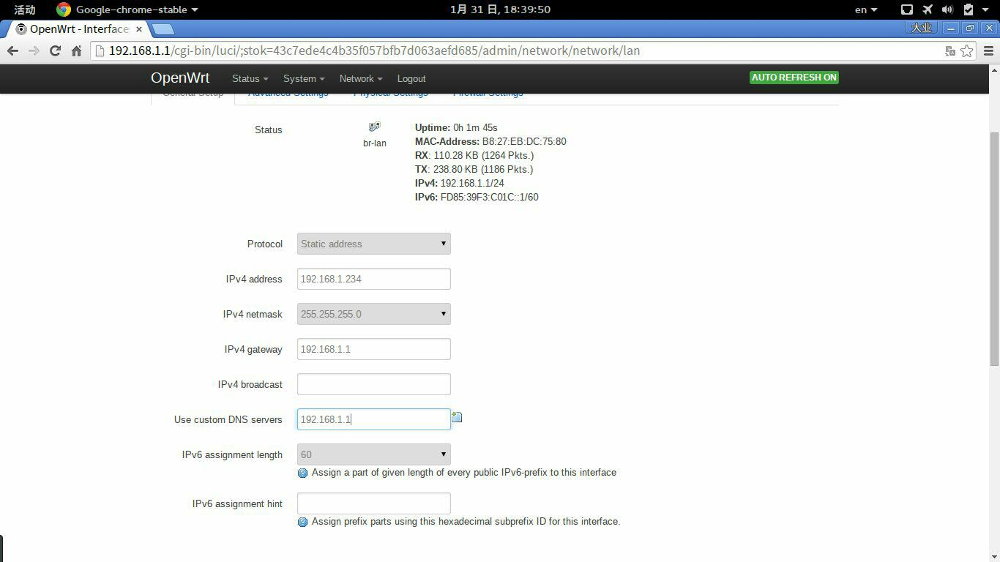

好啦，现在树莓派基本的设置已经完成了，接下来可以关机接到路由器上了。什么？你说OpenWrt没有关机？好吧没办法，因为我也不知道怎么办，我用OpenWrt一直都是拔电源，没什么问题。

# 连接路由器进行主要调试

现在我们把pi拿出来～*无线网卡插到pi上，pi插到网线上，网线插到路由器上，电源线插到pi上，开机！*

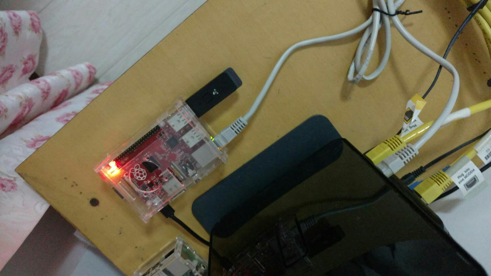

稍等一会绿灯熄灭，这时候通过家庭局域网应该能连接上Pi了，同样，打开浏览器 `192.168.1.234` （按照你刚才设置的ip来），输入密码点击Login。

是不是觉得满屏英文很不爽呢？没关系，我们先来安装中文语言。切换到System——Softwave，点击该页面的 `Update list` ，当然你也可以 `ssh root@192.168.1.234` ，登入之后执行 `opkg update` ，效果是一样的，这个命令就等价于Linux里的 `apt-get update` ， `pacman -Syy` ， `emerge --sync` ，opkg就是openwrt的包管理。当然我比较偏好ssh，因为可以即时看到命令反馈，而**luci基于网页，命令执行过程会表现为刷新，会像卡住一样。**

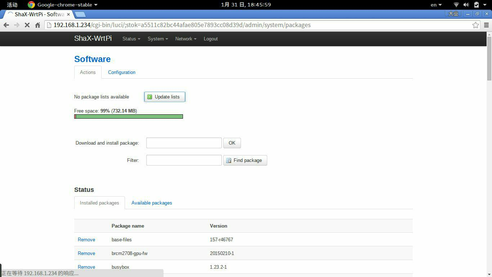

执行完了之后会输出信息 。

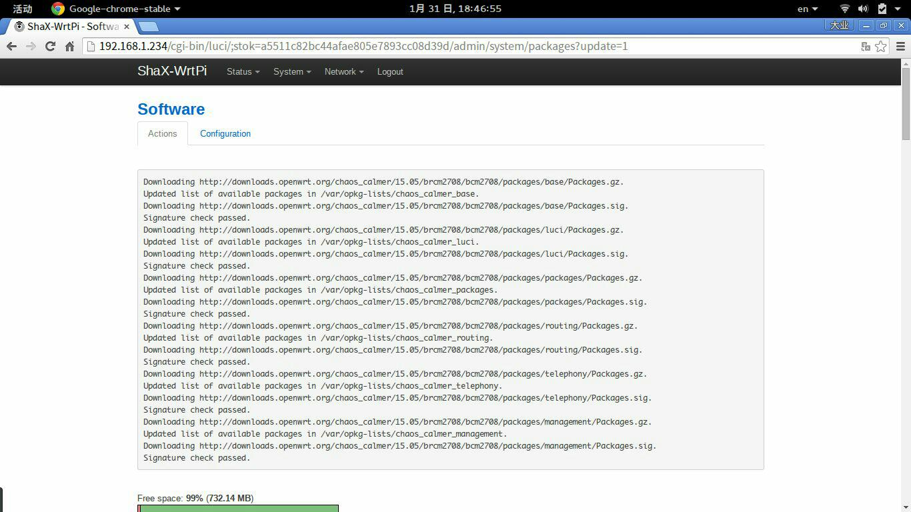

接下来在Filter里面输入chinese，点击Find package，稍等一会点击下面的Available packages，就能看到所有包名含有chinese的包啦，我们要安装的是 `luci-i18n-base-zh-cn` 和 `luci-i18n-firewall-zh-cn` ，点击名字左侧Install，弹出框里点确定稍等即可。

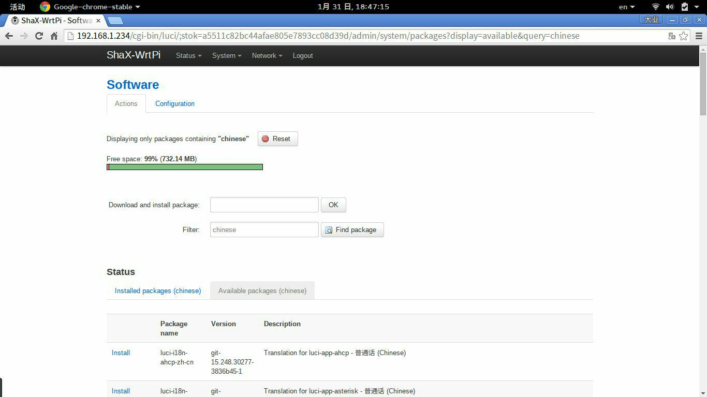

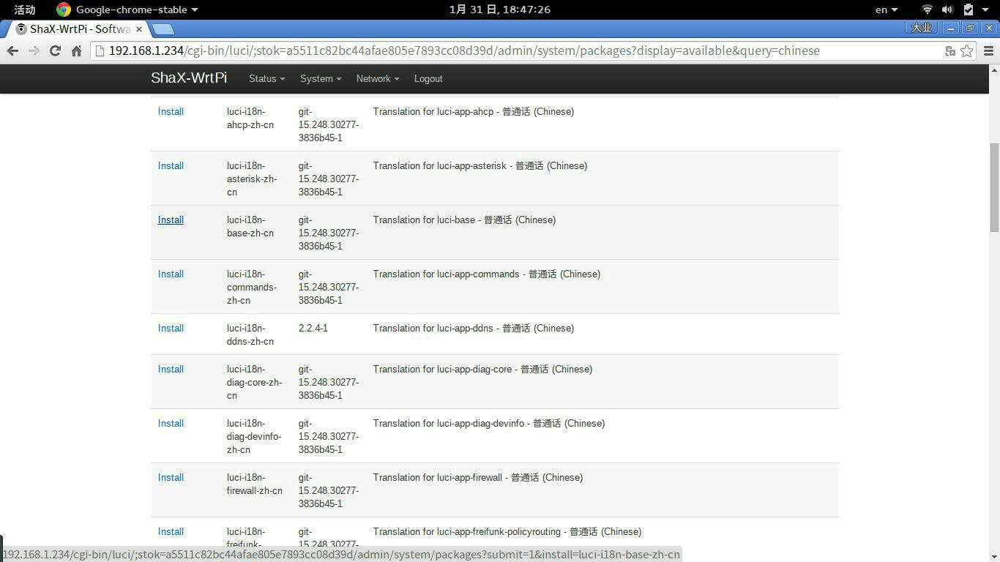

现在我们切换到System——System里，点击Language and style选项卡里面的Language，看看里面是不是有一个普通话的选项了？选中之后点击Save and apply，还没有变成中文就Logout一下看看！

等进去以后我们再进入系统——系统里，第一个选项卡基本设置，把里面的时区改为Asia/Shanghai，再点击上面的同步浏览器时间，最后在主机名里给你的pi设置一个独特的名字！

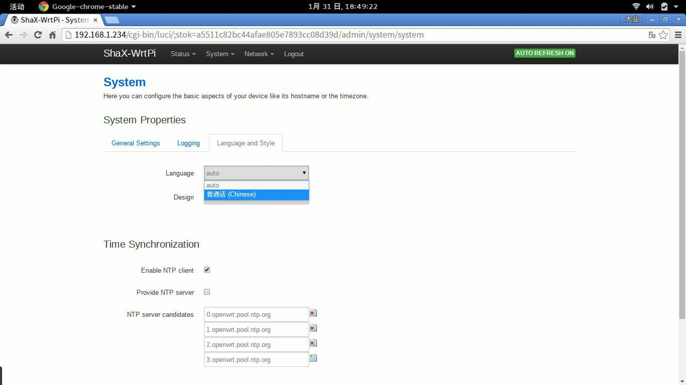

下面开始安装一些必要的软件包！据我统计有 `kmod-usb2` 、 `kmod-usb-ohci` 、 `kmod-usb-ohci` 、 `kmod-ath9k-common` 、 `kmod-ath9k-htc` （ath9k这两个包是我的网卡对应的驱动，**你的网卡需要什么驱动要根据你的芯片来定！我真的不知道你用的什么网卡！**）、 `hostapd` 。什么？你问我怎么安？过滤器在那！都是中文难道还看不懂吗？自己搜索一下！

当然我更喜欢ssh一条命令解决：

````
# opkg install kmod-usb2 kmod-usb-ohci kmod-usb-ohci kmod-ath9k-common kmod-ath9k-htc hostapd
````

## 编译安装Shadow（河蟹）Socks，China（河蟹）DNS以便愉快的番茄

为什么要编译呢？因为pi是小众路由器，openwrt-dist没提供预编译版……

首先我们要下载openwrt的sdk，就在你下载img的那个目录里，点击 `OpenWrt-SDK-15.05.1-brcm2708-bcm2708_gcc-4.8-linaro_uClibc-0.9.33.2_eabi.Linux-x86_64.tar.bz2` 下载这个压缩好的SDK，回来之后用 `tar -xpvjf` 解压之，进入解压后的目录。

PS 老规矩，Pi2用户是bcm2709。

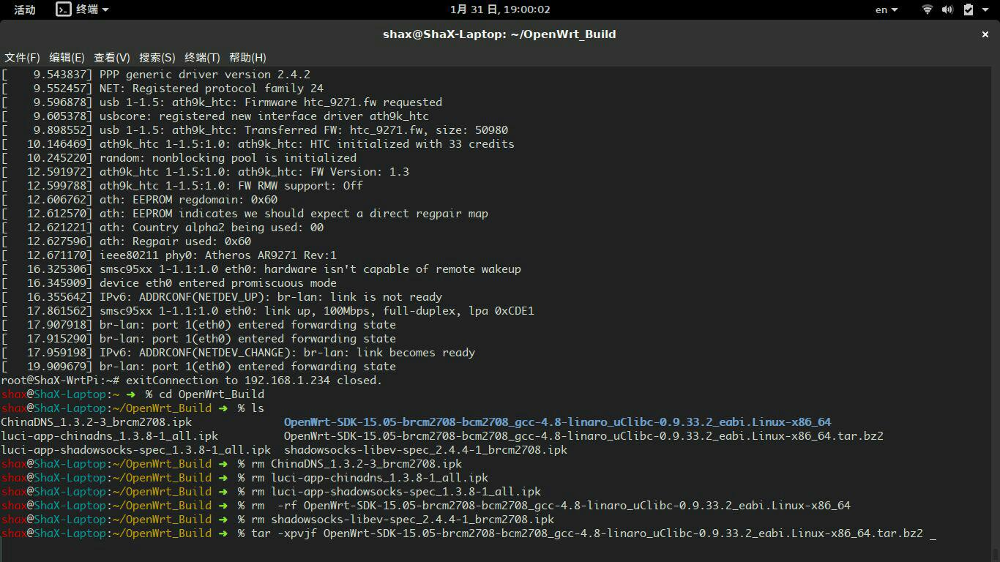

有关编译工具链的问题，我在Gentoo Linux下直接就能编译，所以我也不知道需要哪些依赖，据我所知包括但不限于gcc，git，ulibc。

下面我们来获取所需软件包的源码，这一步用到git：

````
# git clone https://github.com/shadowsocks/openwrt-shadowsocks.git package/shadowsocks-libev
# git clone https://github.com/aa65535/openwrt-chinadns.git package/chinadns
# git clone https://github.com/aa65535/openwrt-dist-luci.git package/openwrt-dist-luci
````

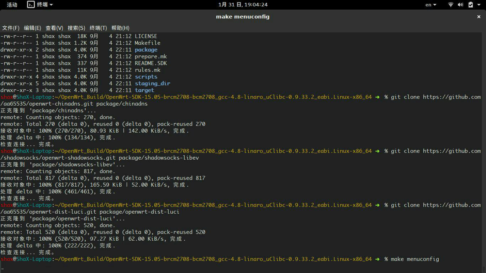

之后我们用menuconfig选择需要编译的软件包，熟悉Linux内核编译的人都会这个：

````
# make menuconfig
````

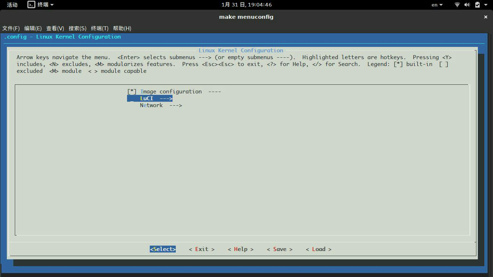

首先进入LuCI——Network里选择上带有ChinaDNS和shadowsocks的行（按空格使前面出现M），之后左右方向键切换下面到Exit，按空格以退回到首页，再切换到下面为Select，再进入Network，选中 `ChinaDNS` 和 `shadowsocks-libev-spec` 到M，之后切换下面到Save，保存之后退出。

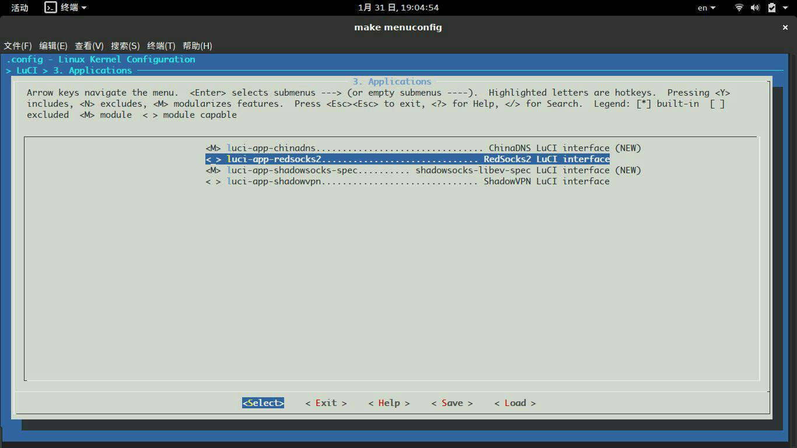

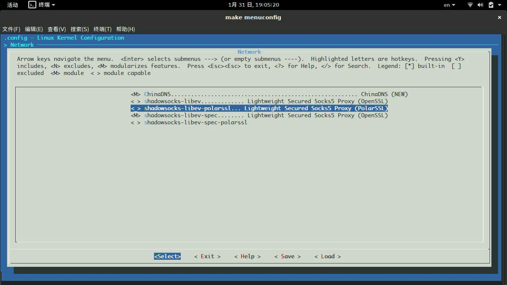

退出之后就可以用

````
# make V=99
````

这条命令来编译啦，编译好的文件在bin/brcm2708/package/base/里，我们要想办法把它传到pi上，最简单的方法就是把pi关掉，卡接到电脑上，把文件随便拷到卡里的一个目录，之后再开机即可安装。

PS Pi2用户请注意，由于Openwrt把Pi1和Pi2的架构统称为brcm2708，所以**编译出来的软件包显示有brcm2708是正确的**。

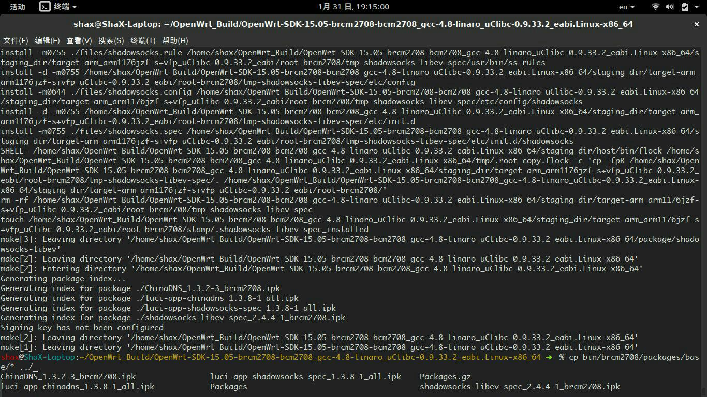

下面还是要ssh到你的pi上，进入你ipk文件存放的地方，先opkg update一下，因为一会需要连网安装依赖。（每次路由器开机都需要执行一次update。）

之后用

````
# opkg install 你拷贝的ipk
````

把四个ipk都安装上。

下面浏览器进入LuCI，在服务里你就能看见Shadowsocks和ChinaDNS啦！

首先进入Shadowsocks，把全局服务器选为`127.0.0.1#1080`，再把下面的UDP服务器设置为与全局服务器相同。

之后下面的服务器配置添上**你的ss服务器的配置**，UDP转发**勾选启用**，被忽略IP列表选择**ChinaDNS路由表**。保存应用。

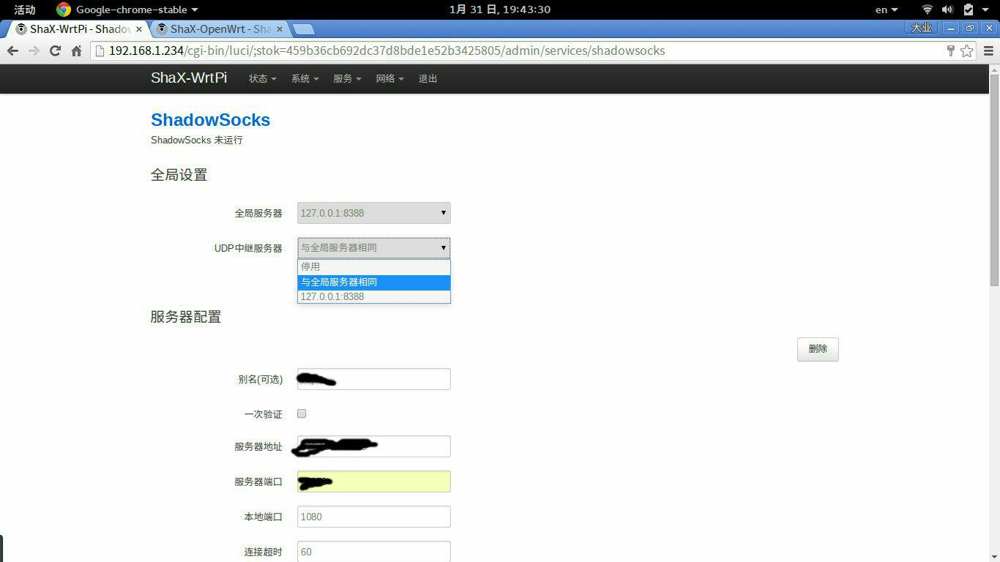

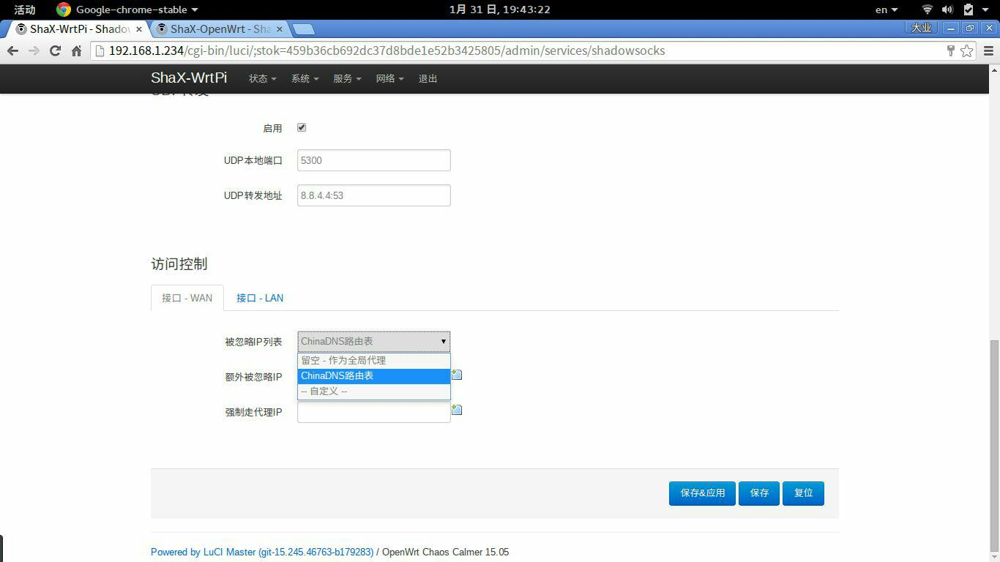

接下来切换到ChinaDNS，勾选启用和启用双向配置。上游服务器改为 114.114.114.114,127.0.0.1#5300`。

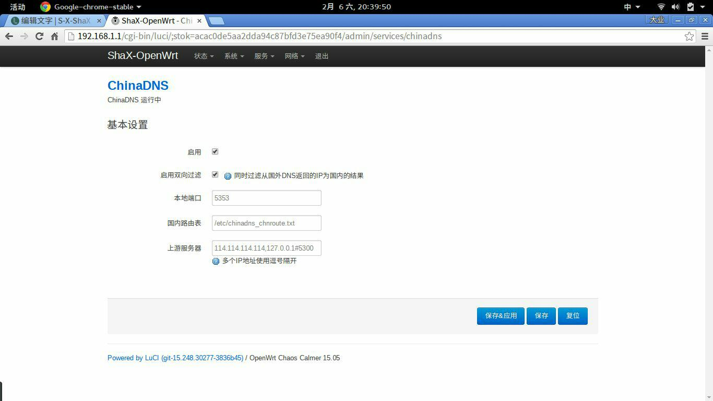

再切换到网络——DHCP/DNS，基本设置里的DNS转发填写`127.0.0.1#5353`，HOSTS和解析文件里**勾选忽略解析文件**。

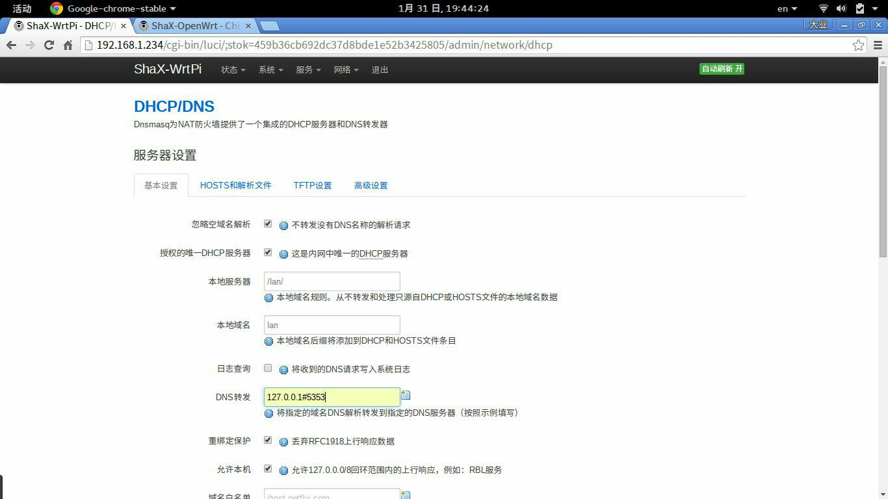

现在ss部署完成！

# 建立AP并调节WiFi

安装完成之后我们来开启wifi！首先这个必须要ssh连接上去了，电脑就是

````
$ ssh root@你的pi的ip地址
````

手机可以用juicessh，良心软件。

登陆进你的pi后执行

````
# wifi detect > /etc/config/wireless
````

建立wifi配置文件。

接着还没完 ，

需要用vi编辑这个文件，不然wifi默认是关闭的（不会用vi/vim的同学悲剧了。。。很简单进去之后按i才可以开始编辑，编辑完按\[Esc\]再输入:wq即可保存，另外反正我是Emacser～别打我！）。

````
# vi /etc/config/wireless
````

注释掉`option disabled 1`的那一行（注释的意思就是在那一行开头输入个‘#’！你要会用vim直接把光标定位到那里，按dd把那行删了也行！）。

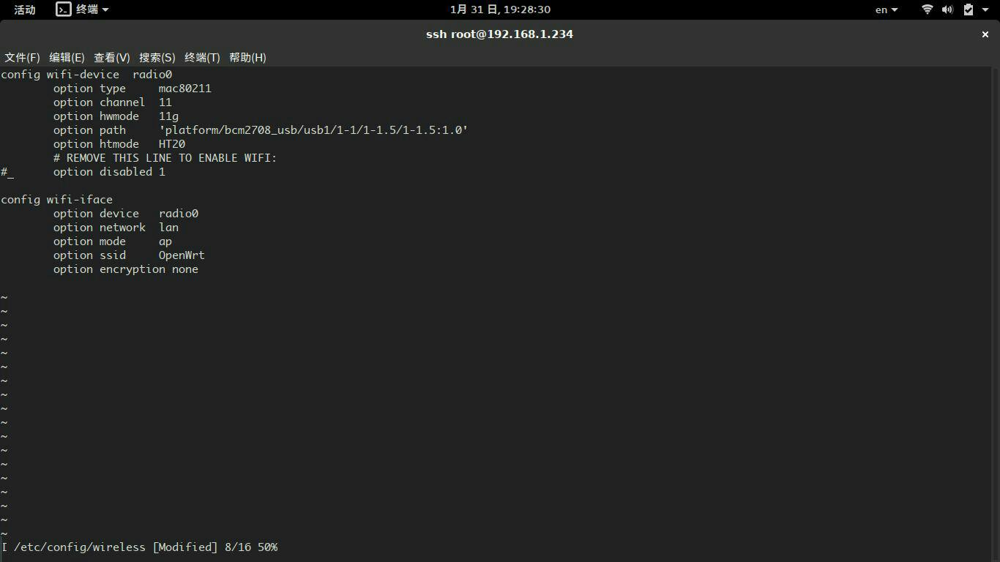

现在系统——重启——执行重启，之后LuCI的网络里应该能看到无线了。点击`修改`来编辑一下。

首先要注意wifi信道不能设置为auto，这是个bug。

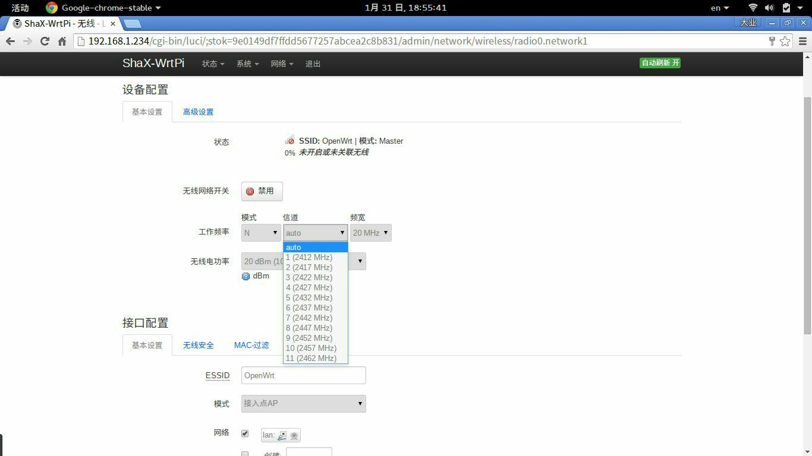

下面的ESSID就是你的WiFi显示的名字，自己设定好。之后去无线安全，加密选择`WPA-PSK/WPA2-PSK Mixed Mode`，密码自然是你的密码咯～

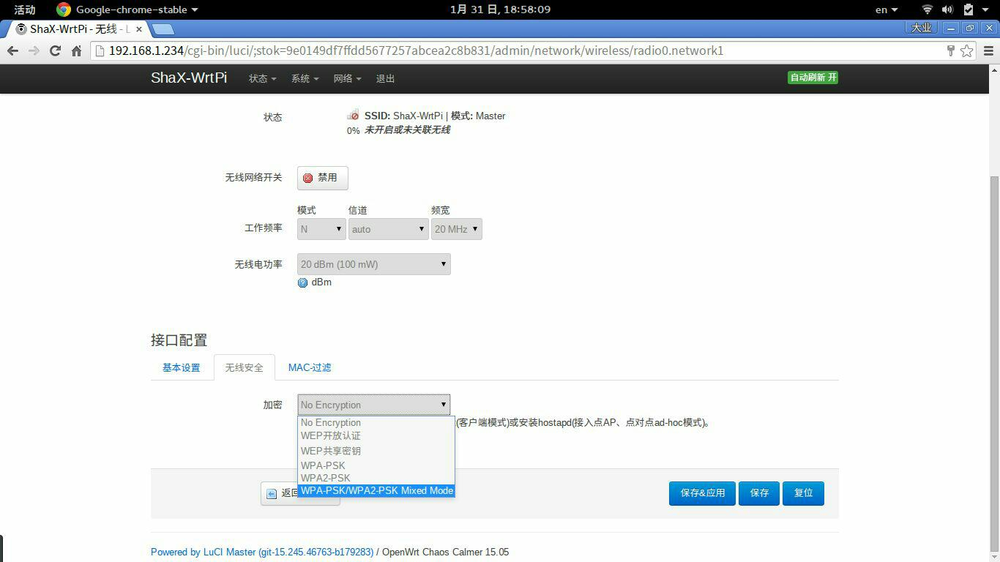

接着就能搜索并连接到wifi了～

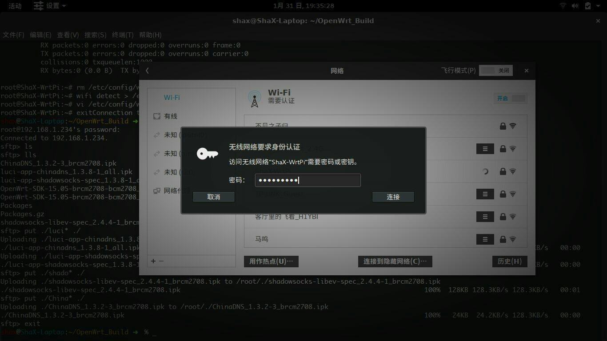

# 分离WAN口和LAN口。

现在Wi\-Fi和有线网卡都在LAN这个网段下，要做便携路由器自然要有个WAN口，首先你要通过Wi\-Fi连接，再登陆LuCI，先去到网络——接口，点击添加新接口，接口名称输入`wan`，协议选择`pppoe`，之后再去修改LAN，把IP和WAN错开，比如我设置为`192.168.234.234`，再**把网关和DNS都清空**（因为接下来pi就是网关了喵～）之后在物理设置里**取消勾选eth0**，再把桥接也取消，保存！

# 连接ADSL开始工作

把Pi和ADSL Modem连接，开机，即可作为无线路由器使用！

# 已知问题和注意事项

- 调节完成后dropbear（轻量的ssh服务器端）不能开机自启动，需要在系统——管理权里保存应用一下。

- wifi信道不能设置为auto。

- WAN口ip和LAN口ip最好不要在一个网段下。

- 2016-02-08:新bug！WiFi地区代码如果不是默认的00--World的话，可能导致无线网卡挂掉！我改成CN之后挂了2333～另dropbear的bug似乎一代二代都有。

搬运自我的Lofter，转载请注明出处。

原文写于2016-02-06\_21:10:25

*Alynx Zhou*

**A Coder & Dreamer**
