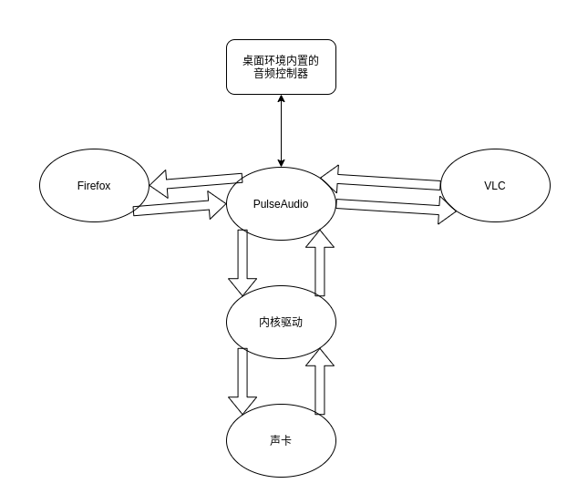
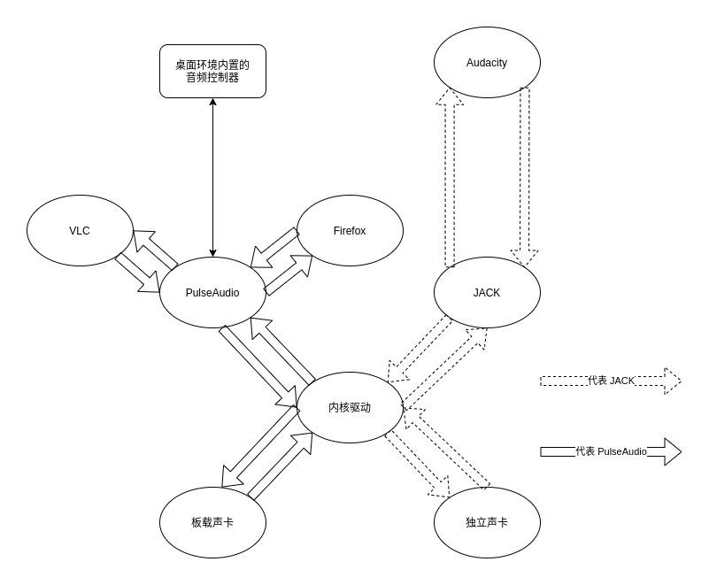
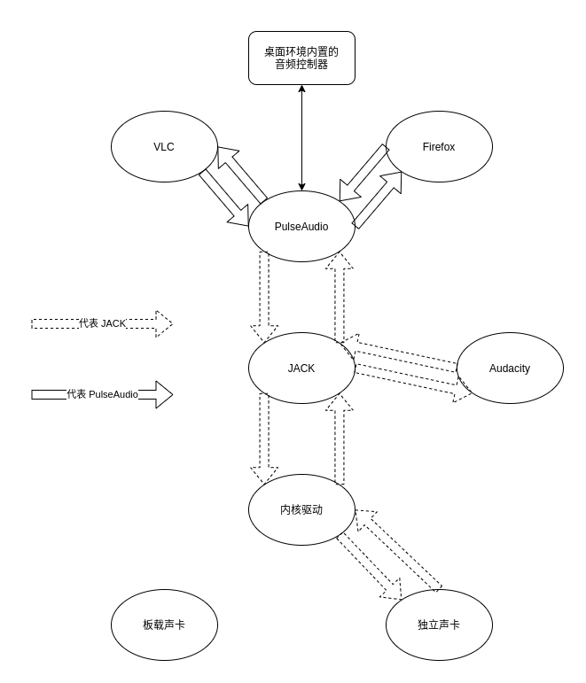
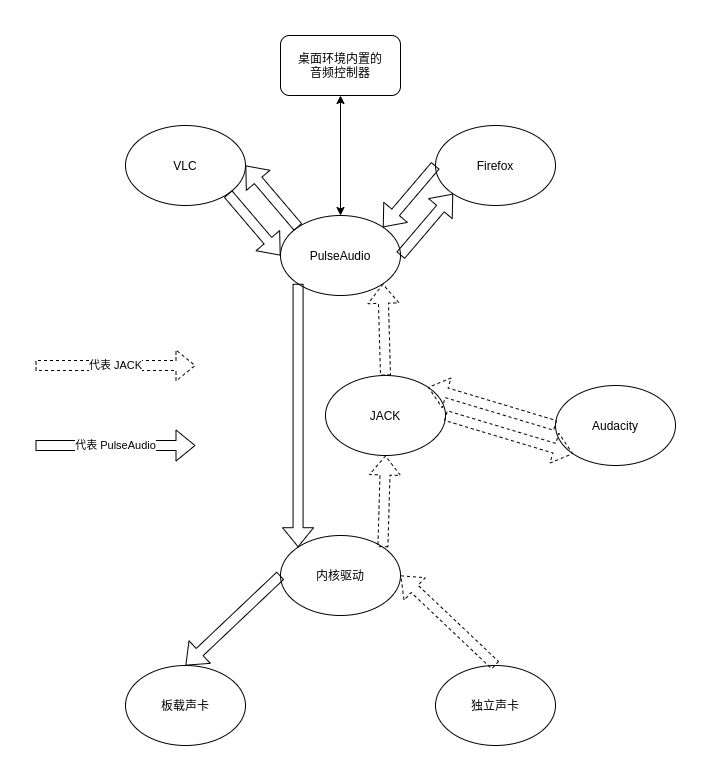
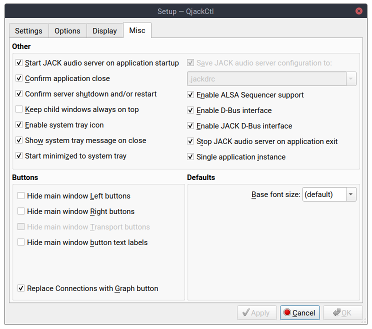

很多朋友都知道我除了是个程序员以外还是个乐器玩家，很久之前因为想要录音上网了解了一下需要购买专门的麦克风声卡从此掉进深坑一发不可收拾。当然 Linux 用户在购买硬件之前需要做好功课，大概 16 年左右我还在上高中的时候用我还凑合的英语水平翻了几个 Linux 音乐论坛最后决定买一台 Focusrite Scarlett 2i4（不过它后来似乎更新了几个版本所以我购买的变成了 1st Gen），我不太清楚除了更换了接口之后还有什么奇怪的改动没有，所以这里就不盲目推荐大家买更新的型号了，反正声卡这玩意够用的话也不太需要追新。

<!--more-->

做功课的时候还了解到常见的 Linux 桌面采用的都是 PulseAudio，但专业录音为了追求更低的延迟所以都使用 JACK，于是简单学习了一下，发现只要打开 Qjackctl 选择设备然后启动，Audacity 就可以选择使用 JACK 设备了。系统的其它软件仍然通过 PulseAudio 输出到板载声卡，不会冲突，基本满足我的需求也就没研究过其它的。

但是最近直播的时候总有人说我的耳机麦克风不太灵敏，我想了想不如干脆把录音用的声卡和话筒利用上，整个系统直接采用 2i4 作为默认声卡？但是虽然 PulseAudio 可以直接控制 2i4，软件的兼容性却不太好，比如 Audacity 启动的时候即使没有运行 JACK 它似乎也会尝试通过 JACK 连接 2i4 于是导致缓慢的启动和几下破音。于是只能采用网上常见的方案也就是把 PulseAudio 的音频输出到 JACK，但我觉得其实这样不太准确因为音频是既有输出又有输入的，所以我的标题是把 PulseAudio 运行在 JACK 上层。当然还有一种方案是采用 PipeWire，打算自己替代 PulseAudio 和 JACK 一桶浆糊的新项目，它欺骗程序让它们以为它就是 JACK 和 PulseAudio，但虽然我是个 GNOME Dev，我对这个不太感冒。有个常见的笑话是“现在有 N 个不那么好用的系统了，我们写个新的把它们全部替代掉！然后现在有 N + 1 个不那么好用的系统了！”。JACK 对于专业用户来说很好用，而专业用户通常是不太喜欢变化的，所以我不太期待 PipeWire 替代 JACK。

有人说 Linux 的音频系统比意大利面条还复杂，这倒不能说错，因为假如你看维基百科上那张巨恐怖的图的话确实是这样。但本质上来说音频不过是把信号丢给声卡，所以只要是个能写声卡的软件都可以叫音频系统嘛，也就不奇怪那张图那么复杂，实际上在现代的 Linux 桌面通常都集成 PulseAudio，我们也没必要去研究那些边边角角的奇怪方案，于是整个结构其实很清晰，一般的用户看到的都是这样的：

然后作为对比，我之前的方式是这样的：

而这篇文章要达到的目的则是下图这样：

当然实际上假如你理解了这个结构的话，其实也没必要只用一个声卡，完全可以用独立声卡录音用板载声卡输出，只是 JACK 是绑定独立声卡的，于是就像下图这样：

总之这样做的依据在于 JACK 被我们绑定了独立声卡，然后利用 PulseAudio 设置不同的输入输出设备控制基于 PulseAudio 的桌面程序的输入输出，同时它还可以把自己作为 JACK 的客户端。而具体到与声卡交互，则全部都是内核里面的 ALSA 组件控制的。这里没有涉及到使用 ALSA 用户态组件的客户端程序，因为 PulseAudio 会把自己伪装成 ALSA 的客户态组件，于是这些老旧的程序就被连接到了 PulseAudio 上面从而无法直接占据声卡了。

了解原理之后就可以具体操作，首先需要安装 jack2，这个软件包包含的是 JACK 的组件，必须要装 jack2 因为 jack1 不支持 DBus 所以也就没办法和桌面交互了。安装 qjackctl 来控制 JACK，然后安装 pulseaudio-jack，这是让 PulseAudio 作为 JACK 客户端的兼容层。

然后需要启动 Qjackctl，在 Setup 的 Settings 选项卡里面选择 Advanced，将 Input Device 和 Output Device 全都设置为 2i4（应该就是 hw:USB 那一项），然后切换到 Misc 选项卡，像下图那样设置 Others 部分（基本就是除了 Keep child windows always on top 的全都勾上），这样就可以做到毫无感觉的启动 JACK（只要打开 Qjackctl 它就在后台启动 JACK，退出 Qjackctl 也只是退到后台）。

这样再次启动 Qjackctl，应该 JACK 就已经在控制 2i4 了，PulseAudio 应该会自动把 2i4 的控制权交给 JACK，省了不少事情。对于一些原生支持 JACK 的客户端程序来说这已经足够了，比如 Ardour 或者 Audacity，它们不经过 PulseAudio，直接连接到 JACK。接下来需要调整的是那些基于 PulseAudio 的客户端程序。

然后打开你桌面环境的音频控制器，比如我是 GNOME 就是 GNOME Control Center 里面的 Sound 选项卡，这里基本都是集成的 PulseAudio 控制，把 Input Device 设置成 Jack Source，于是 2i4 上的麦克风的录音便通过 JACK 传到 PulseAudio 再传到 PulseAudio 的客户端程序比如 OBS Studio 和 Firefox。然后如果你想让 PulseAudio 的客户端程序把音频输出到 2i4 上的耳机里面，那就将 Output Device 设置为 Jack sink，这样其实 PulseAudio 就是运行在 JACK 上层。

最后你需要设置 JACK 在登录时启动，这样 PulseAudio 才能找到 JACK，这个很简单，因为我们已经设置 Qjackctl 无感启动 JACK 了，那只要将 Qjackctl 设置为自动启动即可，比如 GNOME 用户可以在 GNOME Tweaks 里面设置。

当然，一般的家庭录音用户都是单声道麦克风，某些客户端程序需要自己手动设置，比如 OBS Studio 需要在 Advanced Sound Properties 里面勾选 Mono。

如果你遇到了一些奇怪的明明已经设置 PulseAudio 重定向到 JACK 却没有声音的情况，可能是因为你某些软件或者插件带了奇怪的设置，建议先重置它们试试。

*Alynx Zhou*

**A Coder & Dreamer**
