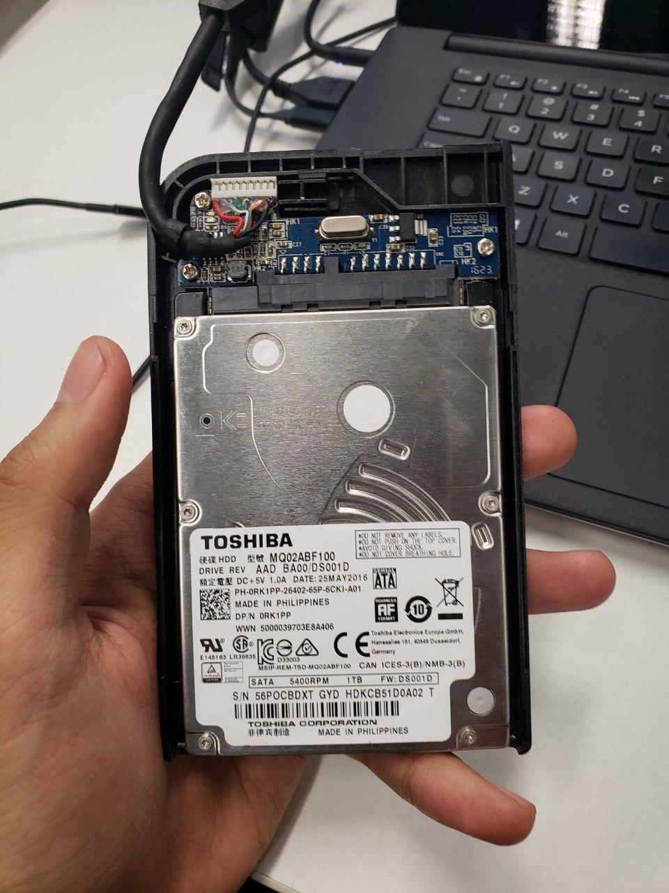
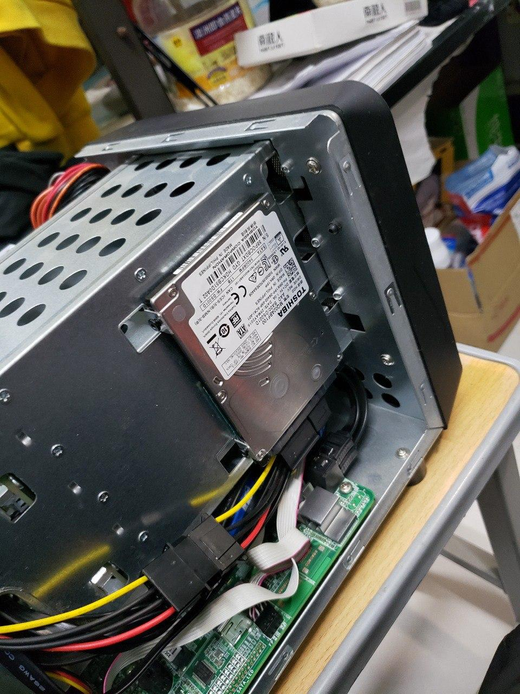
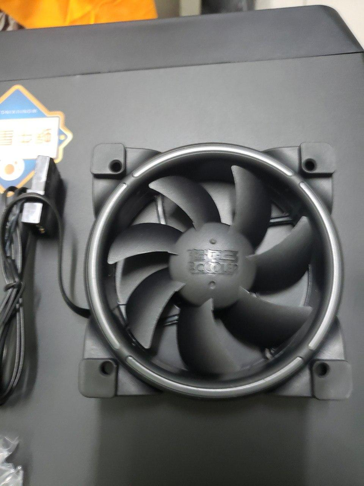
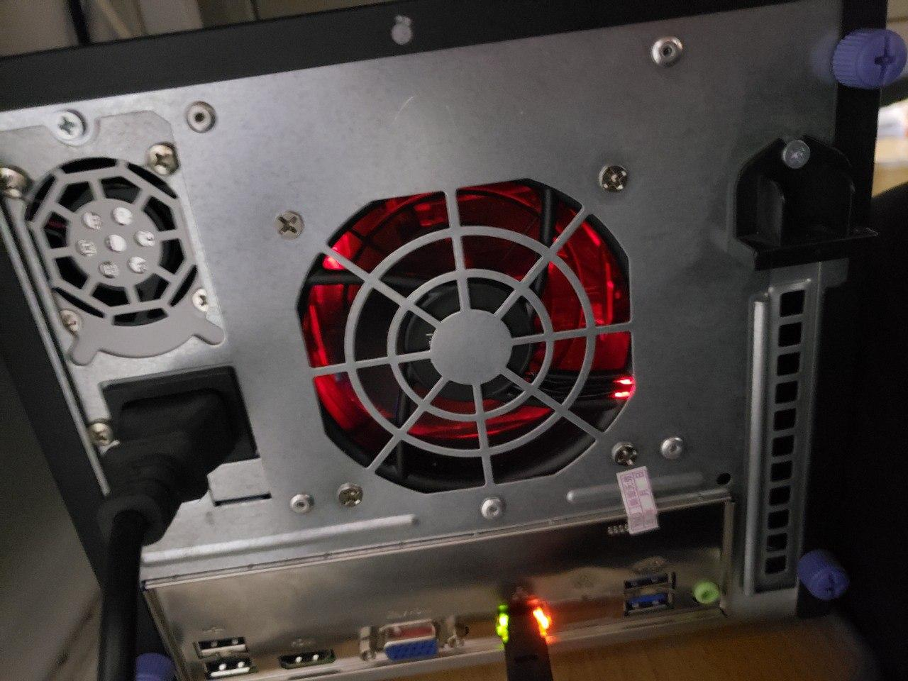
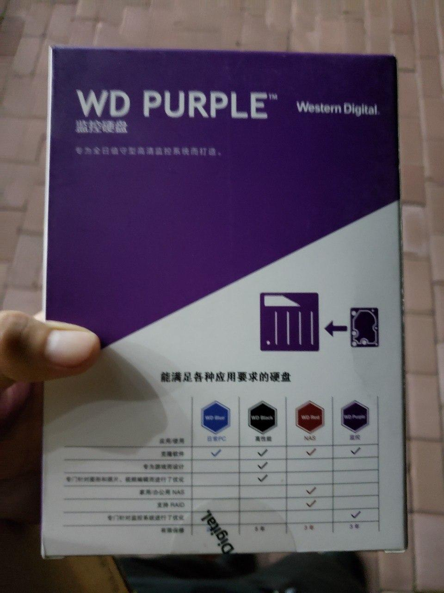
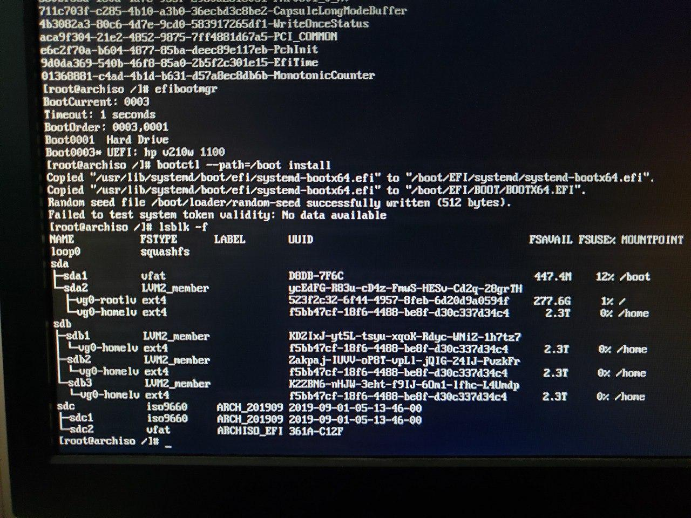

# 需求

以前我一直使用树莓派 + 移动硬盘做 Samba 服务器，好处是完全静音，功耗很低，但是树莓派 2 的网络性能差强人意，并且 USB 2.0 的速度也赶不上移动硬盘的速度，看电影什么的只是能看，要花好长时间缓冲，并且我一直开着，对树莓派的电源也不是很放心。特别是我还拆下来一块笔记本上的 1TB 机械硬盘，完全没法装在树莓派上。

<!--more-->

有点想买一台 NAS，但是看看群晖的价格实在接受不能，然后又看到说群晖把系统放在用户的磁盘里加速读写一类的，其实这些对我来说不太重要，但群晖是个定制化程度很高的 Linux，虽然用起来有很多便利的功能，比如官方的内网穿透（服务器似乎在台湾，速度不快），比较成熟的 btrfs 使用之类的，但比起这些我更想要一台全功能的 Linux 服务器，这样不仅可以作为存储，还可以 SSH 连接上去做一些简单工作。作为一个比较熟练的 Linux 用户，我不需要什么 Webui 或者 App 来访问文件，Solid Explorer 和 VLC 组合起来访问 Samba 好用得很。

机缘巧合我看到隔壁的同学弄了台 D 款的蜗牛星际矿渣，研究一下之后觉得可以上车，正好 Arch CN 群里 [@NickCao](https://nichi.co/) 打算出掉买了回来没时间玩的蜗牛 A 款，于是坐地铁到五道口一起喝了杯咖啡然后当面交易了一下。

# 介绍

蜗牛星际的矿渣是怎么来的呢？简单说就是忽悠别人说这个机器可以挖矿，打着区块链旗号骗人买机器，当然这个机器其实并不需要挖矿，所谓的挖矿就是简单的 App，让你以为自己挖出矿了（毕竟宣传说不用插电也能挖），为了降低成本机器全部都是用现成的山寨货，所以机箱造型是 NAS，而且还带硬盘背板，就是因为这个很成熟。成本不到一千块的机器五千块一台卖给受骗者，受骗者为了挖矿都是十几台几十台的买，然后放小道消息说要涨价到八千块榨干受骗者钱包，最后国际惯例圈钱跑路，受骗者血本无归。

<blockquote class="center-quote">做人还是得懂点计算机。</blockquote>

这个机器有好多型号，细节差距也有很多，网上有现成的帖子分析，我就不分析了，反正我这一台是 A 款单网口绿主板，妥妥的千兆。而且似乎背板有 PCI 槽，不过主板又没有 PCI 接口就不管了。A 款还有个特点是硬盘架侧面可以放个 2.5 寸硬盘，正好装上我拆下来的笔记本硬盘。（硬盘和安装方式如下图。）安装时候需要两个小螺丝固定硬盘一侧，另外一侧是卡住的，不需要螺丝。





# 硬件处理

手头这一台运气比较好，是 zumax 的 150W 电源，虽然都说这个是所有各种电源里最好的，但是接口只是刚刚够，没有多余的，没办法给侧面硬盘供电。再说都是山寨货谁又比谁强到哪里。按照隔壁老司机的推荐淘宝买了益衡 250W 的 Flex 电源（也叫小 1u 电源）替换掉，花了 250 软妹币左右，感觉车速稳了很多，而且多出了许多接口。安装时候需要把原来电源上后面用来装到侧面的铁片拆掉，然后上下翻转才能装上蜗牛里面的支撑片，然后主板有一长一方两个供电口都插上，背板用的大 4pin 接口，不太够长，把卖家赠送的两条大 4pin 延长线都接上就可以了，然后取一个 SATA 供电线给侧面的硬盘。

蜗牛自带一个 16G 的 mSATA 硬盘，速度比 U 盘还慢，而且据说用着用着就坏了，很多人都拿这个做引导盘放系统，因为四个硬盘槽连接的 SATA 口是扩展的，不支持引导，但是 **实际上蜗牛主板上还有一个 SATA2 的口可以引导**，正好连接我的笔记本硬盘，直接拧下四个螺丝把主板抽出来，然后拧掉 mSATA 杂牌硬盘，插上 SATA 线装回去即可。

蜗牛自带的风扇声音很大，因此需要更换一个静音风扇，A 款用的是 8cm 的 3pin 风扇，不支持调速，BCD 都是 12cm 的。8cm 不太好买，开始我在京东找到两个超频三的风扇，一个 2200 转一个 1400 转，标定噪音都是 18dB，于是就买了 2200 转，没想到转速上来了噪音也更大，正好之前在淘宝买了另一个超频三皓月（下面上图），1500 转应该问题不大，装上发现声音小了，但是蜗牛背板有个铆钉，这个 LED 风扇尺寸稍微大一点，正好顶着铆钉。没办法还是换了京东 1400 转的那款，噪音合适，尺寸也合适，蜗牛本来发热也不严重。因此 **建议大家购买 1500 转左右不带 LED 灯效正常尺寸的**。

<div class="alert-green">更换时候记得把原来蜗牛风扇上用来防止线缆伸进风扇里的塑料防护片拧下来装到新风扇没有阻拦的一侧，这一侧朝里，安装之后蜗牛向外吹风。</div>

<div class="alert-red">这个防护片不要拧太紧，以免把它拧裂了，这种是和机箱配套卖的，淘宝上有卖那种金属的防护网，但是都是厂家批发，不太好买。</div>

你问我怎么知道的？当然是大力出悲剧拧裂了然后没办法只能 502 直接粘风扇边上了。





我还在京东购买了一块 2TB 的西数紫盘，没有买 NAS 专用盘是因为太贵了，而最便宜的只便宜了十几块，但是却是大缓存叠瓦式硬盘，性能非常差，这款紫盘则是标准的 64M 缓存垂直式硬盘，建议自行搜索叠瓦式硬盘了解原因。考虑了一下还是不做 RAID1 了，经济条件不允许，而且本来 RAID 是为了高可用不是为了备份，如果是硬件损坏估计两块盘一起炸了，不如冷备份。



往硬盘架安装硬盘需要四个沉孔螺丝分别锁在两侧，当然我这种硬件渣渣其实是不知道啥是沉孔螺丝的，具体多大多粗我也不懂，我装 2.5 硬盘的螺丝是同学买大疆编程小车多出来的内六角，尺寸正好，至于 3.5 硬盘是隔壁老司机送给我的装机剩下的，反正车速很稳，如果自己买的话京东淘宝好像都有装机用的成套螺丝，建议顺手买一套，不要螺丝钉难倒程序员。

# 软件处理

软件部分就十分舒服自在了，接显示器网线键盘开机按 F7 进入 BIOS 设置 UEFI 模式从 U 盘启动，然后进入 Archiso 按照 [安装指南](https://wiki.archlinux.org/index.php/Installation_guide) 安装系统（据说他们最近在处理 base 组，建议随时跟进 wiki，我就不复制了），分区的时候我是在能引导的 2.5 寸硬盘上建立了 ESP，然后其他空间全部用作 LVM，1T 硬盘的剩余空间作为一个 pv，~~并且给 2T 的硬盘分了三个区做 pv（万一我哪天脑子抽了想缩个分区出来呢？）~~，然后建立 vg，建立给根目录和家目录的 lv，然后创建 ext4 文件系统。这一段参照 wiki 对应页面就行了，命令十分简明直观，我第一次用就成功了。配置好的效果如图：



`/etc/mkinitcpio.conf` 里需要给 HOOKS 添加 lvm2，然后运行 `mkinitcpio -p linux`，这样生成的 initramfs 才能支持 LVM。我还给 MODULES 添加了和 intel 显卡有关的部分（虽然可能用不到了），具体修改的位置如下：

```bash
MODULES=(intel_agp i915)
HOOKS=(base udev autodetect modconf block lvm2 filesystems keyboard fsck)
```

至于 2T 的硬盘考虑了一下还是打算再加一块硬盘做 RAID1，不然连续跨设备 lvm 坏了一个就全坏了，由于 mdadm 需要两块设备都在才能建立，但我手头只有一块，于是在 fc 老师建议下决定上 btrfs（而且这货似乎支持多块不同容量硬盘的 RAID1，保证每个文件都在两块盘上有备份），于是建了 `/data` 和 `/data/alynx` 两个子卷，`/data` 就挂载到 `/data`，`/data/alynx` 挂载到我家目录下面。话说 btrfs 的子卷原来很像普通目录，但是又可以分别挂载，不需要用 `mount --rbind`。然后在 samba 下面添加一个 datas 配置，就像 homes 一样每个用户都有个目录（当然得手动创建）：

```ini
[datas]
   comment = Data Directories
   browseable = yes
   writable = yes
   valid users = %S
   path = /data/%S
```

然后我在某东买了一块东芝 2T 64M 7200 转的机械硬盘，到手之后打算加入 btrfs 里面，建立 RAID1，btrfs 的好处就在于这个可以先弄一块之后渐进修改，而且看起来目前没什么大问题的样子（按我的理解并行读取的性能问题大概是用来并行加速的，但是实际上 RAID1 不并行读取也可以读出数据吧）。虽然我本来也可以把数据移出来然后建 mdadm，但是不排除以后再加盘做 RAID 10，似乎 mdadm 没法直接转换的样子？按照 fc 老师多年使用经验似乎 btrfs 也没那么不可靠。

安装 bootloader 的时候我直接用了 systemd-boot，我在自己笔记本上也用的这个，功能够用了就没考虑安装 GRUB，编写 entry 时候内核参数里的 root 可以写 `/dev/vg0/rootlv` 也可以写 `/dev/mapper/vg0-rootlv`（这里中文 wiki 和英文 wiki 分别是这俩，亲测都可以），比如我的就是下面这样：

```
title	Arch Linux
linux	/vmlinuz-linux
initrd	/intel-ucode.img
initrd	/initramfs-linux.img
options	root=/dev/vg0/rootlv rw add_efi_memmap
```

最近 systemd-boot 添加了什么校验设置，在蜗牛上会报错，直接 chroot 进去安装根本装不上，临时解决方案是退出 chroot，然后用 Archiso 里的 bootctl 安装到 `/mnt/boot`，虽然有点 dirty，但是能用？不过还是会报个错，但是启动需要的文件已经安装上了，不管它也能用，只不过每次重启还是会说校验失败，目测是个 bug。

然后由于 NAS 的网络不会经常变化，所以联网的部分也直接用 systemd-networkd 管理了，没必要上 NetworkManager。直接创建 `/etc/systemd/network/wired.network`，写入如下内容：

```ini
[Match]
Name=en*

[Network]
DHCP=ipv4
```

意思是对于所有以 `en` 开头的网卡使用 DHCPv4，然后 `systemctl enable --now systemd-networkd systemd-resolved` 就可以了。

其它的配置基本都是正常操作参照 Arch Wiki，~~我打算以后插新硬盘直接加进 LVM 加给 `/home`，省得还得操心挂载到哪里~~ 决定单独安排 btrfs 数据区了，参见上面。在外面访问我选择配置 WireGuard，参照我 [这篇文章](https://sh.alynx.moe/posts/WireGuard-Usage/) 就可以了，如果只是 SSH 远程控制一下效果还可以。

# 效果

笔记本插了有线之后可以测试千兆对拷，我的路由器还是大一时候买的 WNDR3800，虽然很旧，但四个有线全部都是千兆口（当时价格和配置差不多的极路由 3 只有一个内网千兆好像），samba 拷贝速度轻松达到 110M/s 的满速，甚至比蜗牛的 USB3.0 还快。蜗牛后面两个 USB3.0 只有下面的那个是真的，上面的也就 2.0 速度，下面的跑满了也就 80 到 90M/s，我的 U 盘是 CZ80，放笔记本上比这快多了，而且有时候上面那个也可以跑到 70M/s，具体原因不知道，如果是真的土豪建议直接换主板算了，非土豪完全可以插笔记本然后网络拷进蜗牛，比这奇葩接口还快。

*Alynx Zhou*

**A Coder & Dreamer**
