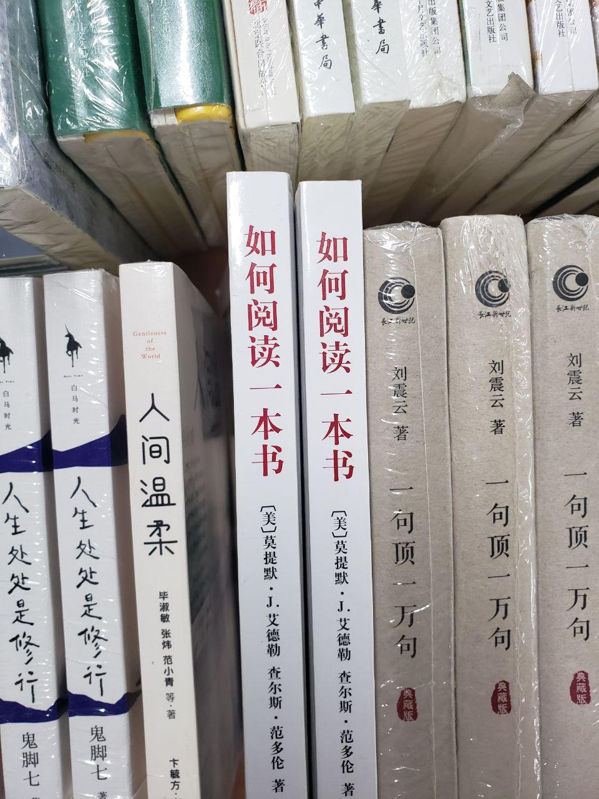
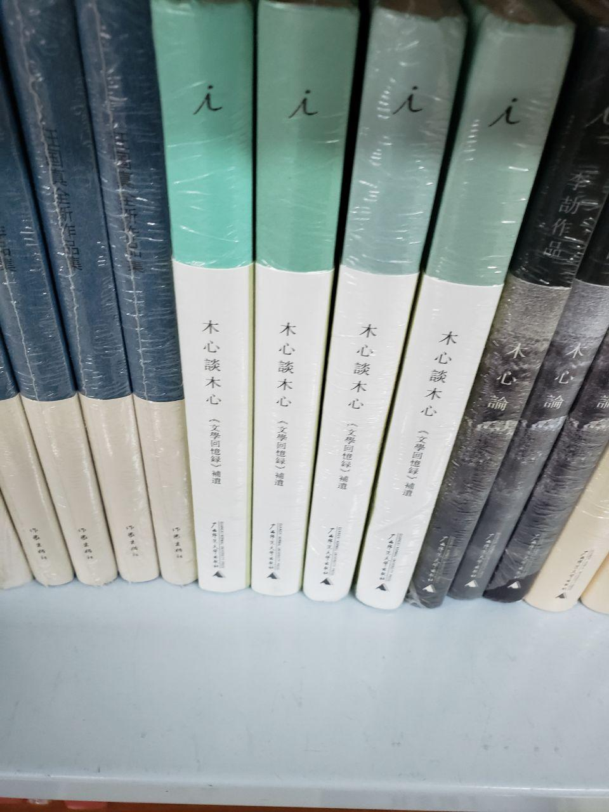
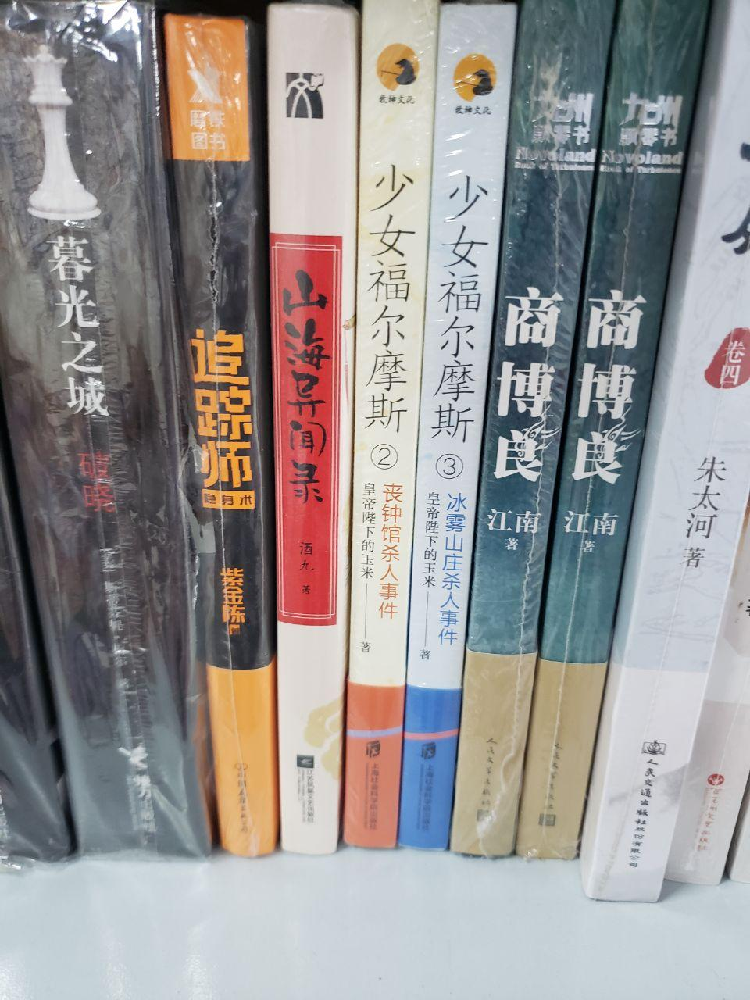
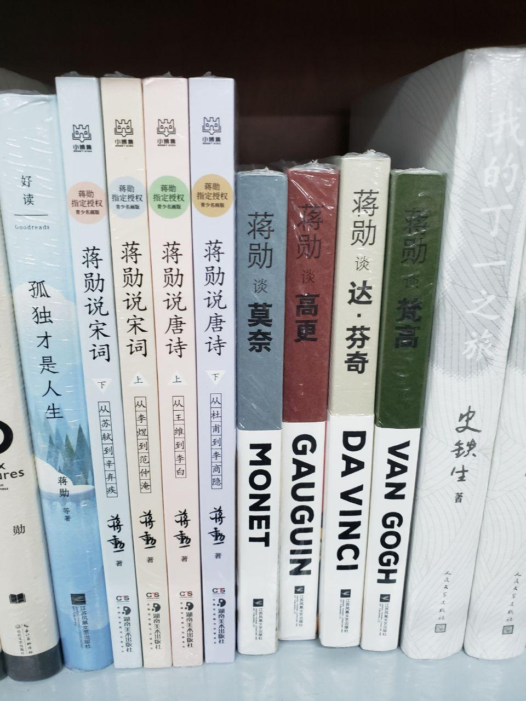
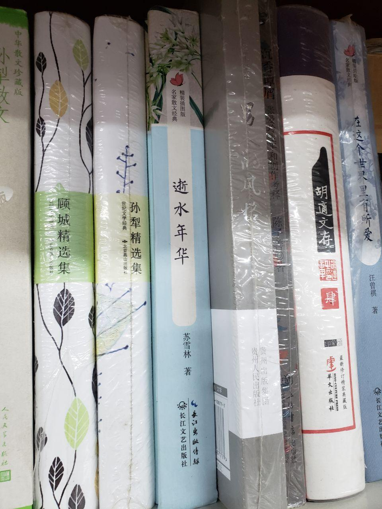
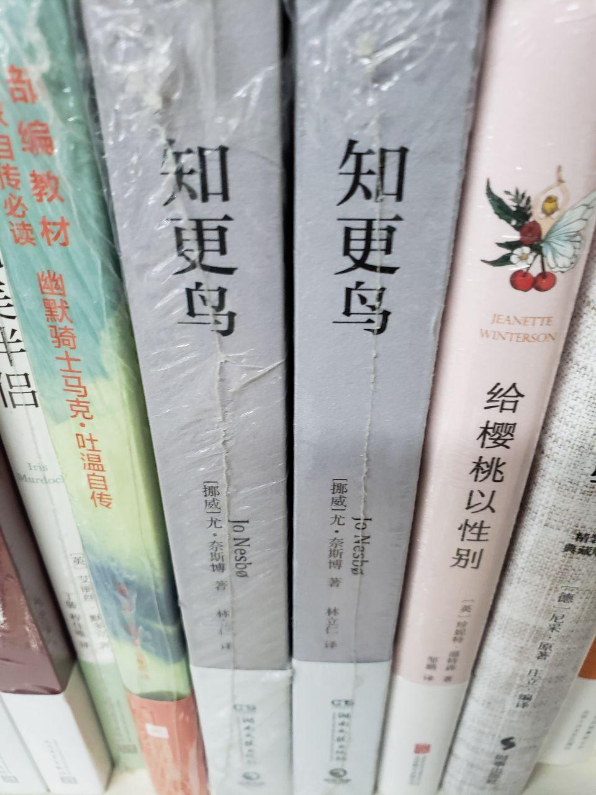
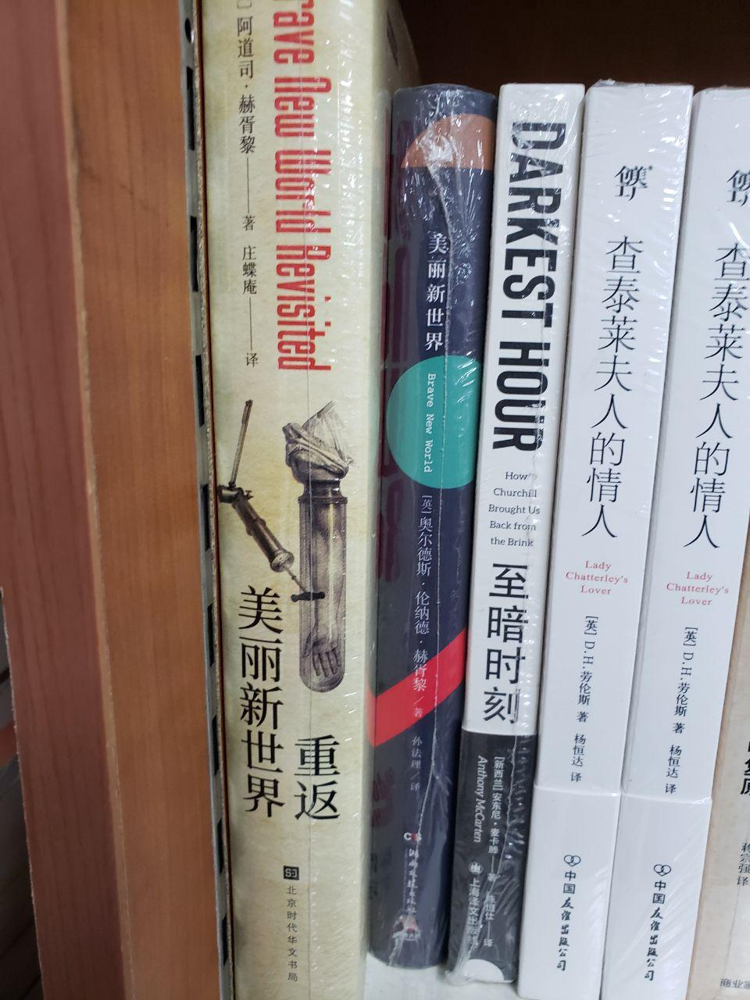
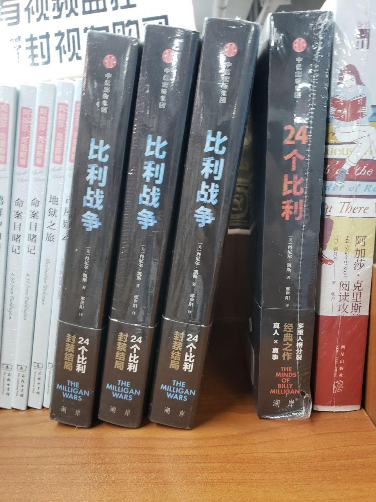
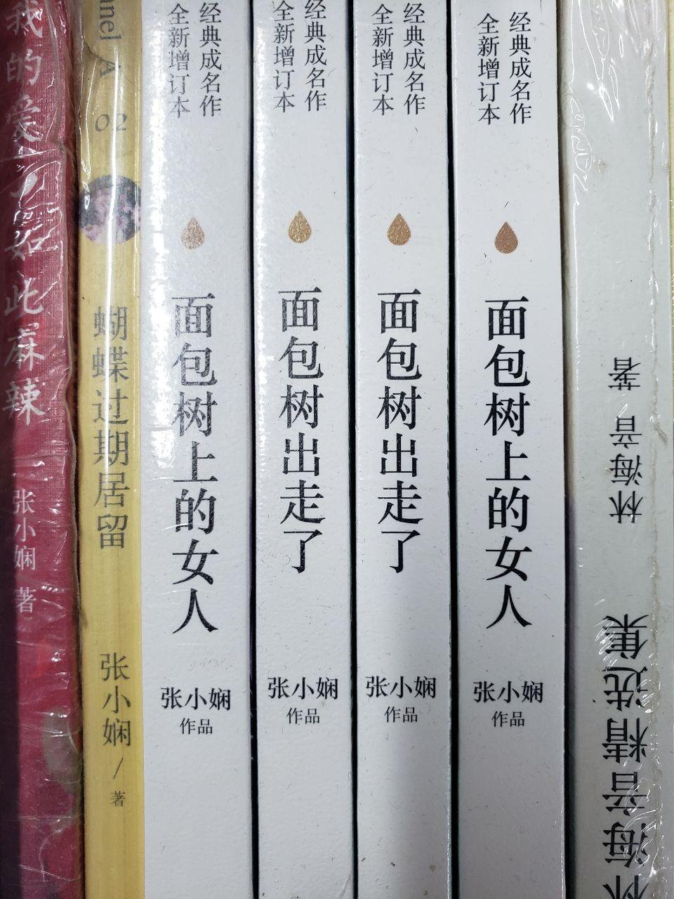
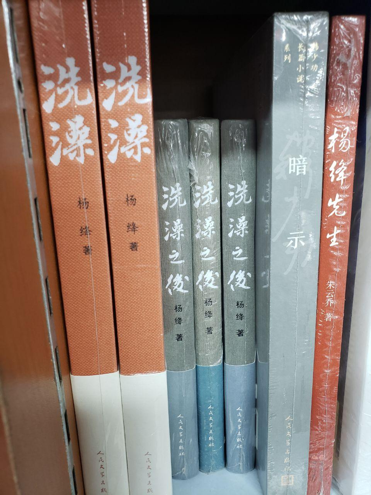

好久没更新非技术类博文了。可能很多人不但丢掉了阅读的习惯，连书店都不去了，书店都沦为练习册店，学生们更加对书店敬而远之，这种恶性循环实在是可悲又无趣的事情。

今天和同学一起去了书店，在常规意义的书店而非练习册店的部分发现了一些有趣或奇怪的书名，很有槽点，让人想要吐槽。于是拍了点照片发到这里。

<!--more-->

# 套娃型

此类书名非常适合套娃，比如这本《如何阅读一本书》，且不说阅读方法因人而异且随经验变化，单就这个名字还可以有《如何阅读如何阅读一本书》、《如何阅读如何阅读如何阅读一本书》。

我以为只有当代为搏销量疯狂吸引眼球的作者会起这种名字，然而接下来我看到了一本《木心谈木心》。虽然我不太清楚木心是谁，但似乎是个有名的作者。这书名总是让我想后续会不会有《木心谈木心谈木心》、《木心谈木心谈木心谈木心》。

# 性转型

这本书的名字非常奇特，她叫做《少女福尔摩斯》，作为半资深福尔摩斯迷和半资深月球氪金母X，我只能说型月都没敢做的这作者做了。由于原作实在是珠玉在前，写老福的故事已经很难了，性转老福怕是难上加难，建议寄一本给蘑菇看看。

# 蹭热度型

这位叫蒋勋的作者在书架上占据了一片，又是说唐诗又是说宋词，一会谈莫奈一会谈高达哦不是梵高和达芬奇，想必上知天文下知地理。**不过这书脊把这些名人加粗放在下面，让我总是有一种这是个达芬奇/梵高/莫奈的著作、作品标题叫做蒋勋的感觉。** 不知道这个叫蒋勋的作品是不是样样通样样松呢？

还有这本《逝水年华》，连我的输入法都怀疑我是不是想输入《追忆似水年华》，敢问作者是不是有点大舌头，让出版社的编辑听错了标题？

# 连锁反应型

《知更鸟》吗？大家都说有本书想杀你，不知道与你是什么关系？

虽然《重返美丽新世界》和《美丽新世界》是一个作者，但总让我想起狗尾续貂，不知道是不是我错了。

好家伙，你把《24个比利》放在这，那他们肯定会打架的，不过叫《比利打群架》比《比利战争》更好吧，无谓夸大不可取，要实事求是。

《面包树上的女人》怎么啦？她没怎么，《面包树出走了》，那可真是个离奇的故事，但是你这内容就不知道是不是好故事了。

我以为文学大家不屑于做这种在标题上吸引人的无聊事情，毕竟内容才是王道。我也不是有意冒犯杨绛先生，但是《洗澡》做书名已经是太随意了，再整一本《洗澡之后》是不是过分了？还是说这是出书的不负责任的编辑洗澡前洗澡后决定的两本文集的名字？那这就说得通了。但是说实话《洗澡》、《洗澡之后》接下来摆一本《暗示》是不是店员的恶趣味？

希望看了我文章的朋友不要给我评论“一看到白胳膊……”，我老实承认我不是一个完全脱离了低级趣味的人，写这文章也是让大家开心一下，毕竟实事求是更重要。我也希望写书的作者们都实事求是一点，内容不行，靠标题党吸引人肯定是经不起考验的。

*Alynx Zhou*

**A Coder & Dreamer**
