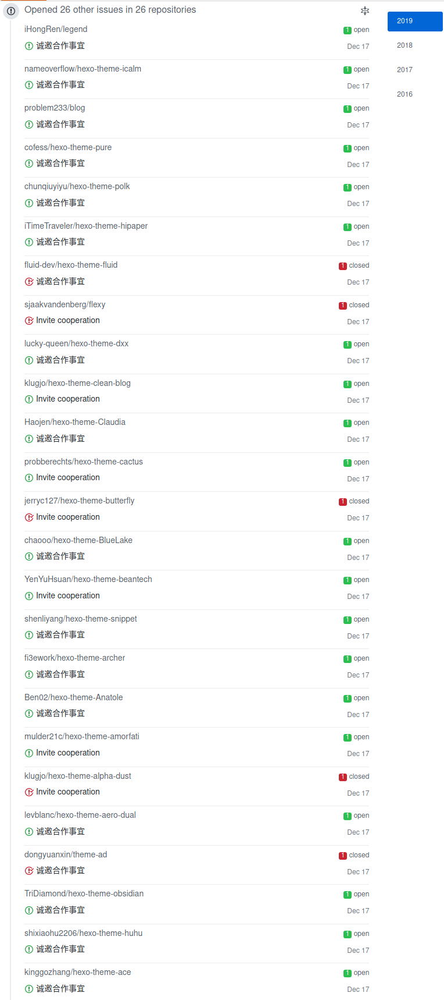

我不觉得我是个刻薄的人，但对于一些实在令我讨厌的人，不把他们的名字挂出来就是我最后的怜悯。

<!--more-->

已经有不止一个人询问过我有关把博客主题移植到其他生成器上的问题了，这实际上是超出我范围的工作，因为我并不熟悉他们的生成器。但如果有人这样询问我（当然最好的方式是发 issue），我一般会先了解一下他说的生成器，然后解释是因为我没有时间或者我不熟悉目标技术栈。

我还记得的最远范围是某个 Gridea 的用户发邮件问我怎么把我的主题用到他这个生成器上。某种程度上我觉得他要么是真的无知要么就是装成无知然后提一些在技术上很显而易见的问题来气人（我今天新学的词叫 troll），于是我去查了一下 Gridea，是个一条龙的基于 Vue 的图形化博客系统。对我足够熟悉的人可能知道我不喜欢把博客做成单页应用的样子，而且在我理解里博客生成器就应该是一个比较简单的命令行工具，而不是一个图形化数据库管理工具。尽管我不太喜欢这个项目和它的宣传方式，但万一对方真的是个并不了解这些的小白用户呢？我回复的语气可能并不是十分客气，但我还是解释了一下博客主题和生成器的关系，以及我不了解 Gridea 的技术栈也不是很喜欢这个项目，所以没办法写一个 收费/免费 的主题给这个项目。当然最后结果相对还不错，他也理解我给他的解释。

但是我最近又收到一封标题为“诚邀合作事宜”的邮件，为了不破坏我第一句的承诺，我修改了部分名词：

> 很喜欢你博客的风格，可否为Cxxxxx-CMS开发一套（免费/付费）主题，然后发布到Cxxxxx商店里面？
>
> CxxxxxJS：是一款顶级NodeJS全栈业务开发框架, 基于KoaJS + EggJS + VueJS + Framework7 
> Cxxxxx-CMS：是基于CxxxxxJS全栈业务开发框架开发的动静结合的CMS，可以快速构建企业网站、博客、社区、商城等Web应用
> Cxxxxx商店：包括品类广泛的各类模块，满足不同场景的开发需求
>
> CxxxxxJS介绍：https://cxxxxx.com/zh-cn/articles/introduce.html
> Cxxxxx-CMS介绍：https://cxxxxx.com/zh-cn/articles/cms-introduce.html
>
> Cxxxxx商店运营模式：https://cxxxxx.com/zh-cn/articles/store.html

我也不是个专业的前端工程师，现在不是，将来大概也不是前端“全栈”工程师，但我还是能懂这封邮件的内容。俗话说“文无第一，武无第二”，程序员的圈子里这句话应该也十分受用，所以我通读全文之后，目光就落在了“顶级”两个字上面。毕竟去掉套话之后，满足这类泛泛功能的项目也不少，所以还是先看看“顶级”比较有意思。

在 Google 搜索这个 Cxxxxx 之后，还是有一些相关度比较高的内容的，出于个人习惯，我直接点开了他在 GitHub 上的仓库。既然是“顶级”框架，想必受益者众多，star 数量高达……108 个（截止昨日 18:00）。

这就十分可笑了，虽然我也不是什么大牛，但是这个数量级 star 的仓库也有，虽然 star 不能说明代码质量，但是说明“顶级”这种人气形容词拿来正合适，如果我有这么个仓库，我肯定不会腆着脸在宣传语里加“顶级”二字。然后在大概阅读了一下文档和官网之后，我觉得就是个普通的 CMS，而且我也不认为静态博客生成器需要和 CMS 结合起来，我更希望静态博客生成器像编译器。而说到 JS 框架的话，既然都基于 `KoaJS`、`EggJS`、`VueJS` 了，我想不出还能在这些套娃外面再套什么娃（禁止套娃！）。

于是我就回了一封有点嘲讽意味的邮件（我知道可能换个人不会说这种话，不过这种情况稍微嘲讽一下也没什么错吧）：

> 前几天有个意思和你差不多的，但他没你这么能吹，他就是另一个博客生成器的普通用户。
>
> 可能我这话有点刻薄，但假如我自己有一个 100 个 star 的项目，我不会在宣传语里用 **顶级** 这种形容词。
>
> 写博客是我个人爱好，换句话说就是我也没打算靠这个玩意赚钱，就是自己用着爽然后开源出来有人喜欢随便用。我也没觉得自己技术强到可以靠这个吃饭了。
>
> 既然是“诚邀”，那我觉得应该先看看我博客主题吧，不然容易让人觉得你是爬个 Hexo 主题作者列表然后群发邮件的哎。如果真看了就知道我这个主题的技术栈和你这个项目完全不搭。我的定位是静态博客生成器哎，我也不是很懂这种 CMS 或者 Koa Egg Vue，对这种快速批量构建网站没兴趣，毕竟个人博客嘛，随便折腾折腾才好玩。
>
> 因此我建议你另请高明，或者真有兴趣，Fork 我的主题随便改。

然后我就去忙别的去了，手头正好有个奇葩 Bug。我想这下大概清净了，没想到过一会又来了一封邮件。

> 这就是一般大学生傲慢的地方了。如果是业务爱好者，我不好说什么。如果是一位志于软件开发的同行，就会一个静态博客生成器有什么可炫耀的呢？只怕你还真没有好好看看CxxxxxJS的文档了。

这话说的很讨人厌哎。我脾气还算好，实在懒得一点点找出这话里有问题的地方反驳他，就随便回了一句：

> 我再说一遍，我可没有给我自己的哪个项目加上“顶级”两个字

然后他又来：

> 你可以细细思考这个问题：我用顶级二字就把你伤到了吗？

Arch Linux CN 群里的群友建议我直接拉黑算了，我也这么想的，但是晚上回去闲的没事翻了翻，发现了其他的东西：

好啊！你还敢说你是“诚邀”！还真被我说中了，明明就是爬了 Hexo 主题列表挨个作者群发！一开始邮件是我略有刻薄，不想再逐条反驳他，但看到这个我实在是 **口区**。

首先对于这类“主题商店”，细细想想就知道不对劲，不仅仅这一个项目，还有别的没什么用户又跟你说邀请你驻入商店也是，他说他是诚邀作者设计一款主题放在他商店收费，可是主题作者真的拿到好处了吗？主题做的好，**作者拿到的钱是用户掏的**，**而用户的使用习惯和黏性是落在他的项目上的**！图里的有些主题我都看过，真的是非常优秀的作者，从作者角度想不得到任何好处地加入某一项目，也会希望这一项目的人气能给自己带来一些用户口碑，而这个项目很显然不满足！**好一招空手套白狼！**用户的钱三七分成，豪绅的钱……豪绅现在连钱都不用掏了，全靠一张嘴吹一吹？

比如 Hexo、Jekyll、Hugo、Pelican 的主题页面（你愿意叫商店也行），都是作者自己主动提交的，为什么？因为这些广受好评的项目，可以为主题作者吸引人气，所以作者才会主动“合作”！

其次说句不客气的，这类 CMS 项目说到底是拼工作量的东西，我也不是没写过。如果作者就是谦虚的说“我写了个 CMS，希望大家能给点意见使用一下”，我一个一般大学生哪里来的毛病非要嘲讽你？我最起码还得心里叨咕一句作者做这种项目坚持下来不容易，先支持一下劳动量再说。可是既然您把自己放在“顶级”的位子上，而且还看不起我，我也就不说什么客套话了。

**这种项目 V2EX 上一天能刷个十来个，有些就是很诚恳用来练手刷简历的，有些则是这种没有痛点制造痛点也要上的**。我还再仔细搜了一遍这个项目，发现了好几篇什么掘金知乎**甚至还真有 V2EX** 上作者发的宣传帖，什么“动静结合”、“全栈开发利器”、“开发业务实战”，这种套话一套一套的。V2EX 帖子就 6 个回帖，有人表示不理解，本来 Hexo 是个静态博客生成器，为啥非得搞个动静结合解决痛点呢？然后作者复读机上身又复制了一下这类套话，换我我也不接着看了。

“一般大学生傲慢的地方”，这话说的真是让人恶心啊，一般大学生怎么了呢？一般大学生哪里傲慢了呢？一般大学生是不会在自己项目上用“顶级”二字做宣传的。“就会一个静态博客生成器有什么可炫耀的”，我倒是想问问这位同行（呕，请别叫我前端全栈工程师啊各位，我知道自己还不合格呢），您在哪里看到我炫耀啦？我也不在知乎掘金 V2EX 发宣传帖，我甚至还没来得及在我自己博客上介绍一下，我还经常说我这个有写地方写的还不够好，一边学习一边继续编写代码解决我自己的问题，请问您在哪听见我炫耀的？**莫非是我在隔壁宿舍和同学聊天吹水时候跟他吹了一下您听见了？如果真是这样，我还得告您搞窃听呢。**哦对了，我也不是什么就会一个静态博客生成器，我写生成器是为了解决我自己遇到的痛点的，这只是我涉及领域的一小部分，如果您真的仔细看了我的博客我的 GitHub，就知道我不是只搞前端，反而我看您 GitHub 都是 EggJS 的插件来着，真是令人眼花缭乱啊。

什么你说让我看文档？文档有什么好看的，你想写什么就写什么，我也能把文档写出花来，那就能欺骗我自己项目本来没解决别人什么痛点嘛？

让我细细思考？我看是您用了“顶级”二字，被我伤到了吧。都是写点胶水代码的玩意，我生成器还没用 Koa、Egg、Vue 这种框架呢，库是别人写的，框架逻辑都是我自己的，我 **细细思考** 一下真的很好奇在三大框架（甚至还有个企业级框架）上面能套出什么框架呢？如果你愿意一层一层一层的剥开我的心？本来我不想扯技术方面的，可是别的方面也没看到这个项目对主题作者有什么优势和好处啊！

我要时时刻刻提醒我自己，我就是个一般大学生，不懂的东西还有很多，也不能学这种说话语气，不然会被人当成知乎上那种讨人厌的家长，就是自己本来也没什么见识还在年轻人面前的死要面子那种，年轻人说点什么就贬低他什么。

我个人是不习惯在知乎掘金 V2EX 上写帖子骗眼球的，所以就写到我自己博客上了，想必“一般大学生”的博客，估计也没什么人看吧！如果您真的介意，还是那句话，“文无第一，武无第二”，评论区或者在您的博客上，放马过来，反驳我这篇文章，我不介意的。但是，我真的很厌恶往别人仓库刷这种“诚邀合作事宜”的 issue，issue 是用来说代码相关问题的也算是程序员的自我修养之一了吧。我写这个也是希望万一有主题作者看到了别上当了，这不是“诚邀”，是“白嫖”作者人气。

*Alynx Zhou*

**A Coder & Dreamer**
