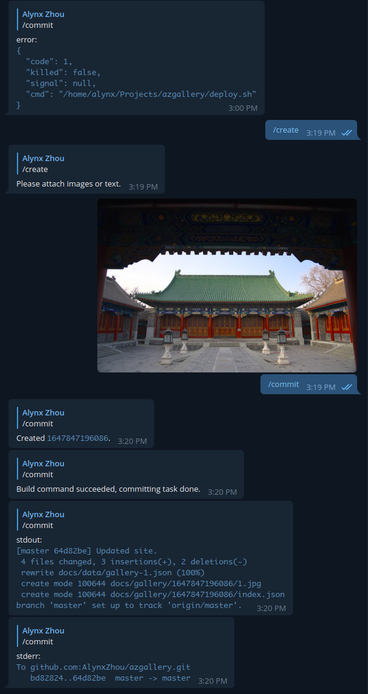

<blockquote class="center-quote">杜洛夫叔叔我啊，最喜欢 TON 了。</blockquote>

其实倒也不一定是 Telegram 机器人，只是我比较熟悉这个的 API，不过看杜洛夫叔叔自己打自己脸的架势甚至比起陈叔叔有过之而无不及，说不定哪天我真的可能把这个服务转移到别的上去，反正原理都是类似的。这篇文章只是记录一下这个点子的来源和形成过程，其实实现起来没什么技术难度。

<!--more-->

我平时总是强迫自己多拍点照片，因为拍照这种东西如果不强迫自己，那就越来越懒最后干脆就不拍了。虽然我没什么审美也没什么技术，不过数量加运气还是能得到一些不错的照片。我试图把这些照片分享到公共平台，不过考虑到我自己的口味问题，有点难办。平时我一般发微信朋友圈然后点击同步到 QQ 空间，这样熟人就可以看到了，不过这不能算是公共平台吧。而微博这种垃圾平台，如果不是猫日在上面更新，我大概也早就不用了，所以是断然不可能发的。很多国内摄影会发小红书，但是我也比较讨厌这个平台，而且它似乎只有手机 APP 没有网页版。抖音我也没什么好感。B 站动态我倒是挺愿意发一发的，不过叔叔的技术水平实在是拉中拉，动态连个指定页码翻页功能都没有。然后考虑国外的社交平台的话，其实也没什么意思，这里我要特别提一下好多名人明星和摄影师喜欢的 Instagram，我真的不能理解这东西是怎么火的，手机客户端一点也不 Native，既不是 Android 风也不是 iOS 风，而且感觉功能比 Twitter 差多了，至于网页版，点开图片显示的窗口比手机屏幕还小，而且 2022 年了，抖音网页版都能不登录就访问，Instagram 网页版还一定要我登录。然后我想退而求其次我能不能利用现有的 API，写个 Telegram 机器人替我定期发图，我只要把图发给 Telegram 机器人就好了。我见过很多这样的 Twitter 机器人。不过问题还是一样，国内平台只想从真人用户身上薅钱，根本不在乎什么技术相关的东西，也不会给你做公开 API。国外平台的话，我还是更想给中文环境的用户看吧，所以也不合适。

其实我不是没想过直接发在我自己的博客上，但是遇到了一些问题，首先博客是以文章为中心的，一篇文章要有标题，但是我想的就是发图然后配几句话或者根本不配（您 pay 吗？），要是单独作为一个 page，那这个 page 可能会很长。我也考虑过新建一个站点然后做一个特化的主题用生成器生成，不过这有点杀鸡用牛刀的意思了。再之后的问题是写博客我会写很长的文章，所以我肯定是在电脑上编写，但我发照片可能是心情到了就发，显然用手机更方便，要是为了这个再写一个网页的发图后台有点麻烦了。所以干脆综合一下想法，跑一个 Telegram 机器人作为后台，每次收到我发的图就自动建立目录然后下载进去，再生成静态网页就可以了。正好我之前从蓝猫那买了一个树莓派 4，但是不知道有什么用，就让它来跑这个。

机器人的部分其实不难，需要注意的也就是限制能交互的用户名，以及只处理私聊的文本和图片消息。其实理论上可以做到每次发带字的图片组就发一条，但是考虑到扩展性我没这样做，而是使用命令处理了（而且从 API 上图片组也不是一条消息，而是多条消息带有同样的组标识）。我的做法是搞了一个状态机，进入 create 状态，收到的图片消息就会被加入图片数组，文本消息则会被连接起来，然后通过状态转移可以进入不同的状态，比如进入 authors 状态就会把收到的每条消息作为一个作者名字放进作者数组，然后最后执行 commit 命令让机器人以时间戳作为名字创建目录，然后把图片下载下来，把图片数组作者数组文本都作为键值对写入这个目录的 `index.json`，这样我们就既有图片又有元数据了。然后让机器人调用生成用的脚本。同样还有 cancel 命令可以取消未 commit 的操作，以及超时之后自动取消。同时为了方便还有 delete 状态，每条消息都会被作为要删除的目录的名字，commit 之后一起删除。当然时间戳有一个需要注意的地方，就是 UNIX 纪元之前的时间是负数，如果直接转成字符串创建目录，就是以 `-` 开头的，在 shell 里面会比较难处理（因为命令行程序会把 `-` 作为参数开始的标记，这不是 shell 负责的，所以就算你反斜杠转义或者加引号也没用，一个通俗约定是在这样开头的字符串前面加一个 `--` 的参数，意思是让程序不要把后面的字符串当作参数列表处理），简单地办法是替换掉这个符号就好了，比如我换成 `n`（但是真的会有人穿越到 1970 年之前用这玩意吗？）。对于 Telegram Bot API 还有需要注意的地方，就是图片下面带的文字并不是在 `text` 键下面，而是在 `caption` 下面，不过处理的代码倒是可以复用。调用生成的脚本的时候也要注意工作目录，这个过程完全是处理磁盘文件，目录很重要。

压缩图片的解决方案其实非常简单：用 Telegram 发图片的时候不就自动压缩图片了吗！虽然作为访问者，我常常希望图片网站提供原图下载，不过当我自己 host 一个图片网站的时候，我觉得还是不要传原图好了，毕竟我是放在 GitHub 上，有容量限制，而且就算没有容量限制，原图访问起来太慢了，体验也不会特别好，反正实在不行如果有访问者真心喜欢，让他发邮件联系我就行了。

一开始其实我觉得这个网页应该会比较简单，所以干脆把构建网页的代码也写进机器人好了，不过群友建议还是分开，只是把 Telegram 机器人作为数据来源，这样以后也好添加别的数据来源，我觉得合理。构建网页其实很简单了，读取所有的图片目录的数据，排序，渲染进网页里，你可以用各种方式解决这个问题，比如现代的双向绑定框架 React 或者 Vue，比如传统的模板系统 EJS 或者 Nunjucks，但是我不想引入别的依赖了，所以做了一个投机取巧的办法，构建的时候读取各个目录的 json，然后得到一个大的数组，给它分页，写进不同的 json 里面，前端的网页通过 JavaScrip `fetch` 去获取这个作为索引的 json，把实际的内容渲染进元素里面（其实就是不用 React 的单页应用了）。然后页码其实就是处理 QueryString 里面的 `p` 参数，这个也可以用 JS 解决。于是我只要构建好之后把这个页面 push 到 GitHub 开启 Pages 就行了。（其实如果实在讨厌前端跑 JS 的话，后端代码里直接拼 HTML 字符串也行嘛，不过我是懒得改了。）

前端的部分没什么好说的，怎么排版照片是个问题，我参考了 <https://css-tricks.com/adaptive-photo-layout-with-flexbox/>，这个效果很不错，不过评论里指出可以用 CSS 伪元素占据最后的空白空间，我也这么实现的。

后端（机器人）的代码在 <https://github.com/AlynxZhou/image-collector-bot/>, 前端的代码在 <https://github.com/AlynxZhou/azgallery/>，感兴趣的朋友也可以自己搞一个玩玩，如果你想看最后的成果，这个博客的菜单栏里面就有照片墙的链接了。
