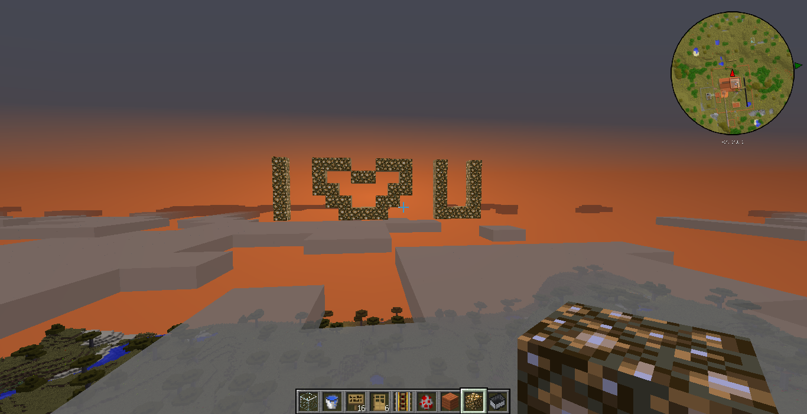

Say to me.

Why are you so tired?

Why are you so lonely?

No,No.

There's no need to say.

<!--more-->

What I need to konw is that you are really tired,really longly,really.

You said you wanna love,to be love.

But no one cares you every time every thing.

Who cares you?Who cares?

However,whenever I see your eyes,deep dark.

I see,you mean you understand.

You mean you believe.

You mean you konw no one would love a silly man.

You mean it's true that no one loves a person who lives by computer,phone,harmonica.

You mean it's true that no one konws what you need.

They have already got and sent what you want from or to other one.

You consider them as everyting while they consider you as nothing.

The world is so hard,it makes you hard to find it.

It was hidden under the dirt,was hidden on the cloud,was hidden behind one's back,was hidden in one's heart.

You can feel the deeply bad of the world.

Though your heart believe the future,your body say it can't wait.

Your body can wait while your heart can't.

Human being is strange,you can't look through them via scanf,#define.

So many stories,some times they are pleasant,but most not.

Stories start,stories stop.

Endless stories.

It seems that you can only tell the words to yourself,and your chair.

You wanna cry,but no tears.

Let it out,let it go.

I have the arms you want.

Why no snow comes after the cloud?

Why no death comes after the pain?

Why no love comes after the significant care?

I konw you want to ask,being sorry for my poor head.

You have nothing but you want everything.

To the whole world,you maybe one person.

But to whom,you are the whole world?

You said you want it simple,for human beings are so complex.

But you can't.

Don't cry.

To you,to me.

To yourself,to myself.

You are myself,I'm yourself.

You can get it one day,maybe.

2016-01-10

*转载自我的LOFTER*
