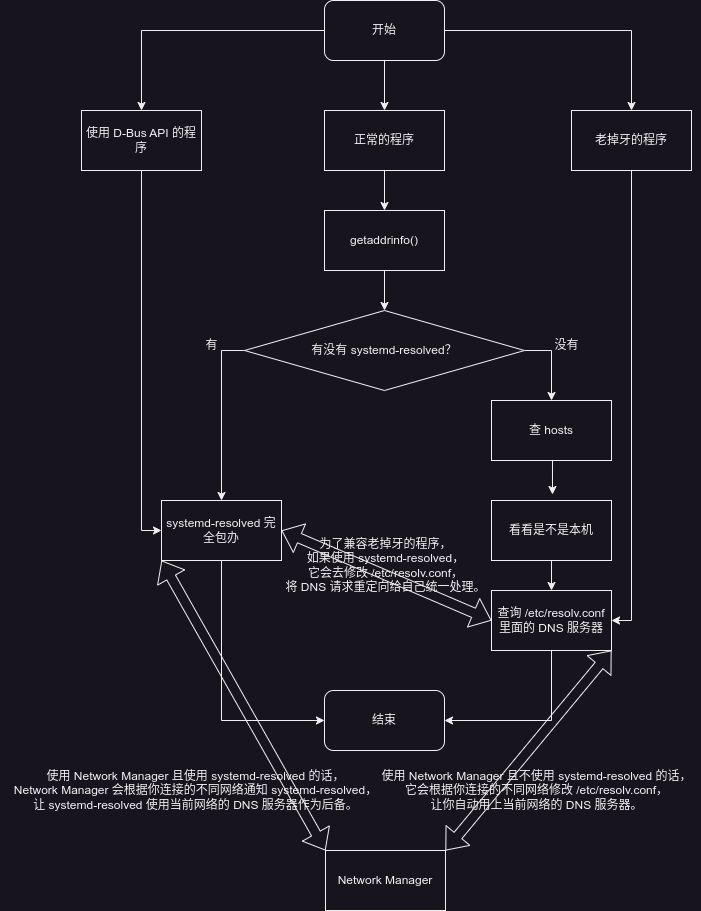

这一篇是之前 [谁动了我的 DNS 解析？](../Who-Moved-My-DNS-Resolving/) 的重制版，因为那一篇杂糅了关于设置 Zeroconf 的 mDNS 的需求和关于 Linux 下面 DNS 解析到底是怎么工作的描述，我怀疑大部分读者对前者不感兴趣（因为我自己后来也发现这玩意不是很可靠），而更想了解后者，所以打算拉出来单写一篇。

标题显然是化用自《谁动了我的奶酪？》，即使我并没有读过这本书。

<!--more-->

# long long ago

一般要讲故事，开头都是“很久很久以前……”，不过计算机领域也没什么太古老的故事可讲，毕竟公认的互联网前身 ARPANET 也就是二十世纪的事情。那个时候能互联的机器一共也就那么几个，所以解决的办法简单粗暴：我们每个机器都保存一个文件，里面记录所有人对应的域名和 IP 不就行了？这个优良传统一直留了下来，也就是现在所有系统里都有的 hosts 文件——不管你写的对不对，它的优先级都比后来出现的 DNS 查询要高。

然后随着加入网络的机器越来越多，这个办法不好用了，毕竟每来一个新人就要所有人更新自己的文件，这复杂度也太高了。所以干脆我们搞一个集中的服务器专门放这个列表，其它机器都向它查询就好了，这就是 DNS 服务器的原理。然后在局域网里，一般路由器和 DNS 服务器以及 DHCP 服务器都是同一台机器，因为很自然的所有设备都会连到路由器上，而 DHCP 服务器恰好知道它分配出去的 IP 地址，所以如果你输入内网设备的主机名恰好能解析，那通常是你的路由器做了这些工作。

但既然有了 DNS 服务器，那问题就变得复杂起来，比如我该将我的 DNS 服务器设置成哪一个？特别地，你可能会发现有很多不同的程序在试图修改你的 DNS 服务器设置，导致你打开某些网站本该秒开却不停地转圈圈，事情为什么会这么复杂？

# chattr +i /etc/resolv.conf

很多 Linux 用户都知道修改 DNS 服务器可以通过编辑 `/etc/resolv.conf` 实现，很多 Linux 用户也被 `/etc/resolv.conf` 困扰，一些人发现自己的这个文件是个软链接，而另一些人发现这个文件总被 Network Manager 覆盖，还有些人的发行版让他们用一个叫 `resolvconf` 的工具处理，然后现在 systemd 又搞了个叫 systemd-resolved 的东西来插一脚……我说的这些已经足够让一些不想学新东西同时又神经紧张的人开始大喊“fuck systemd, fuck network manager, fuck desktop environment and fuck the whole modern world”然后执行 `chattr +i /etc/resolv.conf` 了。不过别着急小炸药包们，也许这个世界上新出现的各种东西目的并不只是惹恼你们这群大笨蛋，哦是的，没错，我说，大笨蛋，恐龙勇士（停停停不要翻译腔了），你不需要的功能并不意味着别人也不需要。总之，不要觉得世界都围着你转，至少读一下这些东西的文档，会告诉你怎么阻止它们修改你的 `/etc/resolv.conf` 的。

在 DNS 服务器设置这件事上并不是一个 `/etc/resolv.conf` 搞定所有，有关这个的故事也是 long long ago，但毕竟是 UNIX 纪元之后的事情，没有太久，大概确实上古时代的程序都是直接读这个获取 DNS 服务器然后再做 DNS 解析的，但实际上这也不一定 OK，比如像之前说的 hosts 文件也需要考虑。所以就有了更复杂的解决方案，大部分程序做 DNS 解析实际上是调用 glibc 里面 `getaddrinfo` 这个 API，所以在它后面我们就可以做一些工作。一个叫做 Name Service Switch 的东西发明出来就是干这个的，它是基于插件的，我们可以通过阅读 `/etc/nsswitch.conf` 里面的 `hosts` 这一行来理解，比如我这里默认是这样的：

```
hosts: mymachines resolve [!UNAVAIL=return] files myhostname dns
```

简单翻译一下的话意思就是查询一个域名的时候首先看看是不是 systemd-machined 的容器（`mymachines` 模块），不是的话再问问 systemd-resolved 能不能解析（`resolve` 模块），如果 systemd-resolved 可用，那到这也就完事了，后面的就不管了（`[!UNAVAIL=return]`），至于为什么我一会解释，然后 `files` 模块会读 hosts 文件，所以它优先级总是高于 DNS 服务器，然后看看是不是本机（`myhostname` 模块），然后再读 `/etc/resolv.conf` 里面的 DNS 服务器进行查询。

按照这个顺序，如果你处在一个极其简单的网络环境：只有一个网络连接（这里包含各种有线无线 VPN 隧道在内都只能有一个）并且完全不会移动到其它网络连接下使用，那确实只要在 `/etc/resolv.conf` 里面写死一个公开的 DNS 服务器就可以满足你的所有查询需求。但可惜并不是所有人的使用环境都这么简单，所以每个工具都有额外的策略并试图修改 `/etc/resolv.conf`。

# 当你是个需要来回跑的笔记本用户……

下面让我们考虑一个比那些觉得自己手搓一个 DHCP 客户端就能联网的大脑皮层极其光滑的只要 `chattr +i /etc/resolv.conf` 就能解决问题的小笨蛋们的场景稍微复杂一点的场景：你是一个背着笔记本来回跑的上班族，公司 WiFi 和家里 WiFi 的网段并不一样，而你需要在公司的时候将 DNS 服务器设置为公司的路由器，在家的时候将 DNS 服务器设置为家的路由器（什么水晶室女），以便在两地都可以通过内网设备的主机名访问对应的内网设备，显然你不可能靠 `chattr +i /etc/resolv.conf` 解决问题。

这就是为什么 Network Manager 需要修改你的 `/etc/resolv.conf`（其它网络管理器我就不考虑了因为我没用过，而且对于所有这种可以帮你自动连接 WiFi 的网络管理器而言，设置 DNS 服务器的逻辑都应该是相同的），对于每个不同的网络连接，它都会记录或者自动获取该局域网的 DNS 服务器，然后根据你当前激活的连接把这个 DNS 服务器写入 `/etc/resolv.conf`，保证无论是使用 `getaddrinfo` 的程序还是自己读取 `/etc/resolv.conf` 的老古董程序都可以获取到正确的局域网 DNS 服务器从而访问内网里的设备。

# 当你是个需要来回跑的笔记本用户，同时你还需要通过 VPN 远程办公……

如果你完全理解了上面那一段，恭喜你已经脱离了草履虫进化成了脊椎动物了！但你又遇到了更复杂的场景：你的工作要求你连接公司的 VPN，从而通过内部的 DNS 服务器解析一些内网才能访问的网站，当你打开了 VPN 下载一些内网才能下载的工具时你想同时放一些音乐打发时间，但你最爱的音乐网站现在要转 3 秒的圈才能访问！Network Manager 可以帮你解决这个问题吗？答案是在某些情况下可以！

尝试分析这个新的需求，你会发现问题在于 VPN 服务也要设置一个 DNS 服务器，如果你的 VPN 服务尝试自己覆盖 `/etc/resolv.conf`，那么 Network Manager 之前按照你的连接帮你设置的“正常的”的 DNS 服务器就会消失，你所有的 DNS 解析就会全部绕到公司内网的 DNS 服务器上跑一圈，导致所有网站的解析都变得很慢。这个时候你可能又打算大喊 `chattr +i /etc/resolv.conf` 退化成草履虫，但这样你就没办法解析公司内网的域名了，也许更好的办法是只让 Network Manager 管理 `/etc/resolv.conf`。因为大部分的 VPN 都已经有 Network Manager 的插件了，所以你只要在 Network Manager 里添加你的 VPN 连接，它就会像管理 WiFi 一样管理这个连接，此时你会发现你的 `/etc/resolv.conf` 里已经同时有了家里路由器的 DNS 服务器和 VPN 的 DNS 服务器。

理想状态下，你的 VPN 应该会自动通知客户端对于哪些域名使用这个 VPN 的 DNS 服务器查询，如果你勾选了“仅对此网络上的资源使用此连接”的话。这样访问不在内网上的网站就不会到这个 DNS 服务器上转一圈，而是直接跑到“正常”的 DNS 服务器上查询。但如果不幸这个自动配置的过程出了问题，你可以通过 `nmcli` 修改这个 VPN 连接的 `ipv4.dns-search` 项，把需要在内网查询的域名列表手动设置好。

对于绝大部分用户，这样的配置应该已经可以满足他们了！但实际情况永远只有更复杂，所以我们还要继续！

# 当你是个需要来回跑的笔记本用户，同时你还需要通过 VPN 远程办公，但你的 VPN 并没有 Network Manager 的插件……

欢迎刚刚进化完成的灵长类！坐稳了！我们要向现代人的方向冲刺了！现在我有一个更加复杂的需求：我给自己的各种内网设备搭建了一个 VPN，这样我即使身在外面也能访问我家里的服务器，但这个 VPN 使用 Tailscale，Network Manager 并没有相关的插件，于是 Tailscale 也来试图覆盖我的 `/etc/resolv.conf`，听个音乐又需要转 3 秒的圈，怎么办？

最好在那边手握 `chattr +i /etc/resolv.conf` 的草履虫嘲笑之前堵上他的嘴，因为这同样会导致我失去解析 VPN 内网域名的能力，我们是现代人，我们要用 systemd-resolved 解决这个问题。

systemd-resolved 并不仅仅是一个管理 `/etc/resolv.conf` 的工具，实际上它本身是一个自带缓存的 DNS 服务器，然后向上接管各种不同的 DNS 查询逻辑，向下为各种需要设置 DNS 服务器的工具提供接口。因此如果你的各种网络连接工具都支持 systemd-resolved 的接口，那它们就不需要自己修改 `/etc/resolv.conf`，而是改为配合 systemd-resolved 工作，恰好 Network Manager 和 Tailscale 都支持 systemd-resolved。

在接管 DNS 查询这个目的上 systemd-resolved 提供了三种不同的接口：首先是自己实现了一个 D-Bus 接口，其它程序可以通过这个接口来实现。然后是在 Name Service Switch 里添加了属于自己的模块以接管 `getaddrinfo`，如果检测到 systemd-resolved 已启用，那它的缓存 DNS 服务器就会接管所有的处理，包括 hosts 和 hostname，以及如果没有缓存到，就会主动向上级 DNS 服务器查询，因此在 `/etc/nsswitch.conf` 里面写了如果检测到 systemd-resolved 就直接返回，跳过后面的模块。最后对于那些自己读取 `/etc/resolv.conf` 的老古董，它也会修改这个文件接管这类程序，这时这个文件只是个软链接，里面只有一句就是把 DNS 服务器设置为 systemd-resolved 自己的 DNS 缓存服务器。

如果你要启用 systemd-resolved，务必保证你的 `/etc/resolv.conf` 是指向 systemd-resolved 管理的文件的软链接：


```shell
# ln -sf ../run/systemd/resolve/stub-resolv.conf /etc/resolv.conf
```

这样如果 Network Manager 和 Tailscale 启动时检测到 `/etc/resolv.conf` 是软链接，就会知道自己需要配合 systemd-resolved 工作（如果你正在配置这个，那就手动重启它们！）。此时执行 `resolvectl status`，应该能看到对于不同的网络接口，都配置了不同的 DNS 服务器，以及需要通过这个服务器查询的域名（如果你配置过的话！）。

当然，你也可以通过 systemd-resolved 的配置添加一个全局的 DNS 服务器。systemd-resolved 支持 unicast，也就是说如果你查询的域名不符合任何一个网络接口设置的要通过这个接口的 DNS 服务器查询的域名的话，它就会通过所有网络接口的 DNS 服务器查询（也包含你设置的全局 DNS 服务器），然后取最快返回的结果。

# 当你是个需要来回跑的笔记本用户，同时你还需要通过 VPN 远程办公，但你的 VPN 并没有 Network Manager 的插件，它也不支持 systemd-resolved……

我们的口号是不做草履虫！实际上这种场景已经非常非常少见了，绝大多数的场景都能被 Network Manager + systemd-resolved 覆盖，这也就是为什么越来越多的通用发行版都使用这一套进行网络管理和 DNS 解析的原因。但如果你真的遇到了，也许你听说过一个叫做 `resolvconf` 的工具，在以前某些发行版会预装它。它的逻辑似乎就是有各种程序都打算自己修改 `/etc/resolv.conf`，那你们干脆都别管了，我来管，听我的（现在有 N + 1 种解决方案了）。至于它到底是怎么工作的，如何配置，这些都别问我！因为我也没有用过！我觉得你不如去建议不支持 systemd-resolved 的项目支持 systemd-resolved 比较实际……

总之无论如何如果你搜到一篇老旧的教程告诉你设置这个 `resolvconf`，那你都该留个心眼查一下，万一你这个需求已经可以用 Network Manager 的插件或者它已经支持 systemd-resolved 了呢？

# 太长不看！

我准备了一张图，让你知道 DNS 解析在 Linux 上都发生了什么，以及 Network Manager 和 systemd-resolved 各自都扮演什么角色……


