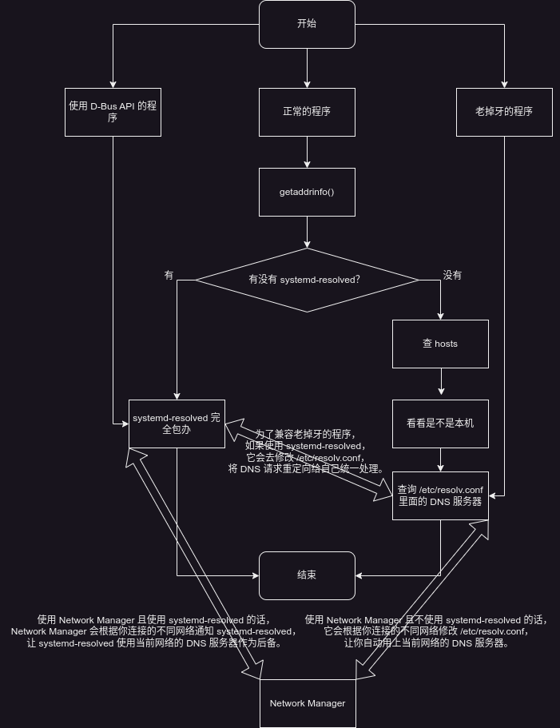

<div class="alert-red">我发现这篇杂糅了关于设置 Zeroconf 的 mDNS 的需求和关于 Linux 下面 DNS 解析到底是怎么工作的描述，如果你只对后者感兴趣，请阅读最新的 <a href="../Who-Moved-My-DNS-Resolving-Remastered/">谁动了我的 DNS 解析（重制版）？</a>。</div>
如果有人看到这个标题以为是什么科学上网相关然后高兴地点进来的话不要怪我，我其实想说的是 Linux 上有关 DNS 解析的流程，这个标题显然是化用自《谁动了我的奶酪？》，即使我并没有读过这本书。我计网真的没认真听课，写的内容都是我现学现卖的，有不对的希望读者指正。

<!--more-->

# 需求

我有一台 NAS，一台 PC 和一台路由器，为了能上网也为了家里的无线设备可以连接 NAS，我给 PC 和 NAS 分别接上路由器，但是路由器只有千兆网口，而 PC 和 NAS 各自多一个 2500 Mbps 的网卡，为了实现最高的连接速度，我又买了一根网线把 PC 和 NAS 直接连接起来，于是现在三台设备两两相连。

直连两台设备其实非常简单，Network Manager 里面 IPv4 设置成手动，然后分别配置 IP 地址和子网掩码，再关掉 IPv6 就可以了，比如我分别设置 IP 为 `10.10.10.1` 和 `10.10.10.2`，然后子网掩码就是 `255.255.255.0`。然后在进行各种网络访问的时候只要使用这个 IP 就可以通过直连访问了。

但是我还是不太满意，我设置了帅气的主机名，为什么还得用 IP 访问呢？但如果我查询主机名对应的 IP，发现得到的并不是直连的 IP，而是比如 `192.168.1.80` 这样的通过路由器的 IP。于是我开始研究如何配置让 DNS 解析给我返回直连的 IP。

# long long ago

一般要讲故事，开头都是“很久很久以前……”，不过计算机领域也没什么太古老的故事可讲，毕竟公认的互联网前身 ARPANET 也就是二十世纪的事情。那个时候能互联的机器一共也就那么几个，所以解决的办法简单粗暴：我们每个机器都保存一个文件，里面记录所有人对应的域名和 IP 不就行了？这个优良传统一直留了下来，也就是现在所有系统里都有的 hosts 文件，不管你写的对不对，它的优先级都比 DNS 查询要高。对于我这个极其简单的网络环境，这肯定是不错的解决方案，但是程序员总会觉得这种非自动化的手段太 low 了，于是就被我 pass 掉了。

然后随着加入网络的机器越来越多，这个办法不好用了，毕竟每来一个新人就要所有人更新自己的文件，这复杂度也太高了。所以干脆我们搞一个集中的服务器专门放这个列表，其它机器都向它查询就好了。这就是 DNS 服务器的原理了，然后在局域网里，一般路由器和 DNS 服务器以及 DHCP 服务器都是同一台机器，因为很自然的所有设备都会连到路由器上，而 DHCP 服务器恰好知道它分配出去的 IP 地址，所以如果你输入主机名恰好能解析，那通常是你的路由器做了这些工作。但对于我这个子网来说，为了这两台电脑再配置 DHCP 和 DNS 显然太麻烦了，pass。

再后来各种子网越来越多，子网里的设备也越来越多，比如打印机这种，以至于现在各种智能家居，不可能再搞一个服务器用来注册“喂，我是茶壶”这种东西，于是苹果搞出了一个叫 Zeroconf 的协议，大概是在 DNS 的基础上可以让子网里支持这个协议的设备互相发现互相通知自己是什么。因为和 DNS 相关，所以有一个部分是 MulticastDNS (mDNS)，简单来说就是不通过 DNS 服务器，而是通过这个协议发现的设备列表实现 DNS 解析。所以这是第三种方式。

以上三种方式其实都是我从 Arch Wiki 抄来的：<https://wiki.archlinux.org/title/Network_configuration#Local_network_hostname_resolution>

所以我决定搞一个第三种，这个好说，wiki 写了可以用 Avahi 做这个，不过怎么 systemd-resolved 也能做 mDNS？这玩意不是管 `/etc/resolv.conf` 的吗？Network Manager 不是也管这个吗？

# chattr +i /etc/resolv.conf

很多 Linux 用户都知道修改 DNS 服务器可以通过编辑 `/etc/resolv.conf` 实现，很多 Linux 用户也被 `/etc/resolv.conf` 困扰，一些人发现自己的这个文件是个软链接，而另一些人发现这个文件总被 Network Manager 覆盖，还有些人的发行版让他们用一个叫 `resolvconf` 的工具处理，然后现在 systemd 又搞了个叫 resolved 的东西来插一脚……我说的这些已经足够让一些不想学新东西同时又神经紧张的人开始大喊“fuck systemd, fuck network manager, fuck desktop environment and fuck the whole modern world”然后执行 `chattr +i /etc/resolv.conf` 了。不过别着急小炸药包们，也许这个世界上新出现的各种东西目的并不只是惹恼你们这群大笨蛋，哦是的，没错，我说，大笨蛋，恐龙勇士（停停停不要翻译腔了），而是真的有场景需要他们。也许对于某个 VPN 连接需要使用自己的 DNS 服务器，总之，不要觉得世界都围着你转，至少读一下这些东西的文档，会告诉你怎么阻止它们修改你的 `/etc/resolv.conf` 的。

但其实也不是一个 `/etc/resolv.conf` 搞定所有，有关这个的故事也是 long long ago，但毕竟是 UNIX 纪元之后的事情，没有太久，大概确实上古时代的程序都是直接读这个获取 DNS 服务器然后再做 DNS 解析的，但实际上这也不一定 OK，比如像之前说的打印机这种怎么解决？以及 hosts 呢？所以就有了更复杂的解决方案，大部分程序做 DNS 解析实际上是调用 glibc 里面 `getaddrinfo` 这个 API，所以在它后面我们就可以做一些工作。一个叫做 Name Service Switch 的东西发明出来就是干这个的，它可以理解为一个基于插件的结构，我们可以通过阅读 `/etc/nsswitch.conf` 里面的 `hosts` 这一行来理解，比如我这里默认是这样的：

```
hosts: mymachines resolve [!UNAVAIL=return] files myhostname dns
```

简单翻译一下的话意思就是查询一个域名的时候首先看看是不是 systemd-machined 的容器（`mymachines` 模块），不是的话再问问 systemd-resolved 能不能解析（`resolve` 模块），如果 systemd-resolved 可用，那到这也就完事了，后面的就不管了（`[!UNAVAIL=return]`），至于为什么我一会解释，然后 `files` 模块会读 hosts 文件，所以它优先级总是高于 DNS 服务器，然后看看是不是本机（`myhostname` 模块），然后再读 `/etc/resolv.conf` 里面的 DNS 服务器进行查询。

对于一个普通的桌面用户，应该使用的只是 Network Manager，默认 Network Manager 不会用 systemd-resolved，于是大部分情况一个外部域名最后还是查询 DNS 服务器，和以前没什么本质区别。那 Network Manager 你为什么要修改 `/etc/resolv.conf`？原因之一就是之前提到不同的 VPN 服务可能有不同的 DNS 服务器，因此建议这些用户不要手动编辑这个文件，可以直接在 Network Manager 的连接配置里设置某个连接的 DNS 服务器。

那 systemd-resolved 又是什么玩意？是不是 systemd 作者又要搞出什么花样替换我习惯的东西？但这东西好像还真是有些实际的需求，它不是一个简单的 `/etc/resolv.conf` 的管理工具，而可以理解为是一个自带缓存的 DNS 服务器。glibc 通过 `/etc/resolv.conf` 里面的 DNS 服务器查询 DNS 其实是不做缓存的，有些场景用户可能希望能自己缓存结果加快速度，这时候就需要搞这个东西了，它自己是一个 DNS 服务器，因此也就不再执行 nsswitch 里面后续的组件（用你的 `dns` 模块查询了我怎么缓存？）。除此之外它还声称自己提供了一个更好的 D-Bus 接口用来解析，而不是用 `getaddrinfo`，不过话又说回来，谁闲得没事去支持你这新搞的 D-Bus API，特别是你自己还搞了个 `getaddrinfo` 的模块。主观来说我其实不推荐一般的桌面用户配置这个，因为大概率你是在一个路由器后面，你的 DNS 服务器一般设置的都是路由器，而路由器上的 DNS 服务器一般会做缓存，所以其实完全没必要在自己电脑上启用这个……我也没遇到任何一定要使用它这个 D-Bus API 的程序。那 systemd-resolved 你为什么要修改 `/etc/resolv.conf`？原因是为了兼容那些直接读这个的上古程序，实际上人家就在这里写一行，就是让这些程序去查 systemd-resolved 内置的 DNS 服务器。

那至于 `resolvconf` 又是啥？这是一个叫 `openresolv` 的项目搞出来的东西，需求就是有各种程序都打算自己修改 `/etc/resolv.conf`，不单单是上面那两个，还有一些 VPN 服务之类的，那你们干脆都别管了，我来管，听我的（现在有 N + 1 种解决方案了）。但实际上我也不推荐你使用这个，因为桌面用户根本没有使用场景，你用 Network Manager 的话，就不要再单独使用什么 VPN 工具，因为 Network Manager 本身支持很多种 VPN 连接，你直接用它管理就好了。就算你需要用 systemd-resolved，其实这个也替你考虑好了，Network Manager 支持 systemd-resolved，检测到你用它的话，就不会去改 `/etc/resolv.conf`，而是直接去修改 systemd-resolved 的配置了。

更新（2023-09-07）：感觉光靠嘴说还是不太清楚，我画了一张图……



所以你可以看到 Network Manager 默认其实并不参与 DNS 解析，它只是方便到处跑的笔记本用户能用上各个局域网内的 DNS 服务器而已。

# 计算机科学是门艺术，当且仅当你不需要考虑兼容性的时候……

那说回到 mDNS 这个问题，为什么我不直接用 systemd-resolved 解决呢？一个是上面提到的我不需要再做一次 DNS 缓存了，另一个是因为 CUPS 这个打印服务依赖 Avahi，它其实不只用到 mDNS，还用到了 Zeroconf 里面其它的功能比如发现设备去连接打印机，虽然我暂时也用不到 CUPS，但我确实是不想搞 systemd-resolved 的 DNS 服务器了，还是配置 Avahi 吧。当然假如你说我既想要 systemd-resolved 的 DNS 缓存和 D-Bus API 又想要 Avahi 的 Zeroconf 怎么办呢？额，其实也有办法，systemd-resolved 提供了选项让你关掉它的 mDNS 功能，具体我没有尝试，不过这样应该就不会冲突了。所以不要见到点新东西就生气，人家把各种兼容的东西都考虑到了，看两眼文档还不行吗……

然后搞清楚整个流程之后 Avahi 的配置其实不难，首先安装 `nss-mdns` 这个包，顾名思义是给 `nsswitch` 提供 `mdns` 模块，然后启动 `avahi-daemon.service`，然后编辑 `/etc/nsswitch.conf`，在 `resolve` 模块之前加入 `mdns4_minimal [NOTFOUND=return]`：

```
hosts: mymachines mdns4 resolve [!UNAVAIL=return] files myhostname dns
```

`mdns4` 模块会试图通过 mDNS 也就是找网络上其它的 Zeroconf 协议设备来解析 IPv4 地址，`4` 表示只尝试 IPv4，因为这种内网设备多半你不会给它分配 IPv6，当然也有 `6` 和没有数字同时支持两种的，不过由于现在的程序都优先查询 IPv6，而我只给直连配置了 IPv4，所以如果不用只支持 4 的，就会 fallback 到后面的模块，那就跑到路由器上查去了，我就是不想走路由器的。

# 读者看爽了，但好像结果不是我想要的……

等到我把所有的东西都搞好以后我发现一个问题……mDNS 虽然说是子网上的设备互相发现，但是它没规定是哪个子网……于是喜闻乐见的每次 `getent ahosts timbersaw.local` 查询给我返回不一样的 IP，一会是 `10.10.10.2` 一会是 `192.168.1.80`，看起来还是写 hosts 比较靠谱……

最后我的配置是不用 `mdns4`，而是用 `mdns4_minimal`，这两个的区别是后者只考虑 `.local` 结尾的域名，并且如果查找不到的话直接返回 `NOTFOUND`，而不是继续 fallback：

```
hosts: mymachines mdns4_minimal [NOTFOUND=return] resolve [!UNAVAIL=return] files myhostname dns
```

然后再修改 `/etc/hosts` 分别添加不带 `.local` 的主机名（因为 `.local` 会在 `files` 之前先被 mDNS 处理）。

# 当你觉得逐渐理解一切，并试图走出新手村……

<div class="alert-blue">这一部分更新于 2024-02-01 18:15:00。因为我的网络配置终于突破了“只要全部交给 NetworkManager 就能解决”的范围。</div>

首先我还是应该对之前的逻辑做一下总结，其实关键无非是一句话：需要添加新的 DNS 服务器的场景有很多，但管理 `/etc/resolv.conf` 的程序只能有一个。比如说你连接到家里的网络，那你首先会希望自己的 DNS 服务器是路由器。然后这时你需要连接到公司的 VPN，那你会多出一个 VPN 的 DNS 服务器用来查询内网域名，并且只应该对内网域名查询这个 DNS 服务器。如果你选择用 NetworkManager 管理 `/etc/resolv.conf`，那你也应该使用 NetworkManager 的 VPN 插件，通过 NetworkManager 去修改 `/etc/resolv.conf`。于是就不再需要额外的进程管理 DNS 查询。

而使我决定最后改用 systemd-resolved 管理 DNS 查询的原因是我开始使用 Tailscale/Headscale 构建一个我自己的 VPN 网络。Tailscale 包含一个叫做 MagicDNS 的组件，可以让你像使用路由器的 DNS 一样通过主机名访问这个虚拟专用网里的设备，此时它会直接覆盖掉 `/etc/resolv.conf` 让 DNS 查询走它自己的 DNS 服务器，这导致我的 OpenVPN 的 DNS 服务器被清掉，无法同时访问公司的内网。

如果你已经理解一切，解决方案应该也很清晰：要么把 Tailscale 也换成 NetworkManager 的插件版本（不存在），要么使用另一个专门管理 `/etc/resolv.conf` 的工具（systemd-resolved）让 Tailscale 和 NetworkManager 都交给它管理从而不要互相覆盖。考虑到 Avahi 的 mDNS 并没有像我想象的那样工作，我毫不犹豫的干掉了它换成了 systemd-resolved。

干掉 Avahi 的部分暂且不提，启用 systemd-resolved 的过程需要额外操作：

```
# systemctl enable --now systemd-resolved
# ln -sf ../run/systemd/resolve/stub-resolv.conf /etc/resolv.conf
```

按照之前讲的，建立软链接是为了让那些老掉牙的程序也使用 systemd-resolved 内置的 DNS 服务器，于是大家现在都走 systemd-resolved 进行查询。然后 Tailscale 和 NetworkManager 都支持 systemd-resolved，检测到这个软链接就不会尝试直接覆盖 `/etc/resolv.conf`，而是通知 systemd-resolved 添加自己的 DNS 解析。

然后重启 NetworkManager 和 Tailscale：

```
# systemctl restart NetworkManager
# systemctl restart tailscaled
```

但以上步骤只是让它们的 DNS 服务器设置可以共存，具体对于哪些域名通过哪个 DNS 服务器查询，是各个程序自己设置的，Tailscale 其实会正确的告诉 systemd-resolved 自己要处理的域名，但对于我的 OpenVPN 我发现需要我手动设置，由于我是使用 NetworkManager 管理我的 OpenVPN，所以需要执行 `nmcli connection edit VPN-CONNECTION`，然后 `set ipv4.dns-search a.internal,b.internal` 这样（看起来 NetworkManager 的 GUI 里没法修改这个），然后再重新开启 VPN 时候，你就可以通过 `resolvectl` 看到 OpenVPN 的 DNS 添加了正确的搜索范围。
